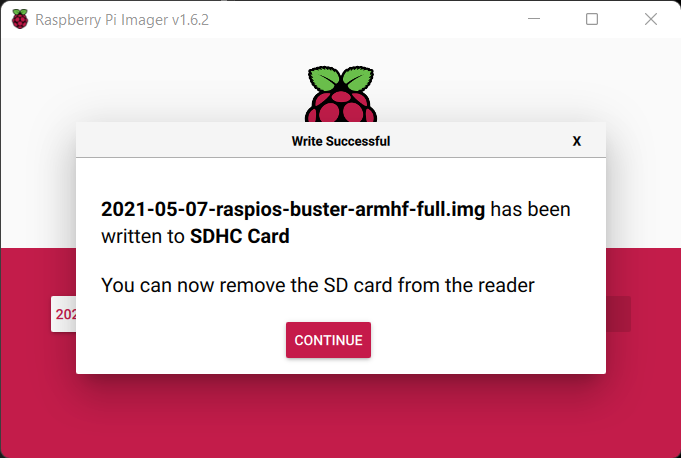
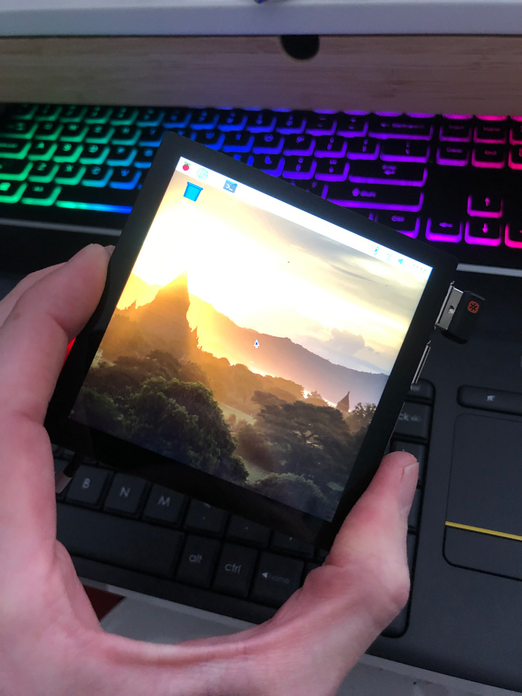
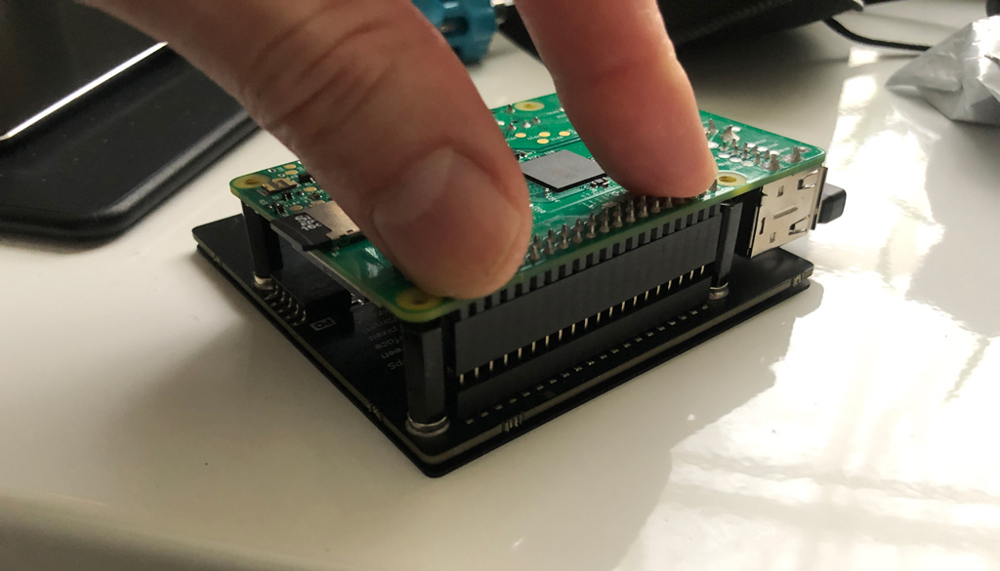
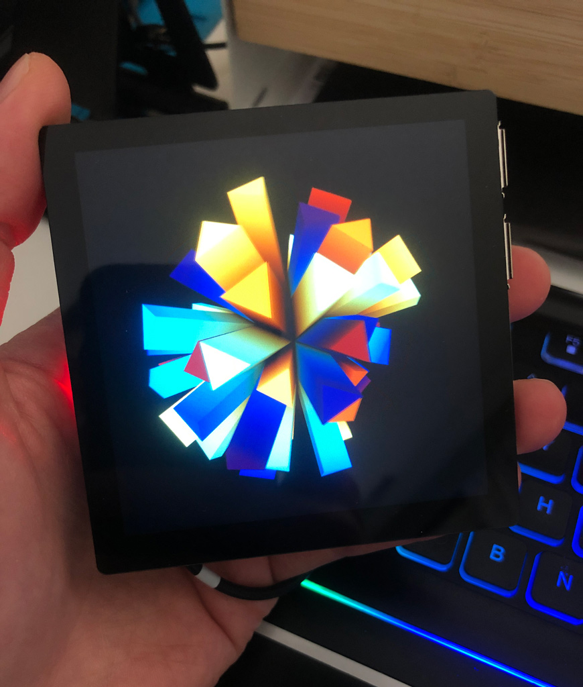

# Smol Square Art Frame Setup

With a Raspberry Pi and a 4" square screen.

There are tons of existing options out there for setting up an art frame, but I wanted to make this as simple as possible for the screen I wanted to try. Here are some places to look for other methods:

* [Raspberry Pi Art Frame Using OpenFrame](https://hackaday.com/2016/03/28/raspberry-pi-art-frame-using-openframe/)
* [How I built a digital picture frame with a Raspberry Pi](https://www.thedigitalpictureframe.com/how-to-build-a-digital-picture-frame-with-a-raspberry-pi/)

## Required Hardware

* [Raspberry Pi](https://www.raspberrypi.com/products/) (I recommend model 3 or 4)
* [Pimoroni Hyperpixel 4"](https://shop.pimoroni.com/products/hyperpixel-4-square?variant=30138251444307) square screen
* 16gb (or larger) MicroSD card

## Installation steps

### Step 1: Install the 2021/05 version of Pi

As of 2021/12, the latest version of Rasberry Pi OS isn't compatible with the Hyperpixel drivers. It took me a while to figure this out and downgrade, which made it all work as expected. 



* Download the OS [.zip file](https://downloads.raspberrypi.org/raspios_full_armhf/images/raspios_full_armhf-2021-05-28/), then extract the .img file
* Write this .img file to your SD card with [Raspberry Pi Imager](https://www.raspberrypi.org/downloads.../) desktop app on your computer
* Put the SD card into the Raspberry Pi and power it on with a keyboard/mouse/monitor attached
* Set up Raspberry Pi normally on the intro screens and get it online with Wifi or an Ethernet cable



### Step 2: Install Pimoroni Hyperpixel drivers

* Open the Terminal app (Pi's Bash shell) and run this command:
  * `curl -sSL https://get.pimoroni.com/hyperpixel4 | bash`
  * Pick your Raspberry Pi version and your Hyperpixel version in the interactive shell script
  * Extra options & info live here: [https://github.com/pimoroni/hyperpixel4](https://github.com/pimoroni/hyperpixel4)
* When driver installation is complete, shut down or restart Pi, then unplug everything to install the Hyperpixel screen

### Step 3: Install the physical screen

* Plug in the Pimoroni Hyperpixel
  * Use the standoffs and the pin extender that come with the screen. You'll want a tiny screwdriver to screw in the standoffs for stability.
  * Put Hyperpixel screen face down on a table, and gently press/wiggle the Raspberry Pi onto it. Don't flex the screen's glass, as you can damage the screen.
* The HDMI port might not work correctly anymore, so you might be stuck coding on the tiny screen now! But that's cool :)



### Step 4: Download your media files that you want to play

* I downloaded my video files from my own website by opening the Chromium browser and right-clicking my videos to save them locally

### Step 5: Install & test playback software

* We'll use [omxplayer](https://elinux.org/Omxplayer) to loop our videos fullscreen. This is already installed on a default/full Raspberry Pi installation
* Open Terminal and run this command to try it out:
  * `omxplayer --loop /absolute-path/to/my/video-file.mp4 --win 0,0,720,720 --no-osd`
    * The `--loop` argument will loop the video indefinitely
    * `--win 0,0,720,720` tells the video to play fullscreen on the Hyperpixel's 720x720 resolution
    * `--no-osd` hides the text info that shows after each loop by default
    * `--crop` and `--aspect-mode` could be useful here if you want to do something fancy like crop an HD aspect ration video to work in the square frame
  * Press `ESC` to quit the app
* Run the following command do disable the Raspberry Pi's "screensaver", which shuts the screen off after some amount of inactivity 
  * `sudo apt-get install xscreensaver`

### Step 6: Create a script to run your art

* Once it's working from Terminal, save your `omxplayer` command into a text file. Use an absolute path to your video so you can call this script from anywhere. I called my script `run-art.sh`, and it's contents were a single line of code:
  * `omxplayer --loop /absolute-path/to/my/video-file.mp4 --win 0,0,720,720 --no-osd`
  * If you created your script with TextEditor, you might need to change permissions:
    * `chmod 755 run-art.sh`
* Try running your script by navigating to the directory in Terminal and calling `./run-art.sh`, or call it anywhere by calling something like `~/Documents/art-frame/run-art.sh`
  * If that works, continue. If it doesn't, your paths or permissions probably aren't right.
  * When you want to change which art your frame is showing, just change the file path in your script!

### Step 7: Set to run on boot!

* Use the Raspberry Pi user `autostart` directory. Mine didn't exist, so I created it. The OS will [run anything in this directory on boot](https://learn.sparkfun.com/tutorials/how-to-run-a-raspberry-pi-program-on-startup/method-2-autostart):
  * Create the directory and move into it:
    * `mkdir ~/.config/autostart`
    * `cd ~/.config/autostart`
  * Create a text file called `art-frame.desktop` with this command
    * `sudo nano art-frame.desktop`
    * And add this as the text file contents. Make sure to point to your own script at the end, after `lxterminal -e `!
      ```
      [Desktop Entry]
      Type=Application
      Name=Art Frame
      Exec=lxterminal -e ~/Documents/art-frame/run-art.sh
      ```
* Test to make sure it starts after a reboot: `sudo reboot` (or unplug & re-plug the power cable)
* Hopefully you have a cute little square art frame now!



### Warning

* On my first attempt, I tried running my `omxplayer` script from `.bashrc`, which is a way to run scripts on boot, but this essentially bricks the Pi, as your key commands won't ever get focus on the `omxplayer` window. Your art frame will work, but you'll never be able to exit and change the art or use the Pi for anything else until you wipe it. Don't do this!


