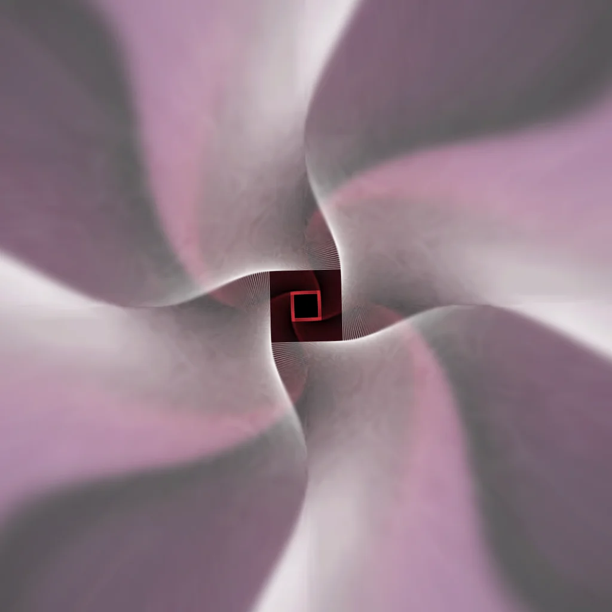
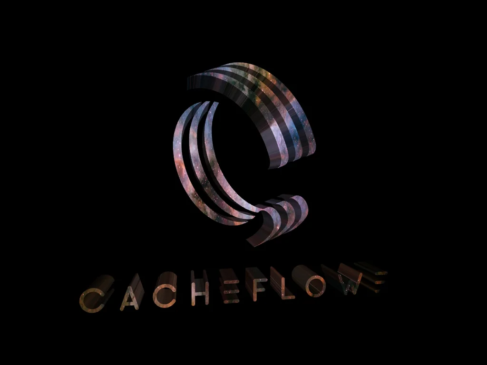
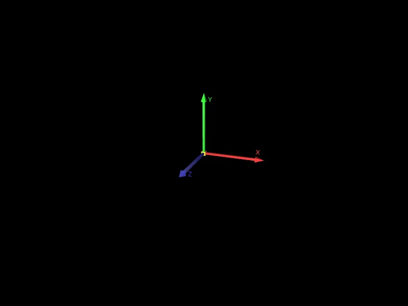
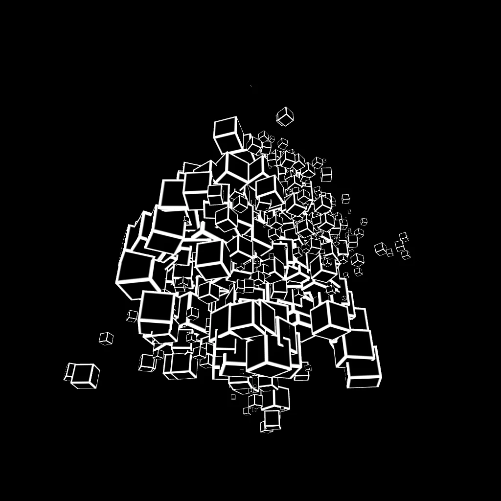
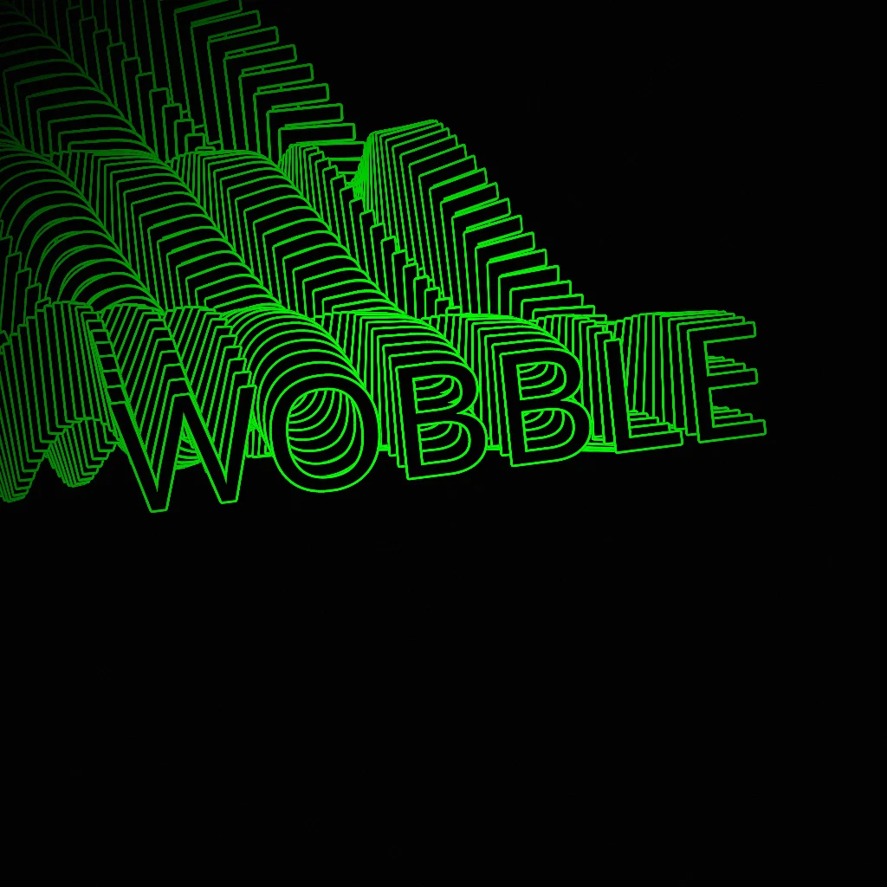
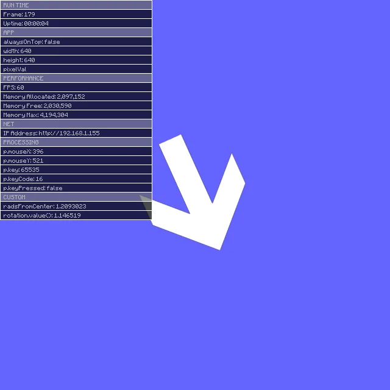
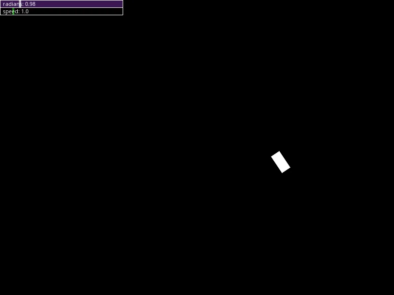
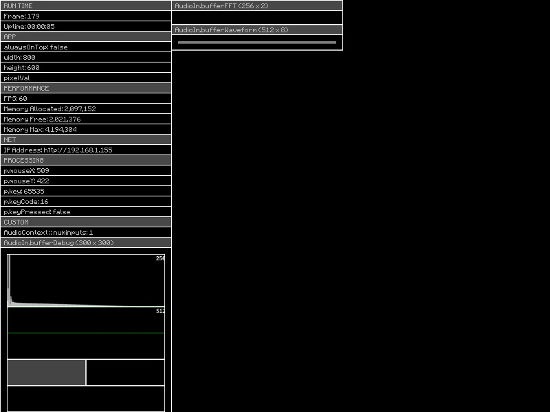

# Haxademic Demo Images
These images are auto-exported from the Haxademic demos. They serve as a reminder of what the demos look like, and may be used in the Haxademic documentation.

## Images

---

### App

[Demo_PAppletHax_DemoScreenshot.java](https://github.com/cacheflowe/haxademic/blob/master/src/com/haxademic/demo/app/Demo_PAppletHax_DemoScreenshot.java) 
 

---

### Data

[Demo_AppStore.java](https://github.com/cacheflowe/haxademic/blob/master/src/com/haxademic/demo/data/Demo_AppStore.java) 
 
[Demo_AppStoreDistributed.java](https://github.com/cacheflowe/haxademic/blob/master/src/com/haxademic/demo/data/Demo_AppStoreDistributed.java) 
 
[Demo_ConvertUtil.java](https://github.com/cacheflowe/haxademic/blob/master/src/com/haxademic/demo/data/Demo_ConvertUtil.java) 
 

---

### Draw > Color

[Demo_ColorUtil.java](https://github.com/cacheflowe/haxademic/blob/master/src/com/haxademic/demo/draw/color/Demo_ColorUtil.java) 
 
[Demo_ColorUtil_gradientComponent.java](https://github.com/cacheflowe/haxademic/blob/master/src/com/haxademic/demo/draw/color/Demo_ColorUtil_gradientComponent.java) 
 
[Demo_EasingColor.java](https://github.com/cacheflowe/haxademic/blob/master/src/com/haxademic/demo/draw/color/Demo_EasingColor.java) 
 
[Demo_GradientEdge.java](https://github.com/cacheflowe/haxademic/blob/master/src/com/haxademic/demo/draw/color/Demo_GradientEdge.java) 
 
[Demo_Gradients_Linear.java](https://github.com/cacheflowe/haxademic/blob/master/src/com/haxademic/demo/draw/color/Demo_Gradients_Linear.java) 
 
[Demo_Gradients_Quad.java](https://github.com/cacheflowe/haxademic/blob/master/src/com/haxademic/demo/draw/color/Demo_Gradients_Quad.java) 
 
[Demo_Gradients_Radial.java](https://github.com/cacheflowe/haxademic/blob/master/src/com/haxademic/demo/draw/color/Demo_Gradients_Radial.java) 
 
[Demo_Gradients_RadialBg.java](https://github.com/cacheflowe/haxademic/blob/master/src/com/haxademic/demo/draw/color/Demo_Gradients_RadialBg.java) 
 
[Demo_Gradients_SlidersRGB.java](https://github.com/cacheflowe/haxademic/blob/master/src/com/haxademic/demo/draw/color/Demo_Gradients_SlidersRGB.java) 
 

---

### Draw > Context

[Demo_Materials.java](https://github.com/cacheflowe/haxademic/blob/master/src/com/haxademic/demo/draw/context/Demo_Materials.java) 
 
[Demo_OpenGLUtil_setBlendMode.java](https://github.com/cacheflowe/haxademic/blob/master/src/com/haxademic/demo/draw/context/Demo_OpenGLUtil_setBlendMode.java) 
 
[Demo_OpenGLUtil_setBlendModeAll.java](https://github.com/cacheflowe/haxademic/blob/master/src/com/haxademic/demo/draw/context/Demo_OpenGLUtil_setBlendModeAll.java) 
 
[Demo_OrientationUtil.java](https://github.com/cacheflowe/haxademic/blob/master/src/com/haxademic/demo/draw/context/Demo_OrientationUtil.java) 
 
[Demo_PG_fadeToBlack.java](https://github.com/cacheflowe/haxademic/blob/master/src/com/haxademic/demo/draw/context/Demo_PG_fadeToBlack.java) 
 
[Demo_PG_feedback.java](https://github.com/cacheflowe/haxademic/blob/master/src/com/haxademic/demo/draw/context/Demo_PG_feedback.java) 
 
[Demo_PG_feedback2.java](https://github.com/cacheflowe/haxademic/blob/master/src/com/haxademic/demo/draw/context/Demo_PG_feedback2.java) 
 
[Demo_PG_pixelFlushPattern.java](https://github.com/cacheflowe/haxademic/blob/master/src/com/haxademic/demo/draw/context/Demo_PG_pixelFlushPattern.java) 
 

---

### Draw > Filters > Shaders

[Demo_AllFilters.java](https://github.com/cacheflowe/haxademic/blob/master/src/com/haxademic/demo/draw/filters/shaders/Demo_AllFilters.java) 
 
[Demo_Arcsine_PinchPoles_Shader.java](https://github.com/cacheflowe/haxademic/blob/master/src/com/haxademic/demo/draw/filters/shaders/Demo_Arcsine_PinchPoles_Shader.java) 
 
[Demo_BloomEffectVanilla.java](https://github.com/cacheflowe/haxademic/blob/master/src/com/haxademic/demo/draw/filters/shaders/Demo_BloomEffectVanilla.java) 
 
[Demo_BloomFilter.java](https://github.com/cacheflowe/haxademic/blob/master/src/com/haxademic/demo/draw/filters/shaders/Demo_BloomFilter.java) 
 
[Demo_BlurHFilter_BlurVFilter_setBlurByPercent.java](https://github.com/cacheflowe/haxademic/blob/master/src/com/haxademic/demo/draw/filters/shaders/Demo_BlurHFilter_BlurVFilter_setBlurByPercent.java) 
 
[Demo_ColorAdjustmentFilter.java](https://github.com/cacheflowe/haxademic/blob/master/src/com/haxademic/demo/draw/filters/shaders/Demo_ColorAdjustmentFilter.java) 
 
[Demo_ColorBandingDither.java](https://github.com/cacheflowe/haxademic/blob/master/src/com/haxademic/demo/draw/filters/shaders/Demo_ColorBandingDither.java) 
 
[Demo_DisplacementMapShader.java](https://github.com/cacheflowe/haxademic/blob/master/src/com/haxademic/demo/draw/filters/shaders/Demo_DisplacementMapShader.java) 
 
[Demo_DitherFilter.java](https://github.com/cacheflowe/haxademic/blob/master/src/com/haxademic/demo/draw/filters/shaders/Demo_DitherFilter.java) 
 
[Demo_FakeLightingFilter.java](https://github.com/cacheflowe/haxademic/blob/master/src/com/haxademic/demo/draw/filters/shaders/Demo_FakeLightingFilter.java) 
 
[Demo_FeedbackMapShader.java](https://github.com/cacheflowe/haxademic/blob/master/src/com/haxademic/demo/draw/filters/shaders/Demo_FeedbackMapShader.java) 
 
[Demo_FeedbackRadialShader.java](https://github.com/cacheflowe/haxademic/blob/master/src/com/haxademic/demo/draw/filters/shaders/Demo_FeedbackRadialShader.java) 
 
[Demo_FeedbackRadialToAlpha.java](https://github.com/cacheflowe/haxademic/blob/master/src/com/haxademic/demo/draw/filters/shaders/Demo_FeedbackRadialToAlpha.java) 
 
[Demo_GlitchSuite.java](https://github.com/cacheflowe/haxademic/blob/master/src/com/haxademic/demo/draw/filters/shaders/Demo_GlitchSuite.java) 
 
[Demo_GlowShader.java](https://github.com/cacheflowe/haxademic/blob/master/src/com/haxademic/demo/draw/filters/shaders/Demo_GlowShader.java) 
 
[Demo_GLSLTransitions.java](https://github.com/cacheflowe/haxademic/blob/master/src/com/haxademic/demo/draw/filters/shaders/Demo_GLSLTransitions.java) 
 
[Demo_JumpFlood_SDF.java](https://github.com/cacheflowe/haxademic/blob/master/src/com/haxademic/demo/draw/filters/shaders/Demo_JumpFlood_SDF.java) 
 
[Demo_PImageShaderContained.java](https://github.com/cacheflowe/haxademic/blob/master/src/com/haxademic/demo/draw/filters/shaders/Demo_PImageShaderContained.java) 
 
[Demo_PoissonFill.java](https://github.com/cacheflowe/haxademic/blob/master/src/com/haxademic/demo/draw/filters/shaders/Demo_PoissonFill.java) 
 
[Demo_PShaderHotSwap_Denoise.java](https://github.com/cacheflowe/haxademic/blob/master/src/com/haxademic/demo/draw/filters/shaders/Demo_PShaderHotSwap_Denoise.java) 
 
[Demo_PShaderHotSwap_Filter.java](https://github.com/cacheflowe/haxademic/blob/master/src/com/haxademic/demo/draw/filters/shaders/Demo_PShaderHotSwap_Filter.java) 
 
[Demo_PShaderHotSwap_Frag.java](https://github.com/cacheflowe/haxademic/blob/master/src/com/haxademic/demo/draw/filters/shaders/Demo_PShaderHotSwap_Frag.java) 
 
[Demo_ReactionDiffusionStepFilter.java](https://github.com/cacheflowe/haxademic/blob/master/src/com/haxademic/demo/draw/filters/shaders/Demo_ReactionDiffusionStepFilter.java) 
 
[Demo_RotateFilter.java](https://github.com/cacheflowe/haxademic/blob/master/src/com/haxademic/demo/draw/filters/shaders/Demo_RotateFilter.java) 
 
[Demo_Saturate.java](https://github.com/cacheflowe/haxademic/blob/master/src/com/haxademic/demo/draw/filters/shaders/Demo_Saturate.java) 
 
[Demo_ToneMappingFilter.java](https://github.com/cacheflowe/haxademic/blob/master/src/com/haxademic/demo/draw/filters/shaders/Demo_ToneMappingFilter.java) 
 
[Demo_ToneMappingFilter_Test.java](https://github.com/cacheflowe/haxademic/blob/master/src/com/haxademic/demo/draw/filters/shaders/Demo_ToneMappingFilter_Test.java) 
 

---

### Draw > Image

[Demo_Fluid.java](https://github.com/cacheflowe/haxademic/blob/master/src/com/haxademic/demo/draw/image/Demo_Fluid.java) 
 
[Demo_FluidGPU.java](https://github.com/cacheflowe/haxademic/blob/master/src/com/haxademic/demo/draw/image/Demo_FluidGPU.java) 
 
[Demo_FractalBrownianMotion.java](https://github.com/cacheflowe/haxademic/blob/master/src/com/haxademic/demo/draw/image/Demo_FractalBrownianMotion.java) 
 
[Demo_GridHelper.java](https://github.com/cacheflowe/haxademic/blob/master/src/com/haxademic/demo/draw/image/Demo_GridHelper.java) 
 
[Demo_ImageCyclerBuffer.java](https://github.com/cacheflowe/haxademic/blob/master/src/com/haxademic/demo/draw/image/Demo_ImageCyclerBuffer.java) 
 
[Demo_ImageFramesHistory.java](https://github.com/cacheflowe/haxademic/blob/master/src/com/haxademic/demo/draw/image/Demo_ImageFramesHistory.java) 
 
[Demo_ImageSequenceMovieClip.java](https://github.com/cacheflowe/haxademic/blob/master/src/com/haxademic/demo/draw/image/Demo_ImageSequenceMovieClip.java) 
 
[Demo_ImageSequenceMovieClip_AdvancedControls.java](https://github.com/cacheflowe/haxademic/blob/master/src/com/haxademic/demo/draw/image/Demo_ImageSequenceMovieClip_AdvancedControls.java) 
 
[Demo_ImageSequenceMovieClip_DrawInterpolatedFrames.java](https://github.com/cacheflowe/haxademic/blob/master/src/com/haxademic/demo/draw/image/Demo_ImageSequenceMovieClip_DrawInterpolatedFrames.java) 
 
[Demo_ImageSequenceRecorder.java](https://github.com/cacheflowe/haxademic/blob/master/src/com/haxademic/demo/draw/image/Demo_ImageSequenceRecorder.java) 
 
[Demo_ImageUtil_blurByRescale.java](https://github.com/cacheflowe/haxademic/blob/master/src/com/haxademic/demo/draw/image/Demo_ImageUtil_blurByRescale.java) 
 
[Demo_ImageUtil_copyImageVsCopyShader.java](https://github.com/cacheflowe/haxademic/blob/master/src/com/haxademic/demo/draw/image/Demo_ImageUtil_copyImageVsCopyShader.java) 
 
[Demo_ImageUtil_cropFillCopyImage.java](https://github.com/cacheflowe/haxademic/blob/master/src/com/haxademic/demo/draw/image/Demo_ImageUtil_cropFillCopyImage.java) 
 
[Demo_ImageUtil_drawImageCropFill.java](https://github.com/cacheflowe/haxademic/blob/master/src/com/haxademic/demo/draw/image/Demo_ImageUtil_drawImageCropFill.java) 
 
[Demo_ImageUtil_getPixel.java](https://github.com/cacheflowe/haxademic/blob/master/src/com/haxademic/demo/draw/image/Demo_ImageUtil_getPixel.java) 
 
[Demo_ImageUtil_imageCroppedEmptySpace.java](https://github.com/cacheflowe/haxademic/blob/master/src/com/haxademic/demo/draw/image/Demo_ImageUtil_imageCroppedEmptySpace.java) 
 
[Demo_ImageUtil_imageCroppedEmptySpace2.java](https://github.com/cacheflowe/haxademic/blob/master/src/com/haxademic/demo/draw/image/Demo_ImageUtil_imageCroppedEmptySpace2.java) 
 
[Demo_Mask.java](https://github.com/cacheflowe/haxademic/blob/master/src/com/haxademic/demo/draw/image/Demo_Mask.java) 
 
[Demo_MaskConcentric.java](https://github.com/cacheflowe/haxademic/blob/master/src/com/haxademic/demo/draw/image/Demo_MaskConcentric.java) 
 
[Demo_MaskSliderFilter.java](https://github.com/cacheflowe/haxademic/blob/master/src/com/haxademic/demo/draw/image/Demo_MaskSliderFilter.java) 
 
[Demo_MotionBlurPGraphics.java](https://github.com/cacheflowe/haxademic/blob/master/src/com/haxademic/demo/draw/image/Demo_MotionBlurPGraphics.java) 
 
[Demo_ReactionDiffusionBlobDetection.java](https://github.com/cacheflowe/haxademic/blob/master/src/com/haxademic/demo/draw/image/Demo_ReactionDiffusionBlobDetection.java) 
 
[Demo_ReactionDiffusionZoom.java](https://github.com/cacheflowe/haxademic/blob/master/src/com/haxademic/demo/draw/image/Demo_ReactionDiffusionZoom.java) 
 
[Demo_ReactionDiffusion_SpinnerSeed.java](https://github.com/cacheflowe/haxademic/blob/master/src/com/haxademic/demo/draw/image/Demo_ReactionDiffusion_SpinnerSeed.java) 
 
[Demo_ReactionDiffusion_UI.java](https://github.com/cacheflowe/haxademic/blob/master/src/com/haxademic/demo/draw/image/Demo_ReactionDiffusion_UI.java) 
 
[Demo_TickerScroller.java](https://github.com/cacheflowe/haxademic/blob/master/src/com/haxademic/demo/draw/image/Demo_TickerScroller.java) 
 
[Demo_TickerScrollerGradient.java](https://github.com/cacheflowe/haxademic/blob/master/src/com/haxademic/demo/draw/image/Demo_TickerScrollerGradient.java) 
 
[Demo_TiledGrid.java](https://github.com/cacheflowe/haxademic/blob/master/src/com/haxademic/demo/draw/image/Demo_TiledGrid.java) 
 
[Demo_TiledTexture_Grid.java](https://github.com/cacheflowe/haxademic/blob/master/src/com/haxademic/demo/draw/image/Demo_TiledTexture_Grid.java) 
 

---

### Draw > Mapping

[Demo_ImageUtil_drawTextureMappedRect.java](https://github.com/cacheflowe/haxademic/blob/master/src/com/haxademic/demo/draw/mapping/Demo_ImageUtil_drawTextureMappedRect.java) 
 
[Demo_ImageUtil_drawTextureMappedRectAdvanced.java](https://github.com/cacheflowe/haxademic/blob/master/src/com/haxademic/demo/draw/mapping/Demo_ImageUtil_drawTextureMappedRectAdvanced.java) 
 
[Demo_PGraphicsKeystone_Basic.java](https://github.com/cacheflowe/haxademic/blob/master/src/com/haxademic/demo/draw/mapping/Demo_PGraphicsKeystone_Basic.java) 
 
[Demo_PGraphicsKeystone_DualProjector.java](https://github.com/cacheflowe/haxademic/blob/master/src/com/haxademic/demo/draw/mapping/Demo_PGraphicsKeystone_DualProjector.java) 
 
[Demo_PGraphicsKeystone_Fine.java](https://github.com/cacheflowe/haxademic/blob/master/src/com/haxademic/demo/draw/mapping/Demo_PGraphicsKeystone_Fine.java) 
 
[Demo_PGraphicsKeystone_Grid.java](https://github.com/cacheflowe/haxademic/blob/master/src/com/haxademic/demo/draw/mapping/Demo_PGraphicsKeystone_Grid.java) 
 
[Demo_PGraphicsKeystone_MappedShader.java](https://github.com/cacheflowe/haxademic/blob/master/src/com/haxademic/demo/draw/mapping/Demo_PGraphicsKeystone_MappedShader.java) 
 
[Demo_PGraphicsKeystone_MappedShader_TwoTextures.java](https://github.com/cacheflowe/haxademic/blob/master/src/com/haxademic/demo/draw/mapping/Demo_PGraphicsKeystone_MappedShader_TwoTextures.java) 
 
[Demo_PGraphicsKeystone_TextureUV.java](https://github.com/cacheflowe/haxademic/blob/master/src/com/haxademic/demo/draw/mapping/Demo_PGraphicsKeystone_TextureUV.java) 
 
[Demo_SavedPointUI.java](https://github.com/cacheflowe/haxademic/blob/master/src/com/haxademic/demo/draw/mapping/Demo_SavedPointUI.java) 
 
[Demo_Shapes_halfCircleUV.java](https://github.com/cacheflowe/haxademic/blob/master/src/com/haxademic/demo/draw/mapping/Demo_Shapes_halfCircleUV.java) 
 
[Demo_TextureToFourSurfaceProjection.java](https://github.com/cacheflowe/haxademic/blob/master/src/com/haxademic/demo/draw/mapping/Demo_TextureToFourSurfaceProjection.java) 
 

---

### Draw > Particle

[Demo_ConfettiExplosion.java](https://github.com/cacheflowe/haxademic/blob/master/src/com/haxademic/demo/draw/particle/Demo_ConfettiExplosion.java) 
 
[Demo_Flocking3DAttractors.java](https://github.com/cacheflowe/haxademic/blob/master/src/com/haxademic/demo/draw/particle/Demo_Flocking3DAttractors.java) 
 
[Demo_ForceDirectedLayout.java](https://github.com/cacheflowe/haxademic/blob/master/src/com/haxademic/demo/draw/particle/Demo_ForceDirectedLayout.java) 
 
[Demo_ParticleSystem3d.java](https://github.com/cacheflowe/haxademic/blob/master/src/com/haxademic/demo/draw/particle/Demo_ParticleSystem3d.java) 
 
[Demo_ParticleSystem3dShadow.java](https://github.com/cacheflowe/haxademic/blob/master/src/com/haxademic/demo/draw/particle/Demo_ParticleSystem3dShadow.java) 
 
[Demo_ParticleSystemSwirl.java](https://github.com/cacheflowe/haxademic/blob/master/src/com/haxademic/demo/draw/particle/Demo_ParticleSystemSwirl.java) 
 
[Demo_ParticleSystem_Custom.java](https://github.com/cacheflowe/haxademic/blob/master/src/com/haxademic/demo/draw/particle/Demo_ParticleSystem_Custom.java) 
 
[Demo_ParticleSystem_Custom_ImageSequenceFloatUp.java](https://github.com/cacheflowe/haxademic/blob/master/src/com/haxademic/demo/draw/particle/Demo_ParticleSystem_Custom_ImageSequenceFloatUp.java) 
 
[Demo_ParticleSystem_FromMap.java](https://github.com/cacheflowe/haxademic/blob/master/src/com/haxademic/demo/draw/particle/Demo_ParticleSystem_FromMap.java) 
 
[Demo_VectorField.java](https://github.com/cacheflowe/haxademic/blob/master/src/com/haxademic/demo/draw/particle/Demo_VectorField.java) 
 
[Demo_VectorFlyer.java](https://github.com/cacheflowe/haxademic/blob/master/src/com/haxademic/demo/draw/particle/Demo_VectorFlyer.java) 
 
[Demo_VectorFlyer_PShapeTrail.java](https://github.com/cacheflowe/haxademic/blob/master/src/com/haxademic/demo/draw/particle/Demo_VectorFlyer_PShapeTrail.java) 
 

---

### Draw > Shapes

[Demo_3dInfiniteRunScene.java](https://github.com/cacheflowe/haxademic/blob/master/src/com/haxademic/demo/draw/shapes/Demo_3dInfiniteRunScene.java) 
 
[Demo_Arc_PieCursor.java](https://github.com/cacheflowe/haxademic/blob/master/src/com/haxademic/demo/draw/shapes/Demo_Arc_PieCursor.java) 
 
[Demo_CubeShatter.java](https://github.com/cacheflowe/haxademic/blob/master/src/com/haxademic/demo/draw/shapes/Demo_CubeShatter.java) 
 
[Demo_Extrude2dPoints.java](https://github.com/cacheflowe/haxademic/blob/master/src/com/haxademic/demo/draw/shapes/Demo_Extrude2dPoints.java) 
 
[Demo_GroupOfBoxesOrthoUVTexture.java](https://github.com/cacheflowe/haxademic/blob/master/src/com/haxademic/demo/draw/shapes/Demo_GroupOfBoxesOrthoUVTexture.java) 
 
[Demo_Icosahedron.java](https://github.com/cacheflowe/haxademic/blob/master/src/com/haxademic/demo/draw/shapes/Demo_Icosahedron.java) 
 
[Demo_Icosahedron_Basic.java](https://github.com/cacheflowe/haxademic/blob/master/src/com/haxademic/demo/draw/shapes/Demo_Icosahedron_Basic.java) 
 
[Demo_ImageTo3D.java](https://github.com/cacheflowe/haxademic/blob/master/src/com/haxademic/demo/draw/shapes/Demo_ImageTo3D.java) 
 
[Demo_LineTrail.java](https://github.com/cacheflowe/haxademic/blob/master/src/com/haxademic/demo/draw/shapes/Demo_LineTrail.java) 
 
[Demo_LineTrailPShape.java](https://github.com/cacheflowe/haxademic/blob/master/src/com/haxademic/demo/draw/shapes/Demo_LineTrailPShape.java) 
 
[Demo_Lissajous_Shapes.java](https://github.com/cacheflowe/haxademic/blob/master/src/com/haxademic/demo/draw/shapes/Demo_Lissajous_Shapes.java) 
 
[Demo_LorenzAttractor.java](https://github.com/cacheflowe/haxademic/blob/master/src/com/haxademic/demo/draw/shapes/Demo_LorenzAttractor.java) 
 
[Demo_MarchingCubes.java](https://github.com/cacheflowe/haxademic/blob/master/src/com/haxademic/demo/draw/shapes/Demo_MarchingCubes.java) 
 
[Demo_MeshShapes.java](https://github.com/cacheflowe/haxademic/blob/master/src/com/haxademic/demo/draw/shapes/Demo_MeshShapes.java) 
 
[Demo_PShapeSolid.java](https://github.com/cacheflowe/haxademic/blob/master/src/com/haxademic/demo/draw/shapes/Demo_PShapeSolid.java) 
 
[Demo_PShapeTransparentTexture.java](https://github.com/cacheflowe/haxademic/blob/master/src/com/haxademic/demo/draw/shapes/Demo_PShapeTransparentTexture.java) 
 
[Demo_PShapeUtil_createBasicPShape.java](https://github.com/cacheflowe/haxademic/blob/master/src/com/haxademic/demo/draw/shapes/Demo_PShapeUtil_createBasicPShape.java) 
 
[Demo_PShapeUtil_createExtrudedShape.java](https://github.com/cacheflowe/haxademic/blob/master/src/com/haxademic/demo/draw/shapes/Demo_PShapeUtil_createExtrudedShape.java) 
 
[Demo_PShapeUtil_exportMesh.java](https://github.com/cacheflowe/haxademic/blob/master/src/com/haxademic/demo/draw/shapes/Demo_PShapeUtil_exportMesh.java) 
 
[Demo_PShapeUtil_getSubShapeByColor.java](https://github.com/cacheflowe/haxademic/blob/master/src/com/haxademic/demo/draw/shapes/Demo_PShapeUtil_getSubShapeByColor.java) 
 
[Demo_PShapeUtil_meshFlipOnAxis.java](https://github.com/cacheflowe/haxademic/blob/master/src/com/haxademic/demo/draw/shapes/Demo_PShapeUtil_meshFlipOnAxis.java) 
 
[Demo_PShapeUtil_meshRotateOnAxis.java](https://github.com/cacheflowe/haxademic/blob/master/src/com/haxademic/demo/draw/shapes/Demo_PShapeUtil_meshRotateOnAxis.java) 
 
[Demo_PShapeUtil_meshShapeToPointsShape.java](https://github.com/cacheflowe/haxademic/blob/master/src/com/haxademic/demo/draw/shapes/Demo_PShapeUtil_meshShapeToPointsShape.java) 
 
[Demo_PShapeUtil_OBJLoaderCustomVertColors.java](https://github.com/cacheflowe/haxademic/blob/master/src/com/haxademic/demo/draw/shapes/Demo_PShapeUtil_OBJLoaderCustomVertColors.java) 
 
[Demo_PShapeUtil_OBJLoaderRegistrationMeasurement.java](https://github.com/cacheflowe/haxademic/blob/master/src/com/haxademic/demo/draw/shapes/Demo_PShapeUtil_OBJLoaderRegistrationMeasurement.java) 
 
[Demo_PShapeUtil_OBJNormalizationAndTexturing.java](https://github.com/cacheflowe/haxademic/blob/master/src/com/haxademic/demo/draw/shapes/Demo_PShapeUtil_OBJNormalizationAndTexturing.java) 
 
[Demo_PShapeUtil_rayIntersectsTriangle.java](https://github.com/cacheflowe/haxademic/blob/master/src/com/haxademic/demo/draw/shapes/Demo_PShapeUtil_rayIntersectsTriangle.java) 
 
[Demo_PShapeUtil_rayIntersectsTriangle_VoxelizeMesh.java](https://github.com/cacheflowe/haxademic/blob/master/src/com/haxademic/demo/draw/shapes/Demo_PShapeUtil_rayIntersectsTriangle_VoxelizeMesh.java) 
 
[Demo_PShapeUtil_setMaterialColor.java](https://github.com/cacheflowe/haxademic/blob/master/src/com/haxademic/demo/draw/shapes/Demo_PShapeUtil_setMaterialColor.java) 
 
[Demo_PShapeUtil_setShapeMaterialTransparent.java](https://github.com/cacheflowe/haxademic/blob/master/src/com/haxademic/demo/draw/shapes/Demo_PShapeUtil_setShapeMaterialTransparent.java) 
 
[Demo_PShapeUtil_shapeFromImage.java](https://github.com/cacheflowe/haxademic/blob/master/src/com/haxademic/demo/draw/shapes/Demo_PShapeUtil_shapeFromImage.java) 
 
[Demo_PShapeUtil_svgExtrudedChildren.java](https://github.com/cacheflowe/haxademic/blob/master/src/com/haxademic/demo/draw/shapes/Demo_PShapeUtil_svgExtrudedChildren.java) 
 
[Demo_PShapeUtil_SVGNormalizationAndTexturing.java](https://github.com/cacheflowe/haxademic/blob/master/src/com/haxademic/demo/draw/shapes/Demo_PShapeUtil_SVGNormalizationAndTexturing.java) 
 
[Demo_PShapeUtil_svgTesselationRepair.java](https://github.com/cacheflowe/haxademic/blob/master/src/com/haxademic/demo/draw/shapes/Demo_PShapeUtil_svgTesselationRepair.java) 
 
[Demo_PShapeUtil_svgToTexturedExtrusion.java](https://github.com/cacheflowe/haxademic/blob/master/src/com/haxademic/demo/draw/shapes/Demo_PShapeUtil_svgToTexturedExtrusion.java) 
 
[Demo_PShapeUtil_svgToUniformPointsShape.java](https://github.com/cacheflowe/haxademic/blob/master/src/com/haxademic/demo/draw/shapes/Demo_PShapeUtil_svgToUniformPointsShape.java) 
 
[Demo_PShapeUtil_svgToUniformPointsShape2.java](https://github.com/cacheflowe/haxademic/blob/master/src/com/haxademic/demo/draw/shapes/Demo_PShapeUtil_svgToUniformPointsShape2.java) 
 
[Demo_PShapeUtil_verticalTwistShape.java](https://github.com/cacheflowe/haxademic/blob/master/src/com/haxademic/demo/draw/shapes/Demo_PShapeUtil_verticalTwistShape.java) 
 
[Demo_PShape_cachedCustomShape.java](https://github.com/cacheflowe/haxademic/blob/master/src/com/haxademic/demo/draw/shapes/Demo_PShape_cachedCustomShape.java) 
 
[Demo_PShape_perfTest.java](https://github.com/cacheflowe/haxademic/blob/master/src/com/haxademic/demo/draw/shapes/Demo_PShape_perfTest.java) 
 
[Demo_PShape_textureMappedCylinderOfSpheres.java](https://github.com/cacheflowe/haxademic/blob/master/src/com/haxademic/demo/draw/shapes/Demo_PShape_textureMappedCylinderOfSpheres.java) 
 
[Demo_RandomUVCoordsConstrained.java](https://github.com/cacheflowe/haxademic/blob/master/src/com/haxademic/demo/draw/shapes/Demo_RandomUVCoordsConstrained.java) 
 
[Demo_Shapes_boxBetween.java](https://github.com/cacheflowe/haxademic/blob/master/src/com/haxademic/demo/draw/shapes/Demo_Shapes_boxBetween.java) 
 
[Demo_Shapes_createCan.java](https://github.com/cacheflowe/haxademic/blob/master/src/com/haxademic/demo/draw/shapes/Demo_Shapes_createCan.java) 
 
[Demo_Shapes_createDisc.java](https://github.com/cacheflowe/haxademic/blob/master/src/com/haxademic/demo/draw/shapes/Demo_Shapes_createDisc.java) 
 
[Demo_Shapes_createDisc3d.java](https://github.com/cacheflowe/haxademic/blob/master/src/com/haxademic/demo/draw/shapes/Demo_Shapes_createDisc3d.java) 
 
[Demo_Shapes_createStrip.java](https://github.com/cacheflowe/haxademic/blob/master/src/com/haxademic/demo/draw/shapes/Demo_Shapes_createStrip.java) 
 
[Demo_Shapes_createTorus.java](https://github.com/cacheflowe/haxademic/blob/master/src/com/haxademic/demo/draw/shapes/Demo_Shapes_createTorus.java) 
 
[Demo_Shapes_createTorusMatcap.java](https://github.com/cacheflowe/haxademic/blob/master/src/com/haxademic/demo/draw/shapes/Demo_Shapes_createTorusMatcap.java) 
 
[Demo_Shapes_drawCylinder.java](https://github.com/cacheflowe/haxademic/blob/master/src/com/haxademic/demo/draw/shapes/Demo_Shapes_drawCylinder.java) 
 
[Demo_Shapes_drawDashedCircle.java](https://github.com/cacheflowe/haxademic/blob/master/src/com/haxademic/demo/draw/shapes/Demo_Shapes_drawDashedCircle.java) 
 
[Demo_Shapes_drawDashedCube.java](https://github.com/cacheflowe/haxademic/blob/master/src/com/haxademic/demo/draw/shapes/Demo_Shapes_drawDashedCube.java) 
 
[Demo_Shapes_drawDashedLine_Basic.java](https://github.com/cacheflowe/haxademic/blob/master/src/com/haxademic/demo/draw/shapes/Demo_Shapes_drawDashedLine_Basic.java) 
 
[Demo_Shapes_drawDashedLine_Grid.java](https://github.com/cacheflowe/haxademic/blob/master/src/com/haxademic/demo/draw/shapes/Demo_Shapes_drawDashedLine_Grid.java) 
 
[Demo_Shapes_drawDashedLine_Pyramid.java](https://github.com/cacheflowe/haxademic/blob/master/src/com/haxademic/demo/draw/shapes/Demo_Shapes_drawDashedLine_Pyramid.java) 
 
[Demo_Shapes_drawDashedLine_Radial.java](https://github.com/cacheflowe/haxademic/blob/master/src/com/haxademic/demo/draw/shapes/Demo_Shapes_drawDashedLine_Radial.java) 
 
[Demo_Shapes_drawDashedLine_Wave.java](https://github.com/cacheflowe/haxademic/blob/master/src/com/haxademic/demo/draw/shapes/Demo_Shapes_drawDashedLine_Wave.java) 
 
[Demo_Shapes_drawDisc.java](https://github.com/cacheflowe/haxademic/blob/master/src/com/haxademic/demo/draw/shapes/Demo_Shapes_drawDisc.java) 
 
[Demo_Shapes_drawDisc2.java](https://github.com/cacheflowe/haxademic/blob/master/src/com/haxademic/demo/draw/shapes/Demo_Shapes_drawDisc2.java) 
 
[Demo_Shapes_drawDiscAudio.java](https://github.com/cacheflowe/haxademic/blob/master/src/com/haxademic/demo/draw/shapes/Demo_Shapes_drawDiscAudio.java) 
 
[Demo_Shapes_drawSphereWithQuads.java](https://github.com/cacheflowe/haxademic/blob/master/src/com/haxademic/demo/draw/shapes/Demo_Shapes_drawSphereWithQuads.java) 
 
[Demo_Shapes_drawTexturedCube.java](https://github.com/cacheflowe/haxademic/blob/master/src/com/haxademic/demo/draw/shapes/Demo_Shapes_drawTexturedCube.java) 
 
[Demo_Shapes_drawTexturedLine.java](https://github.com/cacheflowe/haxademic/blob/master/src/com/haxademic/demo/draw/shapes/Demo_Shapes_drawTexturedLine.java) 
 
[Demo_Shapes_drawTexturedQuad.java](https://github.com/cacheflowe/haxademic/blob/master/src/com/haxademic/demo/draw/shapes/Demo_Shapes_drawTexturedQuad.java) 
 
[Demo_Shapes_originAxis.java](https://github.com/cacheflowe/haxademic/blob/master/src/com/haxademic/demo/draw/shapes/Demo_Shapes_originAxis.java) 
 
[Demo_SquiggleLine.java](https://github.com/cacheflowe/haxademic/blob/master/src/com/haxademic/demo/draw/shapes/Demo_SquiggleLine.java) 
 
[Demo_Superformula.java](https://github.com/cacheflowe/haxademic/blob/master/src/com/haxademic/demo/draw/shapes/Demo_Superformula.java) 
 
[Demo_Superformula2.java](https://github.com/cacheflowe/haxademic/blob/master/src/com/haxademic/demo/draw/shapes/Demo_Superformula2.java) 
 
[Demo_TextToPShape.java](https://github.com/cacheflowe/haxademic/blob/master/src/com/haxademic/demo/draw/shapes/Demo_TextToPShape.java) 
 
[Demo_TexturedPointSheet.java](https://github.com/cacheflowe/haxademic/blob/master/src/com/haxademic/demo/draw/shapes/Demo_TexturedPointSheet.java) 
 
[Demo_TexturedQuadVanilla.java](https://github.com/cacheflowe/haxademic/blob/master/src/com/haxademic/demo/draw/shapes/Demo_TexturedQuadVanilla.java) 
 
[Demo_TexturedStrips.java](https://github.com/cacheflowe/haxademic/blob/master/src/com/haxademic/demo/draw/shapes/Demo_TexturedStrips.java) 
 
[Demo_TexturedStripsPShape.java](https://github.com/cacheflowe/haxademic/blob/master/src/com/haxademic/demo/draw/shapes/Demo_TexturedStripsPShape.java) 
 
[Demo_VoronoiHoffs.java](https://github.com/cacheflowe/haxademic/blob/master/src/com/haxademic/demo/draw/shapes/Demo_VoronoiHoffs.java) 
 
[Demo_VoronoiHoffsCachedShapes.java](https://github.com/cacheflowe/haxademic/blob/master/src/com/haxademic/demo/draw/shapes/Demo_VoronoiHoffsCachedShapes.java) 
 
[Demo_VoxelSphere.java](https://github.com/cacheflowe/haxademic/blob/master/src/com/haxademic/demo/draw/shapes/Demo_VoxelSphere.java) 
 
[Demo_VoxelSphere2.java](https://github.com/cacheflowe/haxademic/blob/master/src/com/haxademic/demo/draw/shapes/Demo_VoxelSphere2.java) 
 

---

### Draw > Shapes > Polygons

[Demo_CollisionUtil.java](https://github.com/cacheflowe/haxademic/blob/master/src/com/haxademic/demo/draw/shapes/polygons/Demo_CollisionUtil.java) 
 
[Demo_Polygon.java](https://github.com/cacheflowe/haxademic/blob/master/src/com/haxademic/demo/draw/shapes/polygons/Demo_Polygon.java) 
 
[Demo_PolygonFill.java](https://github.com/cacheflowe/haxademic/blob/master/src/com/haxademic/demo/draw/shapes/polygons/Demo_PolygonFill.java) 
 
[Demo_RectangleSubdivision.java](https://github.com/cacheflowe/haxademic/blob/master/src/com/haxademic/demo/draw/shapes/polygons/Demo_RectangleSubdivision.java) 
 

---

### Draw > Shapes > Shader

[Demo_BumpMap_Box.java](https://github.com/cacheflowe/haxademic/blob/master/src/com/haxademic/demo/draw/shapes/shader/Demo_BumpMap_Box.java) 
 
[Demo_BumpMap_Plane.java](https://github.com/cacheflowe/haxademic/blob/master/src/com/haxademic/demo/draw/shapes/shader/Demo_BumpMap_Plane.java) 
 
[Demo_BumpMap_Sphere.java](https://github.com/cacheflowe/haxademic/blob/master/src/com/haxademic/demo/draw/shapes/shader/Demo_BumpMap_Sphere.java) 
 
[Demo_DeformMesh2D.java](https://github.com/cacheflowe/haxademic/blob/master/src/com/haxademic/demo/draw/shapes/shader/Demo_DeformMesh2D.java) 
 
[Demo_LightShaderAndToon.java](https://github.com/cacheflowe/haxademic/blob/master/src/com/haxademic/demo/draw/shapes/shader/Demo_LightShaderAndToon.java) 
 
[Demo_LightShaderAndToon_Torus.java](https://github.com/cacheflowe/haxademic/blob/master/src/com/haxademic/demo/draw/shapes/shader/Demo_LightShaderAndToon_Torus.java) 
 
[Demo_LinesDeformAndTextureFiler_Tunnel.java](https://github.com/cacheflowe/haxademic/blob/master/src/com/haxademic/demo/draw/shapes/shader/Demo_LinesDeformAndTextureFiler_Tunnel.java) 
 
[Demo_LinesDeformAndTextureFilter.java](https://github.com/cacheflowe/haxademic/blob/master/src/com/haxademic/demo/draw/shapes/shader/Demo_LinesDeformAndTextureFilter.java) 
 
[Demo_MatCap.java](https://github.com/cacheflowe/haxademic/blob/master/src/com/haxademic/demo/draw/shapes/shader/Demo_MatCap.java) 
 
[Demo_MeshDeformAndTextureFilter_SimpleSheet.java](https://github.com/cacheflowe/haxademic/blob/master/src/com/haxademic/demo/draw/shapes/shader/Demo_MeshDeformAndTextureFilter_SimpleSheet.java) 
 
[Demo_MeshDeformAndTextureFilter_SimpleSheetGravityHole.java](https://github.com/cacheflowe/haxademic/blob/master/src/com/haxademic/demo/draw/shapes/shader/Demo_MeshDeformAndTextureFilter_SimpleSheetGravityHole.java) 
 
[Demo_MeshDeformAndTextureFilter_SimpleSheetTextureMatch.java](https://github.com/cacheflowe/haxademic/blob/master/src/com/haxademic/demo/draw/shapes/shader/Demo_MeshDeformAndTextureFilter_SimpleSheetTextureMatch.java) 
 
[Demo_MeshDeformAndTextureFilter_SimpleSheetWireframe.java](https://github.com/cacheflowe/haxademic/blob/master/src/com/haxademic/demo/draw/shapes/shader/Demo_MeshDeformAndTextureFilter_SimpleSheetWireframe.java) 
 
[Demo_MeshDeformAndTextureFilter_SimpleSheetWireframeTerrain.java](https://github.com/cacheflowe/haxademic/blob/master/src/com/haxademic/demo/draw/shapes/shader/Demo_MeshDeformAndTextureFilter_SimpleSheetWireframeTerrain.java) 
 
[Demo_MeshDeformAndTextureFilter_SimpleSpherical.java](https://github.com/cacheflowe/haxademic/blob/master/src/com/haxademic/demo/draw/shapes/shader/Demo_MeshDeformAndTextureFilter_SimpleSpherical.java) 
 
[Demo_MeshDeformAndTextureFilter_SVG.java](https://github.com/cacheflowe/haxademic/blob/master/src/com/haxademic/demo/draw/shapes/shader/Demo_MeshDeformAndTextureFilter_SVG.java) 
 
[Demo_PointsDeformAndTextureFilter.java](https://github.com/cacheflowe/haxademic/blob/master/src/com/haxademic/demo/draw/shapes/shader/Demo_PointsDeformAndTextureFilter.java) 
 
[Demo_PointsDeformAndTextureFilter_Simple.java](https://github.com/cacheflowe/haxademic/blob/master/src/com/haxademic/demo/draw/shapes/shader/Demo_PointsDeformAndTextureFilter_Simple.java) 
 
[Demo_Sphere_EquirectangularRotate.java](https://github.com/cacheflowe/haxademic/blob/master/src/com/haxademic/demo/draw/shapes/shader/Demo_Sphere_EquirectangularRotate.java) 
 
[Demo_TextToPShapeWobble.java](https://github.com/cacheflowe/haxademic/blob/master/src/com/haxademic/demo/draw/shapes/shader/Demo_TextToPShapeWobble.java) 
 
[Demo_VertexShader_Fattener.java](https://github.com/cacheflowe/haxademic/blob/master/src/com/haxademic/demo/draw/shapes/shader/Demo_VertexShader_Fattener.java) 
 
[Demo_VertexShader_GPUParticles.java](https://github.com/cacheflowe/haxademic/blob/master/src/com/haxademic/demo/draw/shapes/shader/Demo_VertexShader_GPUParticles.java) 
 
[Demo_VertexShader_GPUParticlesLauncher.java](https://github.com/cacheflowe/haxademic/blob/master/src/com/haxademic/demo/draw/shapes/shader/Demo_VertexShader_GPUParticlesLauncher.java) 
 
[Demo_VertexShader_GPUParticlesLauncher_DepthSilhouette.java](https://github.com/cacheflowe/haxademic/blob/master/src/com/haxademic/demo/draw/shapes/shader/Demo_VertexShader_GPUParticlesLauncher_DepthSilhouette.java) 
 
[Demo_VertexShader_GPUParticlesLauncher_DepthSilhouette_Velocity.java](https://github.com/cacheflowe/haxademic/blob/master/src/com/haxademic/demo/draw/shapes/shader/Demo_VertexShader_GPUParticlesLauncher_DepthSilhouette_Velocity.java) 
 
[Demo_VertexShader_GPUParticlesMoveShapes.java](https://github.com/cacheflowe/haxademic/blob/master/src/com/haxademic/demo/draw/shapes/shader/Demo_VertexShader_GPUParticlesMoveShapes.java) 
 
[Demo_VertexShader_GPUParticlesMoveShapes_CubeOfCubes.java](https://github.com/cacheflowe/haxademic/blob/master/src/com/haxademic/demo/draw/shapes/shader/Demo_VertexShader_GPUParticlesMoveShapes_CubeOfCubes.java) 
 
[Demo_VertexShader_GPUParticlesMoveShapes_DepthCamera.java](https://github.com/cacheflowe/haxademic/blob/master/src/com/haxademic/demo/draw/shapes/shader/Demo_VertexShader_GPUParticlesMoveShapes_DepthCamera.java) 
 
[Demo_VertexShader_GPUParticlesSimpleCube.java](https://github.com/cacheflowe/haxademic/blob/master/src/com/haxademic/demo/draw/shapes/shader/Demo_VertexShader_GPUParticlesSimpleCube.java) 
 
[Demo_VertexShader_GPUParticlesSnowAdvanced.java](https://github.com/cacheflowe/haxademic/blob/master/src/com/haxademic/demo/draw/shapes/shader/Demo_VertexShader_GPUParticlesSnowAdvanced.java) 
 
[Demo_VertexShader_GPUParticlesTextureMapDeform_BROKEN.java](https://github.com/cacheflowe/haxademic/blob/master/src/com/haxademic/demo/draw/shapes/shader/Demo_VertexShader_GPUParticlesTextureMapDeform_BROKEN.java) 
 
[Demo_VertexShader_GPUParticlesWarp.java](https://github.com/cacheflowe/haxademic/blob/master/src/com/haxademic/demo/draw/shapes/shader/Demo_VertexShader_GPUParticlesWarp.java) 
 
[Demo_VertexShader_IcosaDeformByBrightness.java](https://github.com/cacheflowe/haxademic/blob/master/src/com/haxademic/demo/draw/shapes/shader/Demo_VertexShader_IcosaDeformByBrightness.java) 
 
[Demo_VertexShader_LightsNoiseTest_WIP.java](https://github.com/cacheflowe/haxademic/blob/master/src/com/haxademic/demo/draw/shapes/shader/Demo_VertexShader_LightsNoiseTest_WIP.java) 
 
[Demo_VertexShader_LightsTest_WIP.java](https://github.com/cacheflowe/haxademic/blob/master/src/com/haxademic/demo/draw/shapes/shader/Demo_VertexShader_LightsTest_WIP.java) 
 
[Demo_VertexShader_PShaderCompiler_Rippleskin.java](https://github.com/cacheflowe/haxademic/blob/master/src/com/haxademic/demo/draw/shapes/shader/Demo_VertexShader_PShaderCompiler_Rippleskin.java) 
 
[Demo_VertexShader_PShaderHotSwap.java](https://github.com/cacheflowe/haxademic/blob/master/src/com/haxademic/demo/draw/shapes/shader/Demo_VertexShader_PShaderHotSwap.java) 
 
[Demo_VertexShader_ReloadGlslFiles.java](https://github.com/cacheflowe/haxademic/blob/master/src/com/haxademic/demo/draw/shapes/shader/Demo_VertexShader_ReloadGlslFiles.java) 
 
[Demo_VertexShader_ReloadInlineGlsl_Rippleskin.java](https://github.com/cacheflowe/haxademic/blob/master/src/com/haxademic/demo/draw/shapes/shader/Demo_VertexShader_ReloadInlineGlsl_Rippleskin.java) 
 
[Demo_VertexShader_SheetDeformVariableTexSize.java](https://github.com/cacheflowe/haxademic/blob/master/src/com/haxademic/demo/draw/shapes/shader/Demo_VertexShader_SheetDeformVariableTexSize.java) 
 
[Demo_VertexShader_TracerstarTexturedShape.java](https://github.com/cacheflowe/haxademic/blob/master/src/com/haxademic/demo/draw/shapes/shader/Demo_VertexShader_TracerstarTexturedShape.java) 
 

---

### Draw > Text

[Demo_Clock.java](https://github.com/cacheflowe/haxademic/blob/master/src/com/haxademic/demo/draw/text/Demo_Clock.java) 
 
[Demo_FitTextBuffer.java](https://github.com/cacheflowe/haxademic/blob/master/src/com/haxademic/demo/draw/text/Demo_FitTextBuffer.java) 
 
[Demo_FitTextBuffer_quadLetter.java](https://github.com/cacheflowe/haxademic/blob/master/src/com/haxademic/demo/draw/text/Demo_FitTextBuffer_quadLetter.java) 
 
[Demo_FitTextBuffer_quadLetterTiledTexture.java](https://github.com/cacheflowe/haxademic/blob/master/src/com/haxademic/demo/draw/text/Demo_FitTextBuffer_quadLetterTiledTexture.java) 
 
[Demo_FontCacher.java](https://github.com/cacheflowe/haxademic/blob/master/src/com/haxademic/demo/draw/text/Demo_FontCacher.java) 
 
[Demo_LetterTextureCache.java](https://github.com/cacheflowe/haxademic/blob/master/src/com/haxademic/demo/draw/text/Demo_LetterTextureCache.java) 
 
[Demo_NoiseGridText.java](https://github.com/cacheflowe/haxademic/blob/master/src/com/haxademic/demo/draw/text/Demo_NoiseGridText.java) 
 
[Demo_PShapeUtil_pointsShapeFromRPoints.java](https://github.com/cacheflowe/haxademic/blob/master/src/com/haxademic/demo/draw/text/Demo_PShapeUtil_pointsShapeFromRPoints.java) 
 
[Demo_StringFormatter_timeFromMilliseconds.java](https://github.com/cacheflowe/haxademic/blob/master/src/com/haxademic/demo/draw/text/Demo_StringFormatter_timeFromMilliseconds.java) 
 
[Demo_StrokeText.java](https://github.com/cacheflowe/haxademic/blob/master/src/com/haxademic/demo/draw/text/Demo_StrokeText.java) 
 
[Demo_TextGeomReduce.java](https://github.com/cacheflowe/haxademic/blob/master/src/com/haxademic/demo/draw/text/Demo_TextGeomReduce.java) 
 
[Demo_TextRepeatGradient.java](https://github.com/cacheflowe/haxademic/blob/master/src/com/haxademic/demo/draw/text/Demo_TextRepeatGradient.java) 
 
[Demo_TextTextureRepeat.java](https://github.com/cacheflowe/haxademic/blob/master/src/com/haxademic/demo/draw/text/Demo_TextTextureRepeat.java) 
 

---

### Draw > Textures > Shaders

[Demo_PerlinNoisePShader.java](https://github.com/cacheflowe/haxademic/blob/master/src/com/haxademic/demo/draw/textures/shaders/Demo_PerlinNoisePShader.java) 
 
[Demo_SimplexNoise3dTexture.java](https://github.com/cacheflowe/haxademic/blob/master/src/com/haxademic/demo/draw/textures/shaders/Demo_SimplexNoise3dTexture.java) 
 
[Demo_SimplexNoise3dTexture_toCylinderTexture.java](https://github.com/cacheflowe/haxademic/blob/master/src/com/haxademic/demo/draw/textures/shaders/Demo_SimplexNoise3dTexture_toCylinderTexture.java) 
 
[Demo_SimplexNoise3dTexture_toCylinderTextureWithFeedback.java](https://github.com/cacheflowe/haxademic/blob/master/src/com/haxademic/demo/draw/textures/shaders/Demo_SimplexNoise3dTexture_toCylinderTextureWithFeedback.java) 
 
[Demo_SimplexNoise3dTexture_toFinsTextureWithFeedback.java](https://github.com/cacheflowe/haxademic/blob/master/src/com/haxademic/demo/draw/textures/shaders/Demo_SimplexNoise3dTexture_toFinsTextureWithFeedback.java) 
 
[Demo_SimplexNoisePShader.java](https://github.com/cacheflowe/haxademic/blob/master/src/com/haxademic/demo/draw/textures/shaders/Demo_SimplexNoisePShader.java) 
 
[Demo_SimplexNoiseTexture.java](https://github.com/cacheflowe/haxademic/blob/master/src/com/haxademic/demo/draw/textures/shaders/Demo_SimplexNoiseTexture.java) 
 
[Demo_ThreeColorRepeatingGradient.java](https://github.com/cacheflowe/haxademic/blob/master/src/com/haxademic/demo/draw/textures/shaders/Demo_ThreeColorRepeatingGradient.java) 
 
[Demo_TwoColorRepeatingGradient.java](https://github.com/cacheflowe/haxademic/blob/master/src/com/haxademic/demo/draw/textures/shaders/Demo_TwoColorRepeatingGradient.java) 
 

---

### Math

[Demo_Arcsine.java](https://github.com/cacheflowe/haxademic/blob/master/src/com/haxademic/demo/math/Demo_Arcsine.java) 
 
[Demo_Arcsine_SquareToCircle.java](https://github.com/cacheflowe/haxademic/blob/master/src/com/haxademic/demo/math/Demo_Arcsine_SquareToCircle.java) 
 
[Demo_Bezier.java](https://github.com/cacheflowe/haxademic/blob/master/src/com/haxademic/demo/math/Demo_Bezier.java) 
 
[Demo_DisplacementPoint.java](https://github.com/cacheflowe/haxademic/blob/master/src/com/haxademic/demo/math/Demo_DisplacementPoint.java) 
 
[Demo_DisplacementPoint3D.java](https://github.com/cacheflowe/haxademic/blob/master/src/com/haxademic/demo/math/Demo_DisplacementPoint3D.java) 
 
[Demo_DistributionCurveTest.java](https://github.com/cacheflowe/haxademic/blob/master/src/com/haxademic/demo/math/Demo_DistributionCurveTest.java) 
 
[Demo_EasingBoolean.java](https://github.com/cacheflowe/haxademic/blob/master/src/com/haxademic/demo/math/Demo_EasingBoolean.java) 
 
[Demo_EasingFloat.java](https://github.com/cacheflowe/haxademic/blob/master/src/com/haxademic/demo/math/Demo_EasingFloat.java) 
 
[Demo_EasingFloat_setDelay.java](https://github.com/cacheflowe/haxademic/blob/master/src/com/haxademic/demo/math/Demo_EasingFloat_setDelay.java) 
 
[Demo_EasingFloat_updateRadians.java](https://github.com/cacheflowe/haxademic/blob/master/src/com/haxademic/demo/math/Demo_EasingFloat_updateRadians.java) 
 
[Demo_ElasticFloat.java](https://github.com/cacheflowe/haxademic/blob/master/src/com/haxademic/demo/math/Demo_ElasticFloat.java) 
 
[Demo_FloatBuffer.java](https://github.com/cacheflowe/haxademic/blob/master/src/com/haxademic/demo/math/Demo_FloatBuffer.java) 
 
[Demo_IEasingValue.java](https://github.com/cacheflowe/haxademic/blob/master/src/com/haxademic/demo/math/Demo_IEasingValue.java) 
 
[Demo_IEasingValueDelegate.java](https://github.com/cacheflowe/haxademic/blob/master/src/com/haxademic/demo/math/Demo_IEasingValueDelegate.java) 
 
[Demo_LinearFloat_setDelay.java](https://github.com/cacheflowe/haxademic/blob/master/src/com/haxademic/demo/math/Demo_LinearFloat_setDelay.java) 
 
[Demo_MathUtil_getRadiansDirectionToTarget.java](https://github.com/cacheflowe/haxademic/blob/master/src/com/haxademic/demo/math/Demo_MathUtil_getRadiansDirectionToTarget.java) 
 
[Demo_MathUtil_getRadiansToTarget.java](https://github.com/cacheflowe/haxademic/blob/master/src/com/haxademic/demo/math/Demo_MathUtil_getRadiansToTarget.java) 
 
[Demo_MathUtil_getRadiansToTargetParticle.java](https://github.com/cacheflowe/haxademic/blob/master/src/com/haxademic/demo/math/Demo_MathUtil_getRadiansToTargetParticle.java) 
 
[Demo_MathUtil_polygonClosestPoint.java](https://github.com/cacheflowe/haxademic/blob/master/src/com/haxademic/demo/math/Demo_MathUtil_polygonClosestPoint.java) 
 
[Demo_MathUtil_rotateAroundPoint.java](https://github.com/cacheflowe/haxademic/blob/master/src/com/haxademic/demo/math/Demo_MathUtil_rotateAroundPoint.java) 
 
[Demo_MathUtil_saw.java](https://github.com/cacheflowe/haxademic/blob/master/src/com/haxademic/demo/math/Demo_MathUtil_saw.java) 
 
[Demo_MathUtil_scaleToTarget.java](https://github.com/cacheflowe/haxademic/blob/master/src/com/haxademic/demo/math/Demo_MathUtil_scaleToTarget.java) 
 
[Demo_PVector_tests.java](https://github.com/cacheflowe/haxademic/blob/master/src/com/haxademic/demo/math/Demo_PVector_tests.java) 
 
[Demo_RandomUniformPointInCircle.java](https://github.com/cacheflowe/haxademic/blob/master/src/com/haxademic/demo/math/Demo_RandomUniformPointInCircle.java) 
 
[Demo_RandomUniformPointOnSphere.java](https://github.com/cacheflowe/haxademic/blob/master/src/com/haxademic/demo/math/Demo_RandomUniformPointOnSphere.java) 
 
[Demo_SpherePoint.java](https://github.com/cacheflowe/haxademic/blob/master/src/com/haxademic/demo/math/Demo_SpherePoint.java) 
 
[Demo_SphereTextureProjection.java](https://github.com/cacheflowe/haxademic/blob/master/src/com/haxademic/demo/math/Demo_SphereTextureProjection.java) 
 
[Demo_SphericalCoordinates.java](https://github.com/cacheflowe/haxademic/blob/master/src/com/haxademic/demo/math/Demo_SphericalCoordinates.java) 
 
[Demo_TrigCircle.java](https://github.com/cacheflowe/haxademic/blob/master/src/com/haxademic/demo/math/Demo_TrigCircle.java) 
 
[Demo_TrigDistribute.java](https://github.com/cacheflowe/haxademic/blob/master/src/com/haxademic/demo/math/Demo_TrigDistribute.java) 
 
[Demo_TrigDriveTest.java](https://github.com/cacheflowe/haxademic/blob/master/src/com/haxademic/demo/math/Demo_TrigDriveTest.java) 
 
[Demo_TrigInfinity.java](https://github.com/cacheflowe/haxademic/blob/master/src/com/haxademic/demo/math/Demo_TrigInfinity.java) 
 

---

### Media > Audio > Analysis

[Demo_AudioLooperWithAnalysisBeads.java](https://github.com/cacheflowe/haxademic/blob/master/src/com/haxademic/demo/media/audio/analysis/Demo_AudioLooperWithAnalysisBeads.java) 
 
[Demo_AudioLooperWithAnalysisMinim.java](https://github.com/cacheflowe/haxademic/blob/master/src/com/haxademic/demo/media/audio/analysis/Demo_AudioLooperWithAnalysisMinim.java) 
 
[Demo_BeatDetectTest.java](https://github.com/cacheflowe/haxademic/blob/master/src/com/haxademic/demo/media/audio/analysis/Demo_BeatDetectTest.java) 
 
[Demo_EQBandDistribute.java](https://github.com/cacheflowe/haxademic/blob/master/src/com/haxademic/demo/media/audio/analysis/Demo_EQBandDistribute.java) 
 
[Demo_EQBandsPolar.java](https://github.com/cacheflowe/haxademic/blob/master/src/com/haxademic/demo/media/audio/analysis/Demo_EQBandsPolar.java) 
 
[Demo_EQBandTriggers.java](https://github.com/cacheflowe/haxademic/blob/master/src/com/haxademic/demo/media/audio/analysis/Demo_EQBandTriggers.java) 
 
[Demo_ESS_Basic.java](https://github.com/cacheflowe/haxademic/blob/master/src/com/haxademic/demo/media/audio/analysis/Demo_ESS_Basic.java) 
 

---

### Media > Audio > Interphase

[Demo_Interphase.java](https://github.com/cacheflowe/haxademic/blob/master/src/com/haxademic/demo/media/audio/interphase/Demo_Interphase.java) 
 
[Demo_Interphase_AVLoop.java](https://github.com/cacheflowe/haxademic/blob/master/src/com/haxademic/demo/media/audio/interphase/Demo_Interphase_AVLoop.java) 
 
[Demo_Interphase_AVLoop_Example.java](https://github.com/cacheflowe/haxademic/blob/master/src/com/haxademic/demo/media/audio/interphase/Demo_Interphase_AVLoop_Example.java) 
 
[Demo_Interphase_AVLoop_Grid.java](https://github.com/cacheflowe/haxademic/blob/master/src/com/haxademic/demo/media/audio/interphase/Demo_Interphase_AVLoop_Grid.java) 
 
[Demo_Interphase_AVLoop_Poster.java](https://github.com/cacheflowe/haxademic/blob/master/src/com/haxademic/demo/media/audio/interphase/Demo_Interphase_AVLoop_Poster.java) 
 
[Demo_Interphase_AVLoop_Pyramid.java](https://github.com/cacheflowe/haxademic/blob/master/src/com/haxademic/demo/media/audio/interphase/Demo_Interphase_AVLoop_Pyramid.java) 
 
[Demo_Interphase_AVLoop_PyramidPitch.java](https://github.com/cacheflowe/haxademic/blob/master/src/com/haxademic/demo/media/audio/interphase/Demo_Interphase_AVLoop_PyramidPitch.java) 
 
[Demo_Interphase_CustomConfig.java](https://github.com/cacheflowe/haxademic/blob/master/src/com/haxademic/demo/media/audio/interphase/Demo_Interphase_CustomConfig.java) 
 
[Demo_Interphase_TriggerDelayTest.java](https://github.com/cacheflowe/haxademic/blob/master/src/com/haxademic/demo/media/audio/interphase/Demo_Interphase_TriggerDelayTest.java) 
 
[Demo_Interphase_VST_Breakbeat.java](https://github.com/cacheflowe/haxademic/blob/master/src/com/haxademic/demo/media/audio/interphase/Demo_Interphase_VST_Breakbeat.java) 
 

---

### Media > Audio > Playback > Beads

[Demo_Beads_AutoPanBloops.java](https://github.com/cacheflowe/haxademic/blob/master/src/com/haxademic/demo/media/audio/playback/beads/Demo_Beads_AutoPanBloops.java) 
 
[Demo_Beads_TriggerWavePlayer.java](https://github.com/cacheflowe/haxademic/blob/master/src/com/haxademic/demo/media/audio/playback/beads/Demo_Beads_TriggerWavePlayer.java) 
 
[Demo_Beads_WavLoopPoints.java](https://github.com/cacheflowe/haxademic/blob/master/src/com/haxademic/demo/media/audio/playback/beads/Demo_Beads_WavLoopPoints.java) 
 
[Demo_Beads_WavLoopPointsMetronome.java](https://github.com/cacheflowe/haxademic/blob/master/src/com/haxademic/demo/media/audio/playback/beads/Demo_Beads_WavLoopPointsMetronome.java) 
 

---

### Media > Audio > Playback

[Demo_Beads_ManualBufferWrite.java](https://github.com/cacheflowe/haxademic/blob/master/src/com/haxademic/demo/media/audio/playback/Demo_Beads_ManualBufferWrite.java) 
 
[Demo_DroneSampler.java](https://github.com/cacheflowe/haxademic/blob/master/src/com/haxademic/demo/media/audio/playback/Demo_DroneSampler.java) 
 
[Demo_Minim_TickRate_PitchBend.java](https://github.com/cacheflowe/haxademic/blob/master/src/com/haxademic/demo/media/audio/playback/Demo_Minim_TickRate_PitchBend.java) 
 
[Demo_SoundFile_FromDirectory.java](https://github.com/cacheflowe/haxademic/blob/master/src/com/haxademic/demo/media/audio/playback/Demo_SoundFile_FromDirectory.java) 
 
[Demo_WavPlayer_synthLoopMixer.java](https://github.com/cacheflowe/haxademic/blob/master/src/com/haxademic/demo/media/audio/playback/Demo_WavPlayer_synthLoopMixer.java) 
 
[Demo_WebcamToSoundBuffer.java](https://github.com/cacheflowe/haxademic/blob/master/src/com/haxademic/demo/media/audio/playback/Demo_WebcamToSoundBuffer.java) 
 

---

### Media > Audio > Playback > Multichannel

[Demo_MultichannelAudio_BeadsJack.java](https://github.com/cacheflowe/haxademic/blob/master/src/com/haxademic/demo/media/audio/playback/multichannel/Demo_MultichannelAudio_BeadsJack.java) 
 

---

### Render

[Demo_FrameLoop.java](https://github.com/cacheflowe/haxademic/blob/master/src/com/haxademic/demo/render/Demo_FrameLoop.java) 
 
[Demo_FrameLoop_frameMod.java](https://github.com/cacheflowe/haxademic/blob/master/src/com/haxademic/demo/render/Demo_FrameLoop_frameMod.java) 
 
[Demo_saveTransparentPng.java](https://github.com/cacheflowe/haxademic/blob/master/src/com/haxademic/demo/render/Demo_saveTransparentPng.java) 
 
[Demo_TemporalSuperSampling.java](https://github.com/cacheflowe/haxademic/blob/master/src/com/haxademic/demo/render/Demo_TemporalSuperSampling.java) 
 

---

### Render > Joons

[Demo_Joons_Materials.java](https://github.com/cacheflowe/haxademic/blob/master/src/com/haxademic/demo/render/joons/Demo_Joons_Materials.java) 
 
[Demo_Joons_PShapeRenderOBJ.java](https://github.com/cacheflowe/haxademic/blob/master/src/com/haxademic/demo/render/joons/Demo_Joons_PShapeRenderOBJ.java) 
 
[Demo_Joons_PShapeRenderSVG.java](https://github.com/cacheflowe/haxademic/blob/master/src/com/haxademic/demo/render/joons/Demo_Joons_PShapeRenderSVG.java) 
 
[Demo_Joons_RenderBasicShape.java](https://github.com/cacheflowe/haxademic/blob/master/src/com/haxademic/demo/render/joons/Demo_Joons_RenderBasicShape.java) 
 

---

### System

[Demo_DateUtil.java](https://github.com/cacheflowe/haxademic/blob/master/src/com/haxademic/demo/system/Demo_DateUtil.java) 
 
[Demo_Stopwatch.java](https://github.com/cacheflowe/haxademic/blob/master/src/com/haxademic/demo/system/Demo_Stopwatch.java) 
 
[Demo_TimerTrigger.java](https://github.com/cacheflowe/haxademic/blob/master/src/com/haxademic/demo/system/Demo_TimerTrigger.java) 
 

---

### Text

[Demo_StringUtil.java](https://github.com/cacheflowe/haxademic/blob/master/src/com/haxademic/demo/text/Demo_StringUtil.java) 
 
