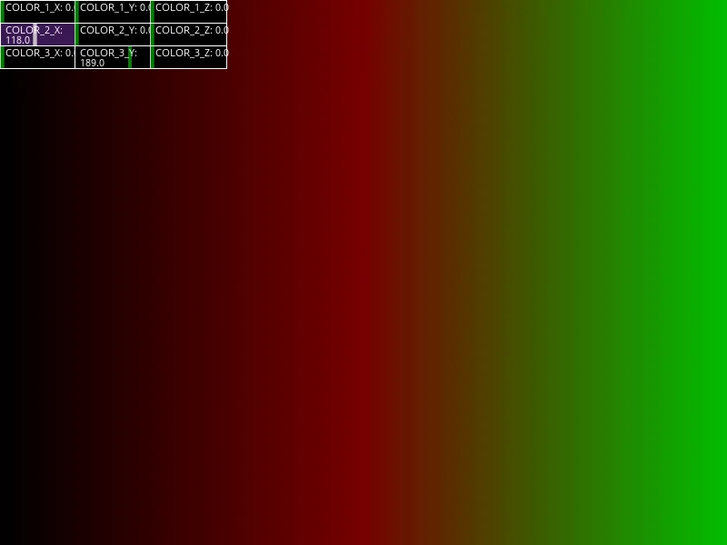
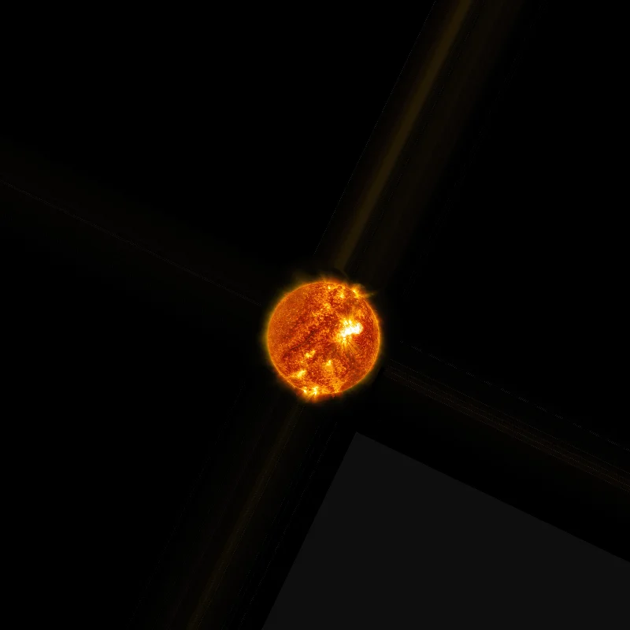
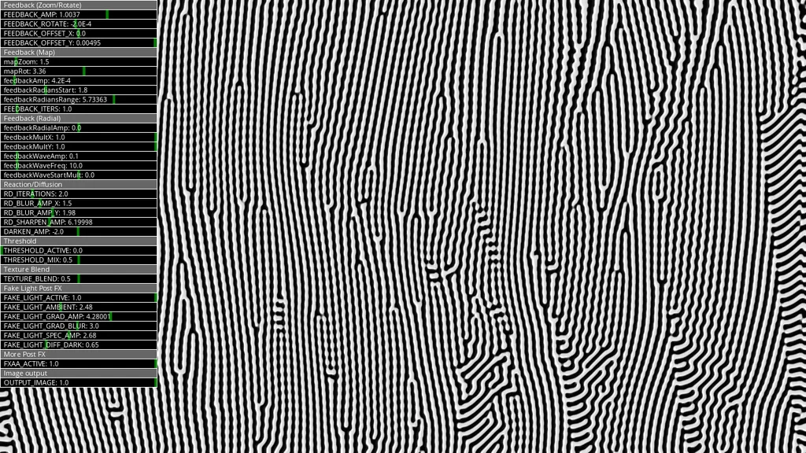
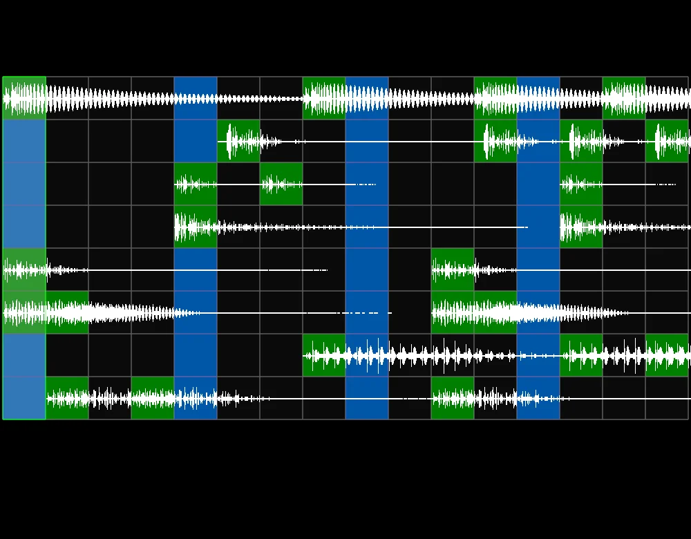

# Haxademic Demo Images
These images are auto-exported from the Haxademic demos. They serve as a reminder of what the demos look like, and may be used in the Haxademic documentation.

## Images

### App

[com.haxademic.demo.app.Demo_PAppletHax_DemoScreenshot.java](https://github.com/cacheflowe/haxademic/blob/master/src/com/haxademic/demo/app/Demo_PAppletHax_DemoScreenshot.java)

### Data

[com.haxademic.demo.data.Demo_AppStore.java](https://github.com/cacheflowe/haxademic/blob/master/src/com/haxademic/demo/data/Demo_AppStore.java)

[com.haxademic.demo.data.Demo_AppStoreDistributed.java](https://github.com/cacheflowe/haxademic/blob/master/src/com/haxademic/demo/data/Demo_AppStoreDistributed.java)

[com.haxademic.demo.data.Demo_ConvertUtil.java](https://github.com/cacheflowe/haxademic/blob/master/src/com/haxademic/demo/data/Demo_ConvertUtil.java)

### Draw > Color

[com.haxademic.demo.draw.color.Demo_ColorUtil.java](https://github.com/cacheflowe/haxademic/blob/master/src/com/haxademic/demo/draw/color/Demo_ColorUtil.java)

[com.haxademic.demo.draw.color.Demo_ColorUtil_gradientComponent.java](https://github.com/cacheflowe/haxademic/blob/master/src/com/haxademic/demo/draw/color/Demo_ColorUtil_gradientComponent.java)

[com.haxademic.demo.draw.color.Demo_EasingColor.java](https://github.com/cacheflowe/haxademic/blob/master/src/com/haxademic/demo/draw/color/Demo_EasingColor.java)

[com.haxademic.demo.draw.color.Demo_GradientEdge.java](https://github.com/cacheflowe/haxademic/blob/master/src/com/haxademic/demo/draw/color/Demo_GradientEdge.java)

[com.haxademic.demo.draw.color.Demo_Gradients_Linear.java](https://github.com/cacheflowe/haxademic/blob/master/src/com/haxademic/demo/draw/color/Demo_Gradients_Linear.java)

[com.haxademic.demo.draw.color.Demo_Gradients_Quad.java](https://github.com/cacheflowe/haxademic/blob/master/src/com/haxademic/demo/draw/color/Demo_Gradients_Quad.java)

[com.haxademic.demo.draw.color.Demo_Gradients_Radial.java](https://github.com/cacheflowe/haxademic/blob/master/src/com/haxademic/demo/draw/color/Demo_Gradients_Radial.java)

[com.haxademic.demo.draw.color.Demo_Gradients_RadialBg.java](https://github.com/cacheflowe/haxademic/blob/master/src/com/haxademic/demo/draw/color/Demo_Gradients_RadialBg.java)

[com.haxademic.demo.draw.color.Demo_Gradients_SlidersRGB.java](https://github.com/cacheflowe/haxademic/blob/master/src/com/haxademic/demo/draw/color/Demo_Gradients_SlidersRGB.java)

### Draw > Context

[com.haxademic.demo.draw.context.Demo_Materials.java](https://github.com/cacheflowe/haxademic/blob/master/src/com/haxademic/demo/draw/context/Demo_Materials.java)

[com.haxademic.demo.draw.context.Demo_OpenGLUtil_setBlendMode.java](https://github.com/cacheflowe/haxademic/blob/master/src/com/haxademic/demo/draw/context/Demo_OpenGLUtil_setBlendMode.java)

[com.haxademic.demo.draw.context.Demo_OpenGLUtil_setBlendModeAll.java](https://github.com/cacheflowe/haxademic/blob/master/src/com/haxademic/demo/draw/context/Demo_OpenGLUtil_setBlendModeAll.java)

[com.haxademic.demo.draw.context.Demo_OrientationUtil.java](https://github.com/cacheflowe/haxademic/blob/master/src/com/haxademic/demo/draw/context/Demo_OrientationUtil.java)

[com.haxademic.demo.draw.context.Demo_PG_fadeToBlack.java](https://github.com/cacheflowe/haxademic/blob/master/src/com/haxademic/demo/draw/context/Demo_PG_fadeToBlack.java)

[com.haxademic.demo.draw.context.Demo_PG_feedback.java](https://github.com/cacheflowe/haxademic/blob/master/src/com/haxademic/demo/draw/context/Demo_PG_feedback.java)

[com.haxademic.demo.draw.context.Demo_PG_feedback2.java](https://github.com/cacheflowe/haxademic/blob/master/src/com/haxademic/demo/draw/context/Demo_PG_feedback2.java)

[com.haxademic.demo.draw.context.Demo_PG_pixelFlushPattern.java](https://github.com/cacheflowe/haxademic/blob/master/src/com/haxademic/demo/draw/context/Demo_PG_pixelFlushPattern.java)

### Draw > Filters > Shaders

[com.haxademic.demo.draw.filters.shaders.Demo_AllFilters.java](https://github.com/cacheflowe/haxademic/blob/master/src/com/haxademic/demo/draw/filters/shaders/Demo_AllFilters.java)

[com.haxademic.demo.draw.filters.shaders.Demo_Arcsine_PinchPoles_Shader.java](https://github.com/cacheflowe/haxademic/blob/master/src/com/haxademic/demo/draw/filters/shaders/Demo_Arcsine_PinchPoles_Shader.java)

[com.haxademic.demo.draw.filters.shaders.Demo_BloomEffectVanilla.java](https://github.com/cacheflowe/haxademic/blob/master/src/com/haxademic/demo/draw/filters/shaders/Demo_BloomEffectVanilla.java)

[com.haxademic.demo.draw.filters.shaders.Demo_BloomFilter.java](https://github.com/cacheflowe/haxademic/blob/master/src/com/haxademic/demo/draw/filters/shaders/Demo_BloomFilter.java)

[com.haxademic.demo.draw.filters.shaders.Demo_BlurHFilter_BlurVFilter_setBlurByPercent.java](https://github.com/cacheflowe/haxademic/blob/master/src/com/haxademic/demo/draw/filters/shaders/Demo_BlurHFilter_BlurVFilter_setBlurByPercent.java)

[com.haxademic.demo.draw.filters.shaders.Demo_ColorAdjustmentFilter.java](https://github.com/cacheflowe/haxademic/blob/master/src/com/haxademic/demo/draw/filters/shaders/Demo_ColorAdjustmentFilter.java)

[com.haxademic.demo.draw.filters.shaders.Demo_ColorBandingDither.java](https://github.com/cacheflowe/haxademic/blob/master/src/com/haxademic/demo/draw/filters/shaders/Demo_ColorBandingDither.java)

[com.haxademic.demo.draw.filters.shaders.Demo_DisplacementMapShader.java](https://github.com/cacheflowe/haxademic/blob/master/src/com/haxademic/demo/draw/filters/shaders/Demo_DisplacementMapShader.java)

[com.haxademic.demo.draw.filters.shaders.Demo_DitherFilter.java](https://github.com/cacheflowe/haxademic/blob/master/src/com/haxademic/demo/draw/filters/shaders/Demo_DitherFilter.java)

[com.haxademic.demo.draw.filters.shaders.Demo_FakeLightingFilter.java](https://github.com/cacheflowe/haxademic/blob/master/src/com/haxademic/demo/draw/filters/shaders/Demo_FakeLightingFilter.java)

[com.haxademic.demo.draw.filters.shaders.Demo_FeedbackMapShader.java](https://github.com/cacheflowe/haxademic/blob/master/src/com/haxademic/demo/draw/filters/shaders/Demo_FeedbackMapShader.java)

[com.haxademic.demo.draw.filters.shaders.Demo_FeedbackRadialShader.java](https://github.com/cacheflowe/haxademic/blob/master/src/com/haxademic/demo/draw/filters/shaders/Demo_FeedbackRadialShader.java)

[com.haxademic.demo.draw.filters.shaders.Demo_FeedbackRadialToAlpha.java](https://github.com/cacheflowe/haxademic/blob/master/src/com/haxademic/demo/draw/filters/shaders/Demo_FeedbackRadialToAlpha.java)

[com.haxademic.demo.draw.filters.shaders.Demo_GlitchSuite.java](https://github.com/cacheflowe/haxademic/blob/master/src/com/haxademic/demo/draw/filters/shaders/Demo_GlitchSuite.java)

[com.haxademic.demo.draw.filters.shaders.Demo_GlowShader.java](https://github.com/cacheflowe/haxademic/blob/master/src/com/haxademic/demo/draw/filters/shaders/Demo_GlowShader.java)

[com.haxademic.demo.draw.filters.shaders.Demo_GLSLTransitions.java](https://github.com/cacheflowe/haxademic/blob/master/src/com/haxademic/demo/draw/filters/shaders/Demo_GLSLTransitions.java)

[com.haxademic.demo.draw.filters.shaders.Demo_JumpFlood_SDF.java](https://github.com/cacheflowe/haxademic/blob/master/src/com/haxademic/demo/draw/filters/shaders/Demo_JumpFlood_SDF.java)

[com.haxademic.demo.draw.filters.shaders.Demo_PImageShaderContained.java](https://github.com/cacheflowe/haxademic/blob/master/src/com/haxademic/demo/draw/filters/shaders/Demo_PImageShaderContained.java)

[com.haxademic.demo.draw.filters.shaders.Demo_PoissonFill.java](https://github.com/cacheflowe/haxademic/blob/master/src/com/haxademic/demo/draw/filters/shaders/Demo_PoissonFill.java)

[com.haxademic.demo.draw.filters.shaders.Demo_PShaderHotSwap_Denoise.java](https://github.com/cacheflowe/haxademic/blob/master/src/com/haxademic/demo/draw/filters/shaders/Demo_PShaderHotSwap_Denoise.java)

[com.haxademic.demo.draw.filters.shaders.Demo_PShaderHotSwap_Filter.java](https://github.com/cacheflowe/haxademic/blob/master/src/com/haxademic/demo/draw/filters/shaders/Demo_PShaderHotSwap_Filter.java)

[com.haxademic.demo.draw.filters.shaders.Demo_PShaderHotSwap_Frag.java](https://github.com/cacheflowe/haxademic/blob/master/src/com/haxademic/demo/draw/filters/shaders/Demo_PShaderHotSwap_Frag.java)

[com.haxademic.demo.draw.filters.shaders.Demo_ReactionDiffusionStepFilter.java](https://github.com/cacheflowe/haxademic/blob/master/src/com/haxademic/demo/draw/filters/shaders/Demo_ReactionDiffusionStepFilter.java)

[com.haxademic.demo.draw.filters.shaders.Demo_RotateFilter.java](https://github.com/cacheflowe/haxademic/blob/master/src/com/haxademic/demo/draw/filters/shaders/Demo_RotateFilter.java)

[com.haxademic.demo.draw.filters.shaders.Demo_Saturate.java](https://github.com/cacheflowe/haxademic/blob/master/src/com/haxademic/demo/draw/filters/shaders/Demo_Saturate.java)

[com.haxademic.demo.draw.filters.shaders.Demo_ToneMappingFilter.java](https://github.com/cacheflowe/haxademic/blob/master/src/com/haxademic/demo/draw/filters/shaders/Demo_ToneMappingFilter.java)

[com.haxademic.demo.draw.filters.shaders.Demo_ToneMappingFilter_Test.java](https://github.com/cacheflowe/haxademic/blob/master/src/com/haxademic/demo/draw/filters/shaders/Demo_ToneMappingFilter_Test.java)

### Draw > Image

[com.haxademic.demo.draw.image.Demo_Fluid.java](https://github.com/cacheflowe/haxademic/blob/master/src/com/haxademic/demo/draw/image/Demo_Fluid.java)

[com.haxademic.demo.draw.image.Demo_FluidGPU.java](https://github.com/cacheflowe/haxademic/blob/master/src/com/haxademic/demo/draw/image/Demo_FluidGPU.java)

[com.haxademic.demo.draw.image.Demo_FractalBrownianMotion.java](https://github.com/cacheflowe/haxademic/blob/master/src/com/haxademic/demo/draw/image/Demo_FractalBrownianMotion.java)

[com.haxademic.demo.draw.image.Demo_GridHelper.java](https://github.com/cacheflowe/haxademic/blob/master/src/com/haxademic/demo/draw/image/Demo_GridHelper.java)

[com.haxademic.demo.draw.image.Demo_ImageCyclerBuffer.java](https://github.com/cacheflowe/haxademic/blob/master/src/com/haxademic/demo/draw/image/Demo_ImageCyclerBuffer.java)

[com.haxademic.demo.draw.image.Demo_ImageFramesHistory.java](https://github.com/cacheflowe/haxademic/blob/master/src/com/haxademic/demo/draw/image/Demo_ImageFramesHistory.java)

[com.haxademic.demo.draw.image.Demo_ImageSequenceMovieClip.java](https://github.com/cacheflowe/haxademic/blob/master/src/com/haxademic/demo/draw/image/Demo_ImageSequenceMovieClip.java)

[com.haxademic.demo.draw.image.Demo_ImageSequenceMovieClip_AdvancedControls.java](https://github.com/cacheflowe/haxademic/blob/master/src/com/haxademic/demo/draw/image/Demo_ImageSequenceMovieClip_AdvancedControls.java)

[com.haxademic.demo.draw.image.Demo_ImageSequenceMovieClip_DrawInterpolatedFrames.java](https://github.com/cacheflowe/haxademic/blob/master/src/com/haxademic/demo/draw/image/Demo_ImageSequenceMovieClip_DrawInterpolatedFrames.java)

[com.haxademic.demo.draw.image.Demo_ImageSequenceRecorder.java](https://github.com/cacheflowe/haxademic/blob/master/src/com/haxademic/demo/draw/image/Demo_ImageSequenceRecorder.java)

[com.haxademic.demo.draw.image.Demo_ImageUtil_blurByRescale.java](https://github.com/cacheflowe/haxademic/blob/master/src/com/haxademic/demo/draw/image/Demo_ImageUtil_blurByRescale.java)

[com.haxademic.demo.draw.image.Demo_ImageUtil_copyImageVsCopyShader.java](https://github.com/cacheflowe/haxademic/blob/master/src/com/haxademic/demo/draw/image/Demo_ImageUtil_copyImageVsCopyShader.java)

[com.haxademic.demo.draw.image.Demo_ImageUtil_cropFillCopyImage.java](https://github.com/cacheflowe/haxademic/blob/master/src/com/haxademic/demo/draw/image/Demo_ImageUtil_cropFillCopyImage.java)

[com.haxademic.demo.draw.image.Demo_ImageUtil_drawImageCropFill.java](https://github.com/cacheflowe/haxademic/blob/master/src/com/haxademic/demo/draw/image/Demo_ImageUtil_drawImageCropFill.java)

[com.haxademic.demo.draw.image.Demo_ImageUtil_getPixel.java](https://github.com/cacheflowe/haxademic/blob/master/src/com/haxademic/demo/draw/image/Demo_ImageUtil_getPixel.java)

[com.haxademic.demo.draw.image.Demo_ImageUtil_imageCroppedEmptySpace.java](https://github.com/cacheflowe/haxademic/blob/master/src/com/haxademic/demo/draw/image/Demo_ImageUtil_imageCroppedEmptySpace.java)

[com.haxademic.demo.draw.image.Demo_ImageUtil_imageCroppedEmptySpace2.java](https://github.com/cacheflowe/haxademic/blob/master/src/com/haxademic/demo/draw/image/Demo_ImageUtil_imageCroppedEmptySpace2.java)

[com.haxademic.demo.draw.image.Demo_Mask.java](https://github.com/cacheflowe/haxademic/blob/master/src/com/haxademic/demo/draw/image/Demo_Mask.java)

[com.haxademic.demo.draw.image.Demo_MaskConcentric.java](https://github.com/cacheflowe/haxademic/blob/master/src/com/haxademic/demo/draw/image/Demo_MaskConcentric.java)

[com.haxademic.demo.draw.image.Demo_MaskSliderFilter.java](https://github.com/cacheflowe/haxademic/blob/master/src/com/haxademic/demo/draw/image/Demo_MaskSliderFilter.java)

[com.haxademic.demo.draw.image.Demo_MotionBlurPGraphics.java](https://github.com/cacheflowe/haxademic/blob/master/src/com/haxademic/demo/draw/image/Demo_MotionBlurPGraphics.java)

[com.haxademic.demo.draw.image.Demo_ReactionDiffusionBlobDetection.java](https://github.com/cacheflowe/haxademic/blob/master/src/com/haxademic/demo/draw/image/Demo_ReactionDiffusionBlobDetection.java)

[com.haxademic.demo.draw.image.Demo_ReactionDiffusionZoom.java](https://github.com/cacheflowe/haxademic/blob/master/src/com/haxademic/demo/draw/image/Demo_ReactionDiffusionZoom.java)

[com.haxademic.demo.draw.image.Demo_ReactionDiffusion_SpinnerSeed.java](https://github.com/cacheflowe/haxademic/blob/master/src/com/haxademic/demo/draw/image/Demo_ReactionDiffusion_SpinnerSeed.java)

[com.haxademic.demo.draw.image.Demo_ReactionDiffusion_UI.java](https://github.com/cacheflowe/haxademic/blob/master/src/com/haxademic/demo/draw/image/Demo_ReactionDiffusion_UI.java)

[com.haxademic.demo.draw.image.Demo_TickerScroller.java](https://github.com/cacheflowe/haxademic/blob/master/src/com/haxademic/demo/draw/image/Demo_TickerScroller.java)

[com.haxademic.demo.draw.image.Demo_TickerScrollerGradient.java](https://github.com/cacheflowe/haxademic/blob/master/src/com/haxademic/demo/draw/image/Demo_TickerScrollerGradient.java)

[com.haxademic.demo.draw.image.Demo_TiledGrid.java](https://github.com/cacheflowe/haxademic/blob/master/src/com/haxademic/demo/draw/image/Demo_TiledGrid.java)

[com.haxademic.demo.draw.image.Demo_TiledTexture_Grid.java](https://github.com/cacheflowe/haxademic/blob/master/src/com/haxademic/demo/draw/image/Demo_TiledTexture_Grid.java)

### Draw > Mapping

[com.haxademic.demo.draw.mapping.Demo_ImageUtil_drawTextureMappedRect.java](https://github.com/cacheflowe/haxademic/blob/master/src/com/haxademic/demo/draw/mapping/Demo_ImageUtil_drawTextureMappedRect.java)

[com.haxademic.demo.draw.mapping.Demo_ImageUtil_drawTextureMappedRectAdvanced.java](https://github.com/cacheflowe/haxademic/blob/master/src/com/haxademic/demo/draw/mapping/Demo_ImageUtil_drawTextureMappedRectAdvanced.java)

[com.haxademic.demo.draw.mapping.Demo_PGraphicsKeystone_Basic.java](https://github.com/cacheflowe/haxademic/blob/master/src/com/haxademic/demo/draw/mapping/Demo_PGraphicsKeystone_Basic.java)

[com.haxademic.demo.draw.mapping.Demo_PGraphicsKeystone_DualProjector.java](https://github.com/cacheflowe/haxademic/blob/master/src/com/haxademic/demo/draw/mapping/Demo_PGraphicsKeystone_DualProjector.java)

[com.haxademic.demo.draw.mapping.Demo_PGraphicsKeystone_Fine.java](https://github.com/cacheflowe/haxademic/blob/master/src/com/haxademic/demo/draw/mapping/Demo_PGraphicsKeystone_Fine.java)

[com.haxademic.demo.draw.mapping.Demo_PGraphicsKeystone_Grid.java](https://github.com/cacheflowe/haxademic/blob/master/src/com/haxademic/demo/draw/mapping/Demo_PGraphicsKeystone_Grid.java)

[com.haxademic.demo.draw.mapping.Demo_PGraphicsKeystone_MappedShader.java](https://github.com/cacheflowe/haxademic/blob/master/src/com/haxademic/demo/draw/mapping/Demo_PGraphicsKeystone_MappedShader.java)

[com.haxademic.demo.draw.mapping.Demo_PGraphicsKeystone_MappedShader_TwoTextures.java](https://github.com/cacheflowe/haxademic/blob/master/src/com/haxademic/demo/draw/mapping/Demo_PGraphicsKeystone_MappedShader_TwoTextures.java)

[com.haxademic.demo.draw.mapping.Demo_PGraphicsKeystone_TextureUV.java](https://github.com/cacheflowe/haxademic/blob/master/src/com/haxademic/demo/draw/mapping/Demo_PGraphicsKeystone_TextureUV.java)

[com.haxademic.demo.draw.mapping.Demo_SavedPointUI.java](https://github.com/cacheflowe/haxademic/blob/master/src/com/haxademic/demo/draw/mapping/Demo_SavedPointUI.java)

[com.haxademic.demo.draw.mapping.Demo_Shapes_halfCircleUV.java](https://github.com/cacheflowe/haxademic/blob/master/src/com/haxademic/demo/draw/mapping/Demo_Shapes_halfCircleUV.java)

[com.haxademic.demo.draw.mapping.Demo_TextureToFourSurfaceProjection.java](https://github.com/cacheflowe/haxademic/blob/master/src/com/haxademic/demo/draw/mapping/Demo_TextureToFourSurfaceProjection.java)

### Draw > Particle

[com.haxademic.demo.draw.particle.Demo_ConfettiExplosion.java](https://github.com/cacheflowe/haxademic/blob/master/src/com/haxademic/demo/draw/particle/Demo_ConfettiExplosion.java)

[com.haxademic.demo.draw.particle.Demo_Flocking3DAttractors.java](https://github.com/cacheflowe/haxademic/blob/master/src/com/haxademic/demo/draw/particle/Demo_Flocking3DAttractors.java)

[com.haxademic.demo.draw.particle.Demo_ForceDirectedLayout.java](https://github.com/cacheflowe/haxademic/blob/master/src/com/haxademic/demo/draw/particle/Demo_ForceDirectedLayout.java)

[com.haxademic.demo.draw.particle.Demo_ParticleSystem3d.java](https://github.com/cacheflowe/haxademic/blob/master/src/com/haxademic/demo/draw/particle/Demo_ParticleSystem3d.java)

[com.haxademic.demo.draw.particle.Demo_ParticleSystem3dShadow.java](https://github.com/cacheflowe/haxademic/blob/master/src/com/haxademic/demo/draw/particle/Demo_ParticleSystem3dShadow.java)

[com.haxademic.demo.draw.particle.Demo_ParticleSystemSwirl.java](https://github.com/cacheflowe/haxademic/blob/master/src/com/haxademic/demo/draw/particle/Demo_ParticleSystemSwirl.java)

[com.haxademic.demo.draw.particle.Demo_ParticleSystem_Custom.java](https://github.com/cacheflowe/haxademic/blob/master/src/com/haxademic/demo/draw/particle/Demo_ParticleSystem_Custom.java)

[com.haxademic.demo.draw.particle.Demo_ParticleSystem_Custom_ImageSequenceFloatUp.java](https://github.com/cacheflowe/haxademic/blob/master/src/com/haxademic/demo/draw/particle/Demo_ParticleSystem_Custom_ImageSequenceFloatUp.java)

[com.haxademic.demo.draw.particle.Demo_ParticleSystem_FromMap.java](https://github.com/cacheflowe/haxademic/blob/master/src/com/haxademic/demo/draw/particle/Demo_ParticleSystem_FromMap.java)

[com.haxademic.demo.draw.particle.Demo_VectorField.java](https://github.com/cacheflowe/haxademic/blob/master/src/com/haxademic/demo/draw/particle/Demo_VectorField.java)

[com.haxademic.demo.draw.particle.Demo_VectorFlyer.java](https://github.com/cacheflowe/haxademic/blob/master/src/com/haxademic/demo/draw/particle/Demo_VectorFlyer.java)

[com.haxademic.demo.draw.particle.Demo_VectorFlyer_PShapeTrail.java](https://github.com/cacheflowe/haxademic/blob/master/src/com/haxademic/demo/draw/particle/Demo_VectorFlyer_PShapeTrail.java)

### Draw > Shapes

[com.haxademic.demo.draw.shapes.Demo_3dInfiniteRunScene.java](https://github.com/cacheflowe/haxademic/blob/master/src/com/haxademic/demo/draw/shapes/Demo_3dInfiniteRunScene.java)

[com.haxademic.demo.draw.shapes.Demo_Arc_PieCursor.java](https://github.com/cacheflowe/haxademic/blob/master/src/com/haxademic/demo/draw/shapes/Demo_Arc_PieCursor.java)

[com.haxademic.demo.draw.shapes.Demo_CubeShatter.java](https://github.com/cacheflowe/haxademic/blob/master/src/com/haxademic/demo/draw/shapes/Demo_CubeShatter.java)

[com.haxademic.demo.draw.shapes.Demo_Extrude2dPoints.java](https://github.com/cacheflowe/haxademic/blob/master/src/com/haxademic/demo/draw/shapes/Demo_Extrude2dPoints.java)

[com.haxademic.demo.draw.shapes.Demo_GroupOfBoxesOrthoUVTexture.java](https://github.com/cacheflowe/haxademic/blob/master/src/com/haxademic/demo/draw/shapes/Demo_GroupOfBoxesOrthoUVTexture.java)

[com.haxademic.demo.draw.shapes.Demo_Icosahedron.java](https://github.com/cacheflowe/haxademic/blob/master/src/com/haxademic/demo/draw/shapes/Demo_Icosahedron.java)

[com.haxademic.demo.draw.shapes.Demo_Icosahedron_Basic.java](https://github.com/cacheflowe/haxademic/blob/master/src/com/haxademic/demo/draw/shapes/Demo_Icosahedron_Basic.java)

[com.haxademic.demo.draw.shapes.Demo_ImageTo3D.java](https://github.com/cacheflowe/haxademic/blob/master/src/com/haxademic/demo/draw/shapes/Demo_ImageTo3D.java)

[com.haxademic.demo.draw.shapes.Demo_LineTrail.java](https://github.com/cacheflowe/haxademic/blob/master/src/com/haxademic/demo/draw/shapes/Demo_LineTrail.java)

[com.haxademic.demo.draw.shapes.Demo_LineTrailPShape.java](https://github.com/cacheflowe/haxademic/blob/master/src/com/haxademic/demo/draw/shapes/Demo_LineTrailPShape.java)

[com.haxademic.demo.draw.shapes.Demo_Lissajous_Shapes.java](https://github.com/cacheflowe/haxademic/blob/master/src/com/haxademic/demo/draw/shapes/Demo_Lissajous_Shapes.java)

[com.haxademic.demo.draw.shapes.Demo_LorenzAttractor.java](https://github.com/cacheflowe/haxademic/blob/master/src/com/haxademic/demo/draw/shapes/Demo_LorenzAttractor.java)

[com.haxademic.demo.draw.shapes.Demo_MarchingCubes.java](https://github.com/cacheflowe/haxademic/blob/master/src/com/haxademic/demo/draw/shapes/Demo_MarchingCubes.java)

[com.haxademic.demo.draw.shapes.Demo_MeshShapes.java](https://github.com/cacheflowe/haxademic/blob/master/src/com/haxademic/demo/draw/shapes/Demo_MeshShapes.java)

[com.haxademic.demo.draw.shapes.Demo_PShapeSolid.java](https://github.com/cacheflowe/haxademic/blob/master/src/com/haxademic/demo/draw/shapes/Demo_PShapeSolid.java)

[com.haxademic.demo.draw.shapes.Demo_PShapeTransparentTexture.java](https://github.com/cacheflowe/haxademic/blob/master/src/com/haxademic/demo/draw/shapes/Demo_PShapeTransparentTexture.java)

[com.haxademic.demo.draw.shapes.Demo_PShapeUtil_createBasicPShape.java](https://github.com/cacheflowe/haxademic/blob/master/src/com/haxademic/demo/draw/shapes/Demo_PShapeUtil_createBasicPShape.java)

[com.haxademic.demo.draw.shapes.Demo_PShapeUtil_createExtrudedShape.java](https://github.com/cacheflowe/haxademic/blob/master/src/com/haxademic/demo/draw/shapes/Demo_PShapeUtil_createExtrudedShape.java)

[com.haxademic.demo.draw.shapes.Demo_PShapeUtil_exportMesh.java](https://github.com/cacheflowe/haxademic/blob/master/src/com/haxademic/demo/draw/shapes/Demo_PShapeUtil_exportMesh.java)

[com.haxademic.demo.draw.shapes.Demo_PShapeUtil_getSubShapeByColor.java](https://github.com/cacheflowe/haxademic/blob/master/src/com/haxademic/demo/draw/shapes/Demo_PShapeUtil_getSubShapeByColor.java)

[com.haxademic.demo.draw.shapes.Demo_PShapeUtil_meshFlipOnAxis.java](https://github.com/cacheflowe/haxademic/blob/master/src/com/haxademic/demo/draw/shapes/Demo_PShapeUtil_meshFlipOnAxis.java)

[com.haxademic.demo.draw.shapes.Demo_PShapeUtil_meshRotateOnAxis.java](https://github.com/cacheflowe/haxademic/blob/master/src/com/haxademic/demo/draw/shapes/Demo_PShapeUtil_meshRotateOnAxis.java)

[com.haxademic.demo.draw.shapes.Demo_PShapeUtil_meshShapeToPointsShape.java](https://github.com/cacheflowe/haxademic/blob/master/src/com/haxademic/demo/draw/shapes/Demo_PShapeUtil_meshShapeToPointsShape.java)

[com.haxademic.demo.draw.shapes.Demo_PShapeUtil_OBJLoaderCustomVertColors.java](https://github.com/cacheflowe/haxademic/blob/master/src/com/haxademic/demo/draw/shapes/Demo_PShapeUtil_OBJLoaderCustomVertColors.java)

[com.haxademic.demo.draw.shapes.Demo_PShapeUtil_OBJLoaderRegistrationMeasurement.java](https://github.com/cacheflowe/haxademic/blob/master/src/com/haxademic/demo/draw/shapes/Demo_PShapeUtil_OBJLoaderRegistrationMeasurement.java)

[com.haxademic.demo.draw.shapes.Demo_PShapeUtil_OBJNormalizationAndTexturing.java](https://github.com/cacheflowe/haxademic/blob/master/src/com/haxademic/demo/draw/shapes/Demo_PShapeUtil_OBJNormalizationAndTexturing.java)

[com.haxademic.demo.draw.shapes.Demo_PShapeUtil_rayIntersectsTriangle.java](https://github.com/cacheflowe/haxademic/blob/master/src/com/haxademic/demo/draw/shapes/Demo_PShapeUtil_rayIntersectsTriangle.java)

[com.haxademic.demo.draw.shapes.Demo_PShapeUtil_rayIntersectsTriangle_VoxelizeMesh.java](https://github.com/cacheflowe/haxademic/blob/master/src/com/haxademic/demo/draw/shapes/Demo_PShapeUtil_rayIntersectsTriangle_VoxelizeMesh.java)

[com.haxademic.demo.draw.shapes.Demo_PShapeUtil_setMaterialColor.java](https://github.com/cacheflowe/haxademic/blob/master/src/com/haxademic/demo/draw/shapes/Demo_PShapeUtil_setMaterialColor.java)

[com.haxademic.demo.draw.shapes.Demo_PShapeUtil_setShapeMaterialTransparent.java](https://github.com/cacheflowe/haxademic/blob/master/src/com/haxademic/demo/draw/shapes/Demo_PShapeUtil_setShapeMaterialTransparent.java)

[com.haxademic.demo.draw.shapes.Demo_PShapeUtil_shapeFromImage.java](https://github.com/cacheflowe/haxademic/blob/master/src/com/haxademic/demo/draw/shapes/Demo_PShapeUtil_shapeFromImage.java)

[com.haxademic.demo.draw.shapes.Demo_PShapeUtil_svgExtrudedChildren.java](https://github.com/cacheflowe/haxademic/blob/master/src/com/haxademic/demo/draw/shapes/Demo_PShapeUtil_svgExtrudedChildren.java)

[com.haxademic.demo.draw.shapes.Demo_PShapeUtil_SVGNormalizationAndTexturing.java](https://github.com/cacheflowe/haxademic/blob/master/src/com/haxademic/demo/draw/shapes/Demo_PShapeUtil_SVGNormalizationAndTexturing.java)

[com.haxademic.demo.draw.shapes.Demo_PShapeUtil_svgTesselationRepair.java](https://github.com/cacheflowe/haxademic/blob/master/src/com/haxademic/demo/draw/shapes/Demo_PShapeUtil_svgTesselationRepair.java)

[com.haxademic.demo.draw.shapes.Demo_PShapeUtil_svgToTexturedExtrusion.java](https://github.com/cacheflowe/haxademic/blob/master/src/com/haxademic/demo/draw/shapes/Demo_PShapeUtil_svgToTexturedExtrusion.java)

[com.haxademic.demo.draw.shapes.Demo_PShapeUtil_svgToUniformPointsShape.java](https://github.com/cacheflowe/haxademic/blob/master/src/com/haxademic/demo/draw/shapes/Demo_PShapeUtil_svgToUniformPointsShape.java)

[com.haxademic.demo.draw.shapes.Demo_PShapeUtil_svgToUniformPointsShape2.java](https://github.com/cacheflowe/haxademic/blob/master/src/com/haxademic/demo/draw/shapes/Demo_PShapeUtil_svgToUniformPointsShape2.java)

[com.haxademic.demo.draw.shapes.Demo_PShapeUtil_verticalTwistShape.java](https://github.com/cacheflowe/haxademic/blob/master/src/com/haxademic/demo/draw/shapes/Demo_PShapeUtil_verticalTwistShape.java)

[com.haxademic.demo.draw.shapes.Demo_PShape_cachedCustomShape.java](https://github.com/cacheflowe/haxademic/blob/master/src/com/haxademic/demo/draw/shapes/Demo_PShape_cachedCustomShape.java)

[com.haxademic.demo.draw.shapes.Demo_PShape_perfTest.java](https://github.com/cacheflowe/haxademic/blob/master/src/com/haxademic/demo/draw/shapes/Demo_PShape_perfTest.java)

[com.haxademic.demo.draw.shapes.Demo_PShape_textureMappedCylinderOfSpheres.java](https://github.com/cacheflowe/haxademic/blob/master/src/com/haxademic/demo/draw/shapes/Demo_PShape_textureMappedCylinderOfSpheres.java)

[com.haxademic.demo.draw.shapes.Demo_RandomUVCoordsConstrained.java](https://github.com/cacheflowe/haxademic/blob/master/src/com/haxademic/demo/draw/shapes/Demo_RandomUVCoordsConstrained.java)

[com.haxademic.demo.draw.shapes.Demo_Shapes_boxBetween.java](https://github.com/cacheflowe/haxademic/blob/master/src/com/haxademic/demo/draw/shapes/Demo_Shapes_boxBetween.java)

[com.haxademic.demo.draw.shapes.Demo_Shapes_createCan.java](https://github.com/cacheflowe/haxademic/blob/master/src/com/haxademic/demo/draw/shapes/Demo_Shapes_createCan.java)

[com.haxademic.demo.draw.shapes.Demo_Shapes_createDisc.java](https://github.com/cacheflowe/haxademic/blob/master/src/com/haxademic/demo/draw/shapes/Demo_Shapes_createDisc.java)

[com.haxademic.demo.draw.shapes.Demo_Shapes_createDisc3d.java](https://github.com/cacheflowe/haxademic/blob/master/src/com/haxademic/demo/draw/shapes/Demo_Shapes_createDisc3d.java)

[com.haxademic.demo.draw.shapes.Demo_Shapes_createStrip.java](https://github.com/cacheflowe/haxademic/blob/master/src/com/haxademic/demo/draw/shapes/Demo_Shapes_createStrip.java)

[com.haxademic.demo.draw.shapes.Demo_Shapes_createTorus.java](https://github.com/cacheflowe/haxademic/blob/master/src/com/haxademic/demo/draw/shapes/Demo_Shapes_createTorus.java)

[com.haxademic.demo.draw.shapes.Demo_Shapes_createTorusMatcap.java](https://github.com/cacheflowe/haxademic/blob/master/src/com/haxademic/demo/draw/shapes/Demo_Shapes_createTorusMatcap.java)

[com.haxademic.demo.draw.shapes.Demo_Shapes_drawCylinder.java](https://github.com/cacheflowe/haxademic/blob/master/src/com/haxademic/demo/draw/shapes/Demo_Shapes_drawCylinder.java)

[com.haxademic.demo.draw.shapes.Demo_Shapes_drawDashedCircle.java](https://github.com/cacheflowe/haxademic/blob/master/src/com/haxademic/demo/draw/shapes/Demo_Shapes_drawDashedCircle.java)

[com.haxademic.demo.draw.shapes.Demo_Shapes_drawDashedCube.java](https://github.com/cacheflowe/haxademic/blob/master/src/com/haxademic/demo/draw/shapes/Demo_Shapes_drawDashedCube.java)

[com.haxademic.demo.draw.shapes.Demo_Shapes_drawDashedLine_Basic.java](https://github.com/cacheflowe/haxademic/blob/master/src/com/haxademic/demo/draw/shapes/Demo_Shapes_drawDashedLine_Basic.java)

[com.haxademic.demo.draw.shapes.Demo_Shapes_drawDashedLine_Grid.java](https://github.com/cacheflowe/haxademic/blob/master/src/com/haxademic/demo/draw/shapes/Demo_Shapes_drawDashedLine_Grid.java)

[com.haxademic.demo.draw.shapes.Demo_Shapes_drawDashedLine_Pyramid.java](https://github.com/cacheflowe/haxademic/blob/master/src/com/haxademic/demo/draw/shapes/Demo_Shapes_drawDashedLine_Pyramid.java)

[com.haxademic.demo.draw.shapes.Demo_Shapes_drawDashedLine_Radial.java](https://github.com/cacheflowe/haxademic/blob/master/src/com/haxademic/demo/draw/shapes/Demo_Shapes_drawDashedLine_Radial.java)

[com.haxademic.demo.draw.shapes.Demo_Shapes_drawDashedLine_Wave.java](https://github.com/cacheflowe/haxademic/blob/master/src/com/haxademic/demo/draw/shapes/Demo_Shapes_drawDashedLine_Wave.java)

[com.haxademic.demo.draw.shapes.Demo_Shapes_drawDisc.java](https://github.com/cacheflowe/haxademic/blob/master/src/com/haxademic/demo/draw/shapes/Demo_Shapes_drawDisc.java)

[com.haxademic.demo.draw.shapes.Demo_Shapes_drawDisc2.java](https://github.com/cacheflowe/haxademic/blob/master/src/com/haxademic/demo/draw/shapes/Demo_Shapes_drawDisc2.java)

[com.haxademic.demo.draw.shapes.Demo_Shapes_drawDiscAudio.java](https://github.com/cacheflowe/haxademic/blob/master/src/com/haxademic/demo/draw/shapes/Demo_Shapes_drawDiscAudio.java)

[com.haxademic.demo.draw.shapes.Demo_Shapes_drawSphereWithQuads.java](https://github.com/cacheflowe/haxademic/blob/master/src/com/haxademic/demo/draw/shapes/Demo_Shapes_drawSphereWithQuads.java)

[com.haxademic.demo.draw.shapes.Demo_Shapes_drawTexturedCube.java](https://github.com/cacheflowe/haxademic/blob/master/src/com/haxademic/demo/draw/shapes/Demo_Shapes_drawTexturedCube.java)

[com.haxademic.demo.draw.shapes.Demo_Shapes_drawTexturedLine.java](https://github.com/cacheflowe/haxademic/blob/master/src/com/haxademic/demo/draw/shapes/Demo_Shapes_drawTexturedLine.java)

[com.haxademic.demo.draw.shapes.Demo_Shapes_drawTexturedQuad.java](https://github.com/cacheflowe/haxademic/blob/master/src/com/haxademic/demo/draw/shapes/Demo_Shapes_drawTexturedQuad.java)

[com.haxademic.demo.draw.shapes.Demo_Shapes_originAxis.java](https://github.com/cacheflowe/haxademic/blob/master/src/com/haxademic/demo/draw/shapes/Demo_Shapes_originAxis.java)

[com.haxademic.demo.draw.shapes.Demo_SquiggleLine.java](https://github.com/cacheflowe/haxademic/blob/master/src/com/haxademic/demo/draw/shapes/Demo_SquiggleLine.java)

[com.haxademic.demo.draw.shapes.Demo_Superformula.java](https://github.com/cacheflowe/haxademic/blob/master/src/com/haxademic/demo/draw/shapes/Demo_Superformula.java)

[com.haxademic.demo.draw.shapes.Demo_Superformula2.java](https://github.com/cacheflowe/haxademic/blob/master/src/com/haxademic/demo/draw/shapes/Demo_Superformula2.java)

[com.haxademic.demo.draw.shapes.Demo_TextToPShape.java](https://github.com/cacheflowe/haxademic/blob/master/src/com/haxademic/demo/draw/shapes/Demo_TextToPShape.java)

[com.haxademic.demo.draw.shapes.Demo_TexturedPointSheet.java](https://github.com/cacheflowe/haxademic/blob/master/src/com/haxademic/demo/draw/shapes/Demo_TexturedPointSheet.java)

[com.haxademic.demo.draw.shapes.Demo_TexturedQuadVanilla.java](https://github.com/cacheflowe/haxademic/blob/master/src/com/haxademic/demo/draw/shapes/Demo_TexturedQuadVanilla.java)

[com.haxademic.demo.draw.shapes.Demo_TexturedStrips.java](https://github.com/cacheflowe/haxademic/blob/master/src/com/haxademic/demo/draw/shapes/Demo_TexturedStrips.java)

[com.haxademic.demo.draw.shapes.Demo_TexturedStripsPShape.java](https://github.com/cacheflowe/haxademic/blob/master/src/com/haxademic/demo/draw/shapes/Demo_TexturedStripsPShape.java)

[com.haxademic.demo.draw.shapes.Demo_VoronoiHoffs.java](https://github.com/cacheflowe/haxademic/blob/master/src/com/haxademic/demo/draw/shapes/Demo_VoronoiHoffs.java)

[com.haxademic.demo.draw.shapes.Demo_VoronoiHoffsCachedShapes.java](https://github.com/cacheflowe/haxademic/blob/master/src/com/haxademic/demo/draw/shapes/Demo_VoronoiHoffsCachedShapes.java)

[com.haxademic.demo.draw.shapes.Demo_VoxelSphere.java](https://github.com/cacheflowe/haxademic/blob/master/src/com/haxademic/demo/draw/shapes/Demo_VoxelSphere.java)

[com.haxademic.demo.draw.shapes.Demo_VoxelSphere2.java](https://github.com/cacheflowe/haxademic/blob/master/src/com/haxademic/demo/draw/shapes/Demo_VoxelSphere2.java)

### Draw > Shapes > Polygons

[com.haxademic.demo.draw.shapes.polygons.Demo_CollisionUtil.java](https://github.com/cacheflowe/haxademic/blob/master/src/com/haxademic/demo/draw/shapes/polygons/Demo_CollisionUtil.java)

[com.haxademic.demo.draw.shapes.polygons.Demo_Polygon.java](https://github.com/cacheflowe/haxademic/blob/master/src/com/haxademic/demo/draw/shapes/polygons/Demo_Polygon.java)

[com.haxademic.demo.draw.shapes.polygons.Demo_PolygonFill.java](https://github.com/cacheflowe/haxademic/blob/master/src/com/haxademic/demo/draw/shapes/polygons/Demo_PolygonFill.java)

[com.haxademic.demo.draw.shapes.polygons.Demo_RectangleSubdivision.java](https://github.com/cacheflowe/haxademic/blob/master/src/com/haxademic/demo/draw/shapes/polygons/Demo_RectangleSubdivision.java)

### Draw > Shapes > Shader

[com.haxademic.demo.draw.shapes.shader.Demo_BumpMap_Box.java](https://github.com/cacheflowe/haxademic/blob/master/src/com/haxademic/demo/draw/shapes/shader/Demo_BumpMap_Box.java)

[com.haxademic.demo.draw.shapes.shader.Demo_BumpMap_Plane.java](https://github.com/cacheflowe/haxademic/blob/master/src/com/haxademic/demo/draw/shapes/shader/Demo_BumpMap_Plane.java)

[com.haxademic.demo.draw.shapes.shader.Demo_BumpMap_Sphere.java](https://github.com/cacheflowe/haxademic/blob/master/src/com/haxademic/demo/draw/shapes/shader/Demo_BumpMap_Sphere.java)

[com.haxademic.demo.draw.shapes.shader.Demo_DeformMesh2D.java](https://github.com/cacheflowe/haxademic/blob/master/src/com/haxademic/demo/draw/shapes/shader/Demo_DeformMesh2D.java)

[com.haxademic.demo.draw.shapes.shader.Demo_LightShaderAndToon.java](https://github.com/cacheflowe/haxademic/blob/master/src/com/haxademic/demo/draw/shapes/shader/Demo_LightShaderAndToon.java)

[com.haxademic.demo.draw.shapes.shader.Demo_LightShaderAndToon_Torus.java](https://github.com/cacheflowe/haxademic/blob/master/src/com/haxademic/demo/draw/shapes/shader/Demo_LightShaderAndToon_Torus.java)

[com.haxademic.demo.draw.shapes.shader.Demo_LinesDeformAndTextureFiler_Tunnel.java](https://github.com/cacheflowe/haxademic/blob/master/src/com/haxademic/demo/draw/shapes/shader/Demo_LinesDeformAndTextureFiler_Tunnel.java)

[com.haxademic.demo.draw.shapes.shader.Demo_LinesDeformAndTextureFilter.java](https://github.com/cacheflowe/haxademic/blob/master/src/com/haxademic/demo/draw/shapes/shader/Demo_LinesDeformAndTextureFilter.java)

[com.haxademic.demo.draw.shapes.shader.Demo_MatCap.java](https://github.com/cacheflowe/haxademic/blob/master/src/com/haxademic/demo/draw/shapes/shader/Demo_MatCap.java)

[com.haxademic.demo.draw.shapes.shader.Demo_MeshDeformAndTextureFilter_SimpleSheet.java](https://github.com/cacheflowe/haxademic/blob/master/src/com/haxademic/demo/draw/shapes/shader/Demo_MeshDeformAndTextureFilter_SimpleSheet.java)

[com.haxademic.demo.draw.shapes.shader.Demo_MeshDeformAndTextureFilter_SimpleSheetGravityHole.java](https://github.com/cacheflowe/haxademic/blob/master/src/com/haxademic/demo/draw/shapes/shader/Demo_MeshDeformAndTextureFilter_SimpleSheetGravityHole.java)

[com.haxademic.demo.draw.shapes.shader.Demo_MeshDeformAndTextureFilter_SimpleSheetTextureMatch.java](https://github.com/cacheflowe/haxademic/blob/master/src/com/haxademic/demo/draw/shapes/shader/Demo_MeshDeformAndTextureFilter_SimpleSheetTextureMatch.java)

[com.haxademic.demo.draw.shapes.shader.Demo_MeshDeformAndTextureFilter_SimpleSheetWireframe.java](https://github.com/cacheflowe/haxademic/blob/master/src/com/haxademic/demo/draw/shapes/shader/Demo_MeshDeformAndTextureFilter_SimpleSheetWireframe.java)

[com.haxademic.demo.draw.shapes.shader.Demo_MeshDeformAndTextureFilter_SimpleSheetWireframeTerrain.java](https://github.com/cacheflowe/haxademic/blob/master/src/com/haxademic/demo/draw/shapes/shader/Demo_MeshDeformAndTextureFilter_SimpleSheetWireframeTerrain.java)

[com.haxademic.demo.draw.shapes.shader.Demo_MeshDeformAndTextureFilter_SimpleSpherical.java](https://github.com/cacheflowe/haxademic/blob/master/src/com/haxademic/demo/draw/shapes/shader/Demo_MeshDeformAndTextureFilter_SimpleSpherical.java)

[com.haxademic.demo.draw.shapes.shader.Demo_MeshDeformAndTextureFilter_SVG.java](https://github.com/cacheflowe/haxademic/blob/master/src/com/haxademic/demo/draw/shapes/shader/Demo_MeshDeformAndTextureFilter_SVG.java)

[com.haxademic.demo.draw.shapes.shader.Demo_PointsDeformAndTextureFilter.java](https://github.com/cacheflowe/haxademic/blob/master/src/com/haxademic/demo/draw/shapes/shader/Demo_PointsDeformAndTextureFilter.java)

[com.haxademic.demo.draw.shapes.shader.Demo_PointsDeformAndTextureFilter_Simple.java](https://github.com/cacheflowe/haxademic/blob/master/src/com/haxademic/demo/draw/shapes/shader/Demo_PointsDeformAndTextureFilter_Simple.java)

[com.haxademic.demo.draw.shapes.shader.Demo_Sphere_EquirectangularRotate.java](https://github.com/cacheflowe/haxademic/blob/master/src/com/haxademic/demo/draw/shapes/shader/Demo_Sphere_EquirectangularRotate.java)

[com.haxademic.demo.draw.shapes.shader.Demo_TextToPShapeWobble.java](https://github.com/cacheflowe/haxademic/blob/master/src/com/haxademic/demo/draw/shapes/shader/Demo_TextToPShapeWobble.java)

[com.haxademic.demo.draw.shapes.shader.Demo_VertexShader_Fattener.java](https://github.com/cacheflowe/haxademic/blob/master/src/com/haxademic/demo/draw/shapes/shader/Demo_VertexShader_Fattener.java)

[com.haxademic.demo.draw.shapes.shader.Demo_VertexShader_GPUParticles.java](https://github.com/cacheflowe/haxademic/blob/master/src/com/haxademic/demo/draw/shapes/shader/Demo_VertexShader_GPUParticles.java)

[com.haxademic.demo.draw.shapes.shader.Demo_VertexShader_GPUParticlesLauncher.java](https://github.com/cacheflowe/haxademic/blob/master/src/com/haxademic/demo/draw/shapes/shader/Demo_VertexShader_GPUParticlesLauncher.java)

[com.haxademic.demo.draw.shapes.shader.Demo_VertexShader_GPUParticlesLauncher_DepthSilhouette.java](https://github.com/cacheflowe/haxademic/blob/master/src/com/haxademic/demo/draw/shapes/shader/Demo_VertexShader_GPUParticlesLauncher_DepthSilhouette.java)

[com.haxademic.demo.draw.shapes.shader.Demo_VertexShader_GPUParticlesLauncher_DepthSilhouette_Velocity.java](https://github.com/cacheflowe/haxademic/blob/master/src/com/haxademic/demo/draw/shapes/shader/Demo_VertexShader_GPUParticlesLauncher_DepthSilhouette_Velocity.java)

[com.haxademic.demo.draw.shapes.shader.Demo_VertexShader_GPUParticlesMoveShapes.java](https://github.com/cacheflowe/haxademic/blob/master/src/com/haxademic/demo/draw/shapes/shader/Demo_VertexShader_GPUParticlesMoveShapes.java)

[com.haxademic.demo.draw.shapes.shader.Demo_VertexShader_GPUParticlesMoveShapes_CubeOfCubes.java](https://github.com/cacheflowe/haxademic/blob/master/src/com/haxademic/demo/draw/shapes/shader/Demo_VertexShader_GPUParticlesMoveShapes_CubeOfCubes.java)

[com.haxademic.demo.draw.shapes.shader.Demo_VertexShader_GPUParticlesMoveShapes_DepthCamera.java](https://github.com/cacheflowe/haxademic/blob/master/src/com/haxademic/demo/draw/shapes/shader/Demo_VertexShader_GPUParticlesMoveShapes_DepthCamera.java)

[com.haxademic.demo.draw.shapes.shader.Demo_VertexShader_GPUParticlesSimpleCube.java](https://github.com/cacheflowe/haxademic/blob/master/src/com/haxademic/demo/draw/shapes/shader/Demo_VertexShader_GPUParticlesSimpleCube.java)

[com.haxademic.demo.draw.shapes.shader.Demo_VertexShader_GPUParticlesSnowAdvanced.java](https://github.com/cacheflowe/haxademic/blob/master/src/com/haxademic/demo/draw/shapes/shader/Demo_VertexShader_GPUParticlesSnowAdvanced.java)

[com.haxademic.demo.draw.shapes.shader.Demo_VertexShader_GPUParticlesTextureMapDeform_BROKEN.java](https://github.com/cacheflowe/haxademic/blob/master/src/com/haxademic/demo/draw/shapes/shader/Demo_VertexShader_GPUParticlesTextureMapDeform_BROKEN.java)

[com.haxademic.demo.draw.shapes.shader.Demo_VertexShader_GPUParticlesWarp.java](https://github.com/cacheflowe/haxademic/blob/master/src/com/haxademic/demo/draw/shapes/shader/Demo_VertexShader_GPUParticlesWarp.java)

[com.haxademic.demo.draw.shapes.shader.Demo_VertexShader_IcosaDeformByBrightness.java](https://github.com/cacheflowe/haxademic/blob/master/src/com/haxademic/demo/draw/shapes/shader/Demo_VertexShader_IcosaDeformByBrightness.java)

[com.haxademic.demo.draw.shapes.shader.Demo_VertexShader_LightsNoiseTest_WIP.java](https://github.com/cacheflowe/haxademic/blob/master/src/com/haxademic/demo/draw/shapes/shader/Demo_VertexShader_LightsNoiseTest_WIP.java)

[com.haxademic.demo.draw.shapes.shader.Demo_VertexShader_LightsTest_WIP.java](https://github.com/cacheflowe/haxademic/blob/master/src/com/haxademic/demo/draw/shapes/shader/Demo_VertexShader_LightsTest_WIP.java)

[com.haxademic.demo.draw.shapes.shader.Demo_VertexShader_PShaderCompiler_Rippleskin.java](https://github.com/cacheflowe/haxademic/blob/master/src/com/haxademic/demo/draw/shapes/shader/Demo_VertexShader_PShaderCompiler_Rippleskin.java)

[com.haxademic.demo.draw.shapes.shader.Demo_VertexShader_PShaderHotSwap.java](https://github.com/cacheflowe/haxademic/blob/master/src/com/haxademic/demo/draw/shapes/shader/Demo_VertexShader_PShaderHotSwap.java)

[com.haxademic.demo.draw.shapes.shader.Demo_VertexShader_ReloadGlslFiles.java](https://github.com/cacheflowe/haxademic/blob/master/src/com/haxademic/demo/draw/shapes/shader/Demo_VertexShader_ReloadGlslFiles.java)

[com.haxademic.demo.draw.shapes.shader.Demo_VertexShader_ReloadInlineGlsl_Rippleskin.java](https://github.com/cacheflowe/haxademic/blob/master/src/com/haxademic/demo/draw/shapes/shader/Demo_VertexShader_ReloadInlineGlsl_Rippleskin.java)

[com.haxademic.demo.draw.shapes.shader.Demo_VertexShader_SheetDeformVariableTexSize.java](https://github.com/cacheflowe/haxademic/blob/master/src/com/haxademic/demo/draw/shapes/shader/Demo_VertexShader_SheetDeformVariableTexSize.java)

[com.haxademic.demo.draw.shapes.shader.Demo_VertexShader_TracerstarTexturedShape.java](https://github.com/cacheflowe/haxademic/blob/master/src/com/haxademic/demo/draw/shapes/shader/Demo_VertexShader_TracerstarTexturedShape.java)

### Draw > Text

[com.haxademic.demo.draw.text.Demo_Clock.java](https://github.com/cacheflowe/haxademic/blob/master/src/com/haxademic/demo/draw/text/Demo_Clock.java)

[com.haxademic.demo.draw.text.Demo_FitTextBuffer.java](https://github.com/cacheflowe/haxademic/blob/master/src/com/haxademic/demo/draw/text/Demo_FitTextBuffer.java)

[com.haxademic.demo.draw.text.Demo_FitTextBuffer_quadLetter.java](https://github.com/cacheflowe/haxademic/blob/master/src/com/haxademic/demo/draw/text/Demo_FitTextBuffer_quadLetter.java)

[com.haxademic.demo.draw.text.Demo_FitTextBuffer_quadLetterTiledTexture.java](https://github.com/cacheflowe/haxademic/blob/master/src/com/haxademic/demo/draw/text/Demo_FitTextBuffer_quadLetterTiledTexture.java)

[com.haxademic.demo.draw.text.Demo_FontCacher.java](https://github.com/cacheflowe/haxademic/blob/master/src/com/haxademic/demo/draw/text/Demo_FontCacher.java)

[com.haxademic.demo.draw.text.Demo_LetterTextureCache.java](https://github.com/cacheflowe/haxademic/blob/master/src/com/haxademic/demo/draw/text/Demo_LetterTextureCache.java)

[com.haxademic.demo.draw.text.Demo_NoiseGridText.java](https://github.com/cacheflowe/haxademic/blob/master/src/com/haxademic/demo/draw/text/Demo_NoiseGridText.java)

[com.haxademic.demo.draw.text.Demo_PShapeUtil_pointsShapeFromRPoints.java](https://github.com/cacheflowe/haxademic/blob/master/src/com/haxademic/demo/draw/text/Demo_PShapeUtil_pointsShapeFromRPoints.java)

[com.haxademic.demo.draw.text.Demo_StringFormatter_timeFromMilliseconds.java](https://github.com/cacheflowe/haxademic/blob/master/src/com/haxademic/demo/draw/text/Demo_StringFormatter_timeFromMilliseconds.java)

[com.haxademic.demo.draw.text.Demo_StrokeText.java](https://github.com/cacheflowe/haxademic/blob/master/src/com/haxademic/demo/draw/text/Demo_StrokeText.java)

[com.haxademic.demo.draw.text.Demo_TextGeomReduce.java](https://github.com/cacheflowe/haxademic/blob/master/src/com/haxademic/demo/draw/text/Demo_TextGeomReduce.java)

[com.haxademic.demo.draw.text.Demo_TextRepeatGradient.java](https://github.com/cacheflowe/haxademic/blob/master/src/com/haxademic/demo/draw/text/Demo_TextRepeatGradient.java)

[com.haxademic.demo.draw.text.Demo_TextTextureRepeat.java](https://github.com/cacheflowe/haxademic/blob/master/src/com/haxademic/demo/draw/text/Demo_TextTextureRepeat.java)

### Draw > Textures > Shaders

[com.haxademic.demo.draw.textures.shaders.Demo_PerlinNoisePShader.java](https://github.com/cacheflowe/haxademic/blob/master/src/com/haxademic/demo/draw/textures/shaders/Demo_PerlinNoisePShader.java)

[com.haxademic.demo.draw.textures.shaders.Demo_SimplexNoise3dTexture.java](https://github.com/cacheflowe/haxademic/blob/master/src/com/haxademic/demo/draw/textures/shaders/Demo_SimplexNoise3dTexture.java)

[com.haxademic.demo.draw.textures.shaders.Demo_SimplexNoise3dTexture_toCylinderTexture.java](https://github.com/cacheflowe/haxademic/blob/master/src/com/haxademic/demo/draw/textures/shaders/Demo_SimplexNoise3dTexture_toCylinderTexture.java)

[com.haxademic.demo.draw.textures.shaders.Demo_SimplexNoise3dTexture_toCylinderTextureWithFeedback.java](https://github.com/cacheflowe/haxademic/blob/master/src/com/haxademic/demo/draw/textures/shaders/Demo_SimplexNoise3dTexture_toCylinderTextureWithFeedback.java)

[com.haxademic.demo.draw.textures.shaders.Demo_SimplexNoise3dTexture_toFinsTextureWithFeedback.java](https://github.com/cacheflowe/haxademic/blob/master/src/com/haxademic/demo/draw/textures/shaders/Demo_SimplexNoise3dTexture_toFinsTextureWithFeedback.java)

[com.haxademic.demo.draw.textures.shaders.Demo_SimplexNoisePShader.java](https://github.com/cacheflowe/haxademic/blob/master/src/com/haxademic/demo/draw/textures/shaders/Demo_SimplexNoisePShader.java)

[com.haxademic.demo.draw.textures.shaders.Demo_SimplexNoiseTexture.java](https://github.com/cacheflowe/haxademic/blob/master/src/com/haxademic/demo/draw/textures/shaders/Demo_SimplexNoiseTexture.java)

[com.haxademic.demo.draw.textures.shaders.Demo_ThreeColorRepeatingGradient.java](https://github.com/cacheflowe/haxademic/blob/master/src/com/haxademic/demo/draw/textures/shaders/Demo_ThreeColorRepeatingGradient.java)

[com.haxademic.demo.draw.textures.shaders.Demo_TwoColorRepeatingGradient.java](https://github.com/cacheflowe/haxademic/blob/master/src/com/haxademic/demo/draw/textures/shaders/Demo_TwoColorRepeatingGradient.java)

### Math

[com.haxademic.demo.math.Demo_Arcsine.java](https://github.com/cacheflowe/haxademic/blob/master/src/com/haxademic/demo/math/Demo_Arcsine.java)

[com.haxademic.demo.math.Demo_Arcsine_SquareToCircle.java](https://github.com/cacheflowe/haxademic/blob/master/src/com/haxademic/demo/math/Demo_Arcsine_SquareToCircle.java)

[com.haxademic.demo.math.Demo_Bezier.java](https://github.com/cacheflowe/haxademic/blob/master/src/com/haxademic/demo/math/Demo_Bezier.java)

[com.haxademic.demo.math.Demo_DisplacementPoint.java](https://github.com/cacheflowe/haxademic/blob/master/src/com/haxademic/demo/math/Demo_DisplacementPoint.java)

[com.haxademic.demo.math.Demo_DisplacementPoint3D.java](https://github.com/cacheflowe/haxademic/blob/master/src/com/haxademic/demo/math/Demo_DisplacementPoint3D.java)

[com.haxademic.demo.math.Demo_DistributionCurveTest.java](https://github.com/cacheflowe/haxademic/blob/master/src/com/haxademic/demo/math/Demo_DistributionCurveTest.java)

[com.haxademic.demo.math.Demo_EasingBoolean.java](https://github.com/cacheflowe/haxademic/blob/master/src/com/haxademic/demo/math/Demo_EasingBoolean.java)

[com.haxademic.demo.math.Demo_EasingFloat.java](https://github.com/cacheflowe/haxademic/blob/master/src/com/haxademic/demo/math/Demo_EasingFloat.java)

[com.haxademic.demo.math.Demo_EasingFloat_setDelay.java](https://github.com/cacheflowe/haxademic/blob/master/src/com/haxademic/demo/math/Demo_EasingFloat_setDelay.java)

[com.haxademic.demo.math.Demo_EasingFloat_updateRadians.java](https://github.com/cacheflowe/haxademic/blob/master/src/com/haxademic/demo/math/Demo_EasingFloat_updateRadians.java)

[com.haxademic.demo.math.Demo_ElasticFloat.java](https://github.com/cacheflowe/haxademic/blob/master/src/com/haxademic/demo/math/Demo_ElasticFloat.java)

[com.haxademic.demo.math.Demo_FloatBuffer.java](https://github.com/cacheflowe/haxademic/blob/master/src/com/haxademic/demo/math/Demo_FloatBuffer.java)

[com.haxademic.demo.math.Demo_IEasingValue.java](https://github.com/cacheflowe/haxademic/blob/master/src/com/haxademic/demo/math/Demo_IEasingValue.java)

[com.haxademic.demo.math.Demo_IEasingValueDelegate.java](https://github.com/cacheflowe/haxademic/blob/master/src/com/haxademic/demo/math/Demo_IEasingValueDelegate.java)

[com.haxademic.demo.math.Demo_LinearFloat_setDelay.java](https://github.com/cacheflowe/haxademic/blob/master/src/com/haxademic/demo/math/Demo_LinearFloat_setDelay.java)

[com.haxademic.demo.math.Demo_MathUtil_getRadiansDirectionToTarget.java](https://github.com/cacheflowe/haxademic/blob/master/src/com/haxademic/demo/math/Demo_MathUtil_getRadiansDirectionToTarget.java)

[com.haxademic.demo.math.Demo_MathUtil_getRadiansToTarget.java](https://github.com/cacheflowe/haxademic/blob/master/src/com/haxademic/demo/math/Demo_MathUtil_getRadiansToTarget.java)

[com.haxademic.demo.math.Demo_MathUtil_getRadiansToTargetParticle.java](https://github.com/cacheflowe/haxademic/blob/master/src/com/haxademic/demo/math/Demo_MathUtil_getRadiansToTargetParticle.java)

[com.haxademic.demo.math.Demo_MathUtil_polygonClosestPoint.java](https://github.com/cacheflowe/haxademic/blob/master/src/com/haxademic/demo/math/Demo_MathUtil_polygonClosestPoint.java)

[com.haxademic.demo.math.Demo_MathUtil_rotateAroundPoint.java](https://github.com/cacheflowe/haxademic/blob/master/src/com/haxademic/demo/math/Demo_MathUtil_rotateAroundPoint.java)

[com.haxademic.demo.math.Demo_MathUtil_saw.java](https://github.com/cacheflowe/haxademic/blob/master/src/com/haxademic/demo/math/Demo_MathUtil_saw.java)

[com.haxademic.demo.math.Demo_MathUtil_scaleToTarget.java](https://github.com/cacheflowe/haxademic/blob/master/src/com/haxademic/demo/math/Demo_MathUtil_scaleToTarget.java)

[com.haxademic.demo.math.Demo_PVector_tests.java](https://github.com/cacheflowe/haxademic/blob/master/src/com/haxademic/demo/math/Demo_PVector_tests.java)

[com.haxademic.demo.math.Demo_RandomUniformPointInCircle.java](https://github.com/cacheflowe/haxademic/blob/master/src/com/haxademic/demo/math/Demo_RandomUniformPointInCircle.java)

[com.haxademic.demo.math.Demo_RandomUniformPointOnSphere.java](https://github.com/cacheflowe/haxademic/blob/master/src/com/haxademic/demo/math/Demo_RandomUniformPointOnSphere.java)

[com.haxademic.demo.math.Demo_SpherePoint.java](https://github.com/cacheflowe/haxademic/blob/master/src/com/haxademic/demo/math/Demo_SpherePoint.java)

[com.haxademic.demo.math.Demo_SphereTextureProjection.java](https://github.com/cacheflowe/haxademic/blob/master/src/com/haxademic/demo/math/Demo_SphereTextureProjection.java)

[com.haxademic.demo.math.Demo_SphericalCoordinates.java](https://github.com/cacheflowe/haxademic/blob/master/src/com/haxademic/demo/math/Demo_SphericalCoordinates.java)

[com.haxademic.demo.math.Demo_TrigCircle.java](https://github.com/cacheflowe/haxademic/blob/master/src/com/haxademic/demo/math/Demo_TrigCircle.java)

[com.haxademic.demo.math.Demo_TrigDistribute.java](https://github.com/cacheflowe/haxademic/blob/master/src/com/haxademic/demo/math/Demo_TrigDistribute.java)

[com.haxademic.demo.math.Demo_TrigDriveTest.java](https://github.com/cacheflowe/haxademic/blob/master/src/com/haxademic/demo/math/Demo_TrigDriveTest.java)

[com.haxademic.demo.math.Demo_TrigInfinity.java](https://github.com/cacheflowe/haxademic/blob/master/src/com/haxademic/demo/math/Demo_TrigInfinity.java)

### Media > Audio > Analysis

[com.haxademic.demo.media.audio.analysis.Demo_AudioLooperWithAnalysisBeads.java](https://github.com/cacheflowe/haxademic/blob/master/src/com/haxademic/demo/media/audio/analysis/Demo_AudioLooperWithAnalysisBeads.java)

[com.haxademic.demo.media.audio.analysis.Demo_AudioLooperWithAnalysisMinim.java](https://github.com/cacheflowe/haxademic/blob/master/src/com/haxademic/demo/media/audio/analysis/Demo_AudioLooperWithAnalysisMinim.java)

[com.haxademic.demo.media.audio.analysis.Demo_BeatDetectTest.java](https://github.com/cacheflowe/haxademic/blob/master/src/com/haxademic/demo/media/audio/analysis/Demo_BeatDetectTest.java)

[com.haxademic.demo.media.audio.analysis.Demo_EQBandDistribute.java](https://github.com/cacheflowe/haxademic/blob/master/src/com/haxademic/demo/media/audio/analysis/Demo_EQBandDistribute.java)

[com.haxademic.demo.media.audio.analysis.Demo_EQBandsPolar.java](https://github.com/cacheflowe/haxademic/blob/master/src/com/haxademic/demo/media/audio/analysis/Demo_EQBandsPolar.java)

[com.haxademic.demo.media.audio.analysis.Demo_EQBandTriggers.java](https://github.com/cacheflowe/haxademic/blob/master/src/com/haxademic/demo/media/audio/analysis/Demo_EQBandTriggers.java)

[com.haxademic.demo.media.audio.analysis.Demo_ESS_Basic.java](https://github.com/cacheflowe/haxademic/blob/master/src/com/haxademic/demo/media/audio/analysis/Demo_ESS_Basic.java)

### Media > Audio > Interphase

[com.haxademic.demo.media.audio.interphase.Demo_Interphase.java](https://github.com/cacheflowe/haxademic/blob/master/src/com/haxademic/demo/media/audio/interphase/Demo_Interphase.java)

[com.haxademic.demo.media.audio.interphase.Demo_Interphase_AVLoop.java](https://github.com/cacheflowe/haxademic/blob/master/src/com/haxademic/demo/media/audio/interphase/Demo_Interphase_AVLoop.java)

[com.haxademic.demo.media.audio.interphase.Demo_Interphase_AVLoop_Example.java](https://github.com/cacheflowe/haxademic/blob/master/src/com/haxademic/demo/media/audio/interphase/Demo_Interphase_AVLoop_Example.java)

[com.haxademic.demo.media.audio.interphase.Demo_Interphase_AVLoop_Grid.java](https://github.com/cacheflowe/haxademic/blob/master/src/com/haxademic/demo/media/audio/interphase/Demo_Interphase_AVLoop_Grid.java)

[com.haxademic.demo.media.audio.interphase.Demo_Interphase_AVLoop_Poster.java](https://github.com/cacheflowe/haxademic/blob/master/src/com/haxademic/demo/media/audio/interphase/Demo_Interphase_AVLoop_Poster.java)

[com.haxademic.demo.media.audio.interphase.Demo_Interphase_AVLoop_Pyramid.java](https://github.com/cacheflowe/haxademic/blob/master/src/com/haxademic/demo/media/audio/interphase/Demo_Interphase_AVLoop_Pyramid.java)

[com.haxademic.demo.media.audio.interphase.Demo_Interphase_AVLoop_PyramidPitch.java](https://github.com/cacheflowe/haxademic/blob/master/src/com/haxademic/demo/media/audio/interphase/Demo_Interphase_AVLoop_PyramidPitch.java)

[com.haxademic.demo.media.audio.interphase.Demo_Interphase_CustomConfig.java](https://github.com/cacheflowe/haxademic/blob/master/src/com/haxademic/demo/media/audio/interphase/Demo_Interphase_CustomConfig.java)

[com.haxademic.demo.media.audio.interphase.Demo_Interphase_TriggerDelayTest.java](https://github.com/cacheflowe/haxademic/blob/master/src/com/haxademic/demo/media/audio/interphase/Demo_Interphase_TriggerDelayTest.java)

[com.haxademic.demo.media.audio.interphase.Demo_Interphase_VST_Breakbeat.java](https://github.com/cacheflowe/haxademic/blob/master/src/com/haxademic/demo/media/audio/interphase/Demo_Interphase_VST_Breakbeat.java)

### Media > Audio > Playback > Beads

[com.haxademic.demo.media.audio.playback.beads.Demo_Beads_AutoPanBloops.java](https://github.com/cacheflowe/haxademic/blob/master/src/com/haxademic/demo/media/audio/playback/beads/Demo_Beads_AutoPanBloops.java)

[com.haxademic.demo.media.audio.playback.beads.Demo_Beads_TriggerWavePlayer.java](https://github.com/cacheflowe/haxademic/blob/master/src/com/haxademic/demo/media/audio/playback/beads/Demo_Beads_TriggerWavePlayer.java)

[com.haxademic.demo.media.audio.playback.beads.Demo_Beads_WavLoopPoints.java](https://github.com/cacheflowe/haxademic/blob/master/src/com/haxademic/demo/media/audio/playback/beads/Demo_Beads_WavLoopPoints.java)

[com.haxademic.demo.media.audio.playback.beads.Demo_Beads_WavLoopPointsMetronome.java](https://github.com/cacheflowe/haxademic/blob/master/src/com/haxademic/demo/media/audio/playback/beads/Demo_Beads_WavLoopPointsMetronome.java)

### Media > Audio > Playback

[com.haxademic.demo.media.audio.playback.Demo_Beads_ManualBufferWrite.java](https://github.com/cacheflowe/haxademic/blob/master/src/com/haxademic/demo/media/audio/playback/Demo_Beads_ManualBufferWrite.java)

[com.haxademic.demo.media.audio.playback.Demo_DroneSampler.java](https://github.com/cacheflowe/haxademic/blob/master/src/com/haxademic/demo/media/audio/playback/Demo_DroneSampler.java)

[com.haxademic.demo.media.audio.playback.Demo_Minim_TickRate_PitchBend.java](https://github.com/cacheflowe/haxademic/blob/master/src/com/haxademic/demo/media/audio/playback/Demo_Minim_TickRate_PitchBend.java)

[com.haxademic.demo.media.audio.playback.Demo_SoundFile_FromDirectory.java](https://github.com/cacheflowe/haxademic/blob/master/src/com/haxademic/demo/media/audio/playback/Demo_SoundFile_FromDirectory.java)

[com.haxademic.demo.media.audio.playback.Demo_WavPlayer_synthLoopMixer.java](https://github.com/cacheflowe/haxademic/blob/master/src/com/haxademic/demo/media/audio/playback/Demo_WavPlayer_synthLoopMixer.java)

[com.haxademic.demo.media.audio.playback.Demo_WebcamToSoundBuffer.java](https://github.com/cacheflowe/haxademic/blob/master/src/com/haxademic/demo/media/audio/playback/Demo_WebcamToSoundBuffer.java)

### Media > Audio > Playback > Multichannel

[com.haxademic.demo.media.audio.playback.multichannel.Demo_MultichannelAudio_BeadsJack.java](https://github.com/cacheflowe/haxademic/blob/master/src/com/haxademic/demo/media/audio/playback/multichannel/Demo_MultichannelAudio_BeadsJack.java)

### Render

[com.haxademic.demo.render.Demo_FrameLoop.java](https://github.com/cacheflowe/haxademic/blob/master/src/com/haxademic/demo/render/Demo_FrameLoop.java)

[com.haxademic.demo.render.Demo_FrameLoop_frameMod.java](https://github.com/cacheflowe/haxademic/blob/master/src/com/haxademic/demo/render/Demo_FrameLoop_frameMod.java)

[com.haxademic.demo.render.Demo_saveTransparentPng.java](https://github.com/cacheflowe/haxademic/blob/master/src/com/haxademic/demo/render/Demo_saveTransparentPng.java)

[com.haxademic.demo.render.Demo_TemporalSuperSampling.java](https://github.com/cacheflowe/haxademic/blob/master/src/com/haxademic/demo/render/Demo_TemporalSuperSampling.java)

### Render > Joons

[com.haxademic.demo.render.joons.Demo_Joons_Materials.java](https://github.com/cacheflowe/haxademic/blob/master/src/com/haxademic/demo/render/joons/Demo_Joons_Materials.java)

[com.haxademic.demo.render.joons.Demo_Joons_PShapeRenderOBJ.java](https://github.com/cacheflowe/haxademic/blob/master/src/com/haxademic/demo/render/joons/Demo_Joons_PShapeRenderOBJ.java)

[com.haxademic.demo.render.joons.Demo_Joons_PShapeRenderSVG.java](https://github.com/cacheflowe/haxademic/blob/master/src/com/haxademic/demo/render/joons/Demo_Joons_PShapeRenderSVG.java)

[com.haxademic.demo.render.joons.Demo_Joons_RenderBasicShape.java](https://github.com/cacheflowe/haxademic/blob/master/src/com/haxademic/demo/render/joons/Demo_Joons_RenderBasicShape.java)

### System

[com.haxademic.demo.system.Demo_DateUtil.java](https://github.com/cacheflowe/haxademic/blob/master/src/com/haxademic/demo/system/Demo_DateUtil.java)

[com.haxademic.demo.system.Demo_Stopwatch.java](https://github.com/cacheflowe/haxademic/blob/master/src/com/haxademic/demo/system/Demo_Stopwatch.java)

[com.haxademic.demo.system.Demo_TimerTrigger.java](https://github.com/cacheflowe/haxademic/blob/master/src/com/haxademic/demo/system/Demo_TimerTrigger.java)

### Text

[com.haxademic.demo.text.Demo_StringUtil.java](https://github.com/cacheflowe/haxademic/blob/master/src/com/haxademic/demo/text/Demo_StringUtil.java)

