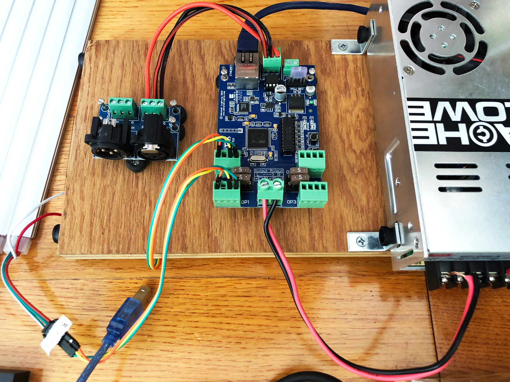

# Art-Net with Processing

[Art-Net](https://en.wikipedia.org/wiki/Art-Net) is a network-based protocol for communicating with individual LED lights on a strip, (or on their own). It's a more robust and powerful way to send DMX messages to larger numbers of lights. You can get a "pixel controller" that can receive art-net messages and convert them to the required electrical signals that different types of LED strips use for communication.

As I wrote this guide, I was alerted to the new [WLED](https://github.com/Aircoookie/WLED) method of controlling addressable LED strips. This is a nice viable alternative to the methods I describe here, and has its own pros & cons that I'm not informed enough to weigh in on at this point. I'll be investigating this soon.

Also, if you're interested in controlling individual light fixtures with DMX, you can check out my [DMX for Processing guide](./processing-dmx.md).

### Pixel Controllers

For this guide, I'm using the [Advatek PixLite 4 Mk2](https://www.advateklights.com/pixlite-4-mk2-control-board). There are many other "pixel controllers" out there, but this is the one I chose, as it seemed less complicated than other options. To use a pixel controller, you need:

* The pixel controller board
* A power supply (5v, 12v or 24v) that matches the voltage of your addressable LED strips
* A router or network switch to stream ArtNet data from your computer to the pixel controller. You can also use an Arduino, lighting control board, or other types of computers to send your ArtNet data.
* LED strips! The most common being WS2811 - WS2815, otherwise referred to as "[Neopixel](https://learn.adafruit.com/adafruit-neopixel-uberguide)"

### Addressable lights

The WS2812 category of addressable LED lights seems to be the most common type of addressable lights, so this is a good choice for most purposes. This type of light strip has 3 wires that will plug into the pixel controller. You can daisy chain as many lights as you want, but power distribution to all of the pixels can become an issue after 100 lights or so. 

The ArtNet data that you'll send over the LAN is actually DMX signals under the hood, so familiarize yourself with DMX signals if you're not already. To break it down quickly, your ArtNet messages are a large array of integers, each representing a color component (R, G, B) for each physical light. For RGB light control of multiple lights, your array of data looks like this: 

```
[r, g, b, r, g, b, r, g, b, r, g, b...]
```

It's up to you to build this array of sequential RGB values for as many lights as you need to animate. For example, if you have 10 lights, you'll need to send an array of 30 color values.

### Powering your lights

Even though I used 5v lights and power in my example setup here, 12v is a more common voltage for LED strip lights, so we'll go with that when talking about calculating power. 

A power supply has a **wattage** and **amperage** rating, which will help us calculate how may LED strips a single power supply can support. Here are some recommendations that I've come across that will help with your calculations:

* Find the **watts** that a single LED strip will use at full brightness. This should be availabl in the product tech specifications, and might be displayed as wattage per foot, or for the whole strip. My 5-meter (16.4') 12v strips consume 90 watts at full brightness, for example. You should add 20% and round up to determine how many watts your power supply should have. In this case, 90 watts + 20% (18 watts) = 108 watts. I might round up slightly higher to a 120 watt power supply, just to be safe. This extra power headroom will help prevent your power supply from overheating and failing prematurely.
* Figure out how many **amps** your power supply should have. The [spec sheet](https://www.amazon.com/BTF-LIGHTING-Upgraded-Individually-Addressable-Non-Waterproof/dp/B07LG6J39V/) for my LED strip suggests that for every 90 watt, 5-meter strip with 300 LEDs, you'd want a 10 amp, 120 watt  power supply. 
* The density of your LED strips will impact its power consumtion. Common densities are 30, 60, and 100 LED per meter. Many strips come in 5-meter (16.4') spools, so a density of 60/m would mean 300 total LEDs for a 5-meter spool. 
* If you want to have fewer power supplies, multiply the watts per strip by how many strips you have. For example, if my strip need 90 watts and 10 amps, and I want to power 4 of them from a single power supply, I should start with 90 * 4 = 360, add 20% again (72 watts), and round up. In this case, I might just go with a 500 watt / 42 amp power supply to ensure that I have enough juice.

#### Links: Choosing an LED strip and power supply

* [What Digital LED chip to choose](https://quinled.info/2019/06/02/what-digital-led-chip-to-choose/)
* [Powering Any WS2812b Setup](https://www.temposlighting.com/guides/power-any-ws2812b-setup)
* [How to choose a power supply for your LED strip project](https://www.waveformlighting.com/home-residential/how-to-choose-a-power-supply-for-your-led-strip-project)
* [LED Strip Lighting: Choosing the Right LED Power Supply](https://www.superbrightleds.com/blog/choose-right-power-supply-led-strip-lighting/2186/)
* [How many LED strips can I connect together?](https://vetco.net/blog/how-many-led-strips-can-i-connect-together/2018-09-26-10-24-27-0700)

#### Power injection

As you support more LED strips with fewer (and more powerful) power supplies, you'll need to learn about power injection, because of voltage drop. Essentially, the further an LED is from the power source, the less power it might have to illuminate it's diodes. This has drop brightness and change the color, and the R, G, & B diodes consume different amounts of electricity. My strip noted above suggests adding power injection after every 5 meters of strip. 

#### Links: Power injection

* [Power injection (via Advatek)](https://www.advateklights.com/knowledge-base/power-injection)
* [Combating LED voltage drop | LED Power Injection](https://www.youtube.com/watch?v=EcjPR0UlU7U)
* [Power Injection, Voltage Drop, Brightness Regulation and More](https://www.youtube.com/watch?v=apwQ5Jh4VyE)
* [Power Injection Demystified](http://spikerlights.com/pwrinjection.aspx)
* [How Do I Power Christmas Light Pixels? Power Injection 101](https://learnchristmaslighting.com/how-do-i-power-christmas-light-pixels-power-injection-101/)

### Preparing the Pixel Controller

For the Advatek pixel controller, you need to download the [Advatek Assistant](https://www.advateklights.com/downloads/advatek-assistant/windows) desktop app. This will help you find (on the LAN) and configure the device to work for with the lights that you've chosen. You'll also want to download the [PixLite Configuration Guide](https://www.advateklights.com/downloads/user-manuals/pixlite-configuration-guide) and the [PixLite 4 manual](https://www.advateklights.com/downloads/user-manuals/pixlite-4-mk2). Unfortunately, this type of addressable LED setup isn't exactly plug-and-play, hence my guide here!

### Wiring the components


First, you need a power supply. Wire up the grounded 3-wire power plug (on the right) so you can plug into a power outlet, and send power to the pixel controller with red & black wire (on the left).



Next, connect your LED strip to one of the 4-terminal outputs. The PixLite 4 has four of these, and it uses the electricity from the power supply to turn on your lights. I like to use jumper cables to prototype these connections.

The WS2812-style strips only have 3 wires, so you'll ignore one of the outputs' terminals. We need to connect the power (pin 1), data (pin 3), and ground (pin 4). These LEDs don't have a "Clock" wire, but other types of LED strips do. 


You can generally figure out which wire is which by looking very closely at the the LED strip. In the image below, we can see the GND (Ground), DIN (data), and +5V (5-volt power) indications on the strip, and how those correspond to the white, green, and red wires, respectively. This is how we figure out where to plug in each wire into the pixel controller's output terminal, and which direction data and power should be flowing via the big arrow (originating from the controller).


In this example, I've also taken advantage of the extra DMX output on my pixel controller to communicate with standard DMX light fixtures, all from this single controller. It's nice that we can send DMX to both the LED strip pixels **and** larger traditional DMX fixtures all from one unit. I've wired up a nice DMX terminal so I can plug in a standard DMX cable and daisy chain that to my lights. 


## Configuring the Pixel Controller

You'll note that the pixel controller also has an ethernet cable plugged in. This is because ArtNet is a network-based protocol. This means that your messages from computer software to the pixel controller are sent as network data, sent through a router/switch, and received by the pixel controller, which then translates and distributes these messages as electrical signals that are formatted for the LED strip type that you've selected. 

To configure the PixLite 4, you need to download and open the Advatek Assistant app. This app will search for Advatek controllers on your network, which depends upon which network adapter (Wifi or ethernet, generally) you're connected to. In my case, I'm using Wifi for my normal computer internet traffic, but I'm hard-wired into a router that only for ArtNet communication. A physical ethernet cable will be faster and more reliable than sending ArtNet over Wifi!


If you have multiple network connections, select the correct adapter. The IP address in the dropdown should be **your** IP address on the network(s) that you're connected to. If you change any connections or power cycle any equipment, you'll need to click "Refresh Adapters" to trigger another network scan. If all goes well, your PixLite adapter would show up in the list and display its IP address on the network. Take note of this IP address, as this will be the destination for your ArtNet messages. From here, you can double-click the row to continue to the configuration of your pixel controller.  

There are a few basic settings to update. You can update the controller's IP address if you'd like in the Network tab. If you do this, you'll need to re-scan and reconnect to the device afterwards. Next, set your **universe** - it's best to start with `1`, assuming you're just starting out building your lighting display. A DMX universe supports 512 channels. If you're using RGB lights, this means you can have 170 individual pixels, since each takes 3 channels. Your universe will be left with 2 unused channels, which is handy to know when you're spanning multiple universes. 


If you max out a universe, you can have the controller can continue using sequential universes as is shown on the Advanced Output Configuration screen. Since you're left with two extra channels after 510, you need to account for this in your code, and jump to the next universe for the starting channel of your 171st pixel (and so on) as you cross the size of further universes. Use the "End Universe" and "Num Pixels" settings to define how many individual LEDs you plan to control with a single controller output terminal. The PixLite 4 can support about 1,000 pixels per output. 


Next, choose your LED strip type and the RGB order. Many RGB strips expect the 3 sequential channels for RGB colors components to be in GRB order! This can be confusing if you think you're sending red, but the lights display green.


Finally, when you think you have everything set up and wired properly, try running a test pattern. You should hopefully see something happen on the light strip! Make sure the RGB vs. GRB setting is correct - you'll know if it's right when you select the Red test pattern and see red (correct) or green (incorrect). If this looks good, turn the test mode off and let's code our own light display!


### Code

If you're using the Processing IDE, install the [ArtNet](https://github.com/hdavid/dmxP512) library. 


If you're using the Processing IDE and have installed the `ArtNet for Java and Processing` library, the following code is the most basic example to test your lights. Make sure `controllerAddress` matches your Advatek IP address.

```java
// original code from: 
// https://github.com/cansik/artnet4j/blob/master/examples/SendDmxData/SendDmxData.pde

import ch.bildspur.artnet.*;

ArtNetClient artnet;
byte[] dmxData = new byte[512];
String controllerAddress = "192.168.1.101";
int curUniverse = 0;

void setup()
{
  size(500, 250);
  
  colorMode(HSB, 360, 100, 100);
  textAlign(CENTER, CENTER);
  textSize(20);

  // create artnet client without buffer (no receving needed)
  artnet = new ArtNetClient(null);
  artnet.start();
}

void draw()
{
  // create color
  int c = color(frameCount % 360, 80, 100);

  background(c);

  // fill dmx array
  dmxData[0] = (byte) red(c);
  dmxData[1] = (byte) green(c);
  dmxData[2] = (byte) blue(c);

  // send dmx to localhost
  artnet.unicastDmx(controllerAddress, 0, curUniverse, dmxData);

  // show values
  text("R: " + (int)red(c) + " Green: " + (int)green(c) + " Blue: " + (int)blue(c), width / 2, height / 2);
}
```

From here, you'll want to fill up the `dmxData` array with different color values to take advantage of your addressable lights. How you do this is up to you :)

### Hardware links

* [Neopixel extension wire](https://www.amazon.com/RGBZONE-Extension-WS2812B-WS2811-Lights/dp/B06Y4716V7/) [[2](https://www.amazon.com/dp/B08JTZKN4M/)]
* [Neopixel 3-wire quick connectors](https://www.amazon.com/BTF-LIGHTING-Connectors-WS2812B-WS2811-WS2812/dp/B01DC0KIT2/)