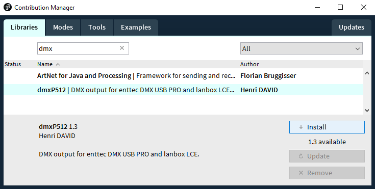
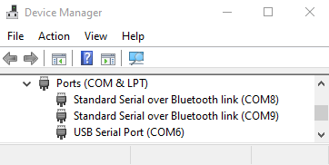
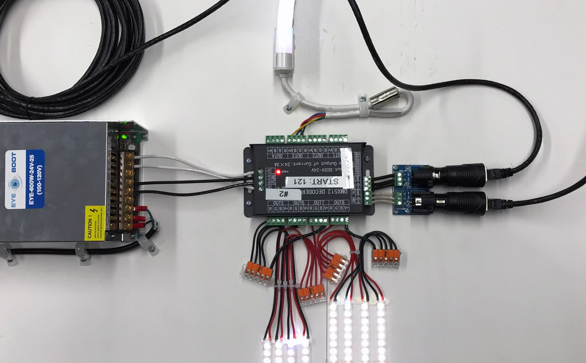

# DMX with Processing

[DMX](https://en.wikipedia.org/wiki/DMX512) is an old protocol for communicating with stage lights. If you ever go to a concert, chances are that many of the lights are controlled with DMX signals. You can get a USB DMX interface and write code that can send these same signals.

### DMX interfaces

* [ENTTEC DMX USB Pro](https://www.amazon.com/Enttec-70304-Lighting-Controller-Interface/dp/B077VW1DJH)
  * [5-to-3 pin converter](https://www.amazon.com/American-DJ-5-Pin-Female-Turnaround/dp/B0013XWB14) if you get the ENTTEC
* or [DMXking UltraDMX Micro](https://www.amazon.com/DMXking-UltraDMX-Micro-Adapter-Dongle/dp/B00T8OKM98/) (an ENTTEC clone, but smaller and cheaper)

Use DMX over ethernet for super long cable runs - standard DMX cables are generally rated for ~75', but ethernet can go hundreds of feet. You need a [male](https://www.amazon.com/TecNec-DMX-3XM-CAT5-3-pin-Adapter-TecNec/dp/B00KUTR7MA) & [female](https://www.amazon.com/TecNec-DMX-3XF-CAT5-3-pin-Female-Adapter/dp/B00KUTZW3Q) adapter for the 2 ends of a standard cat-5 network cable.

Or use a [wireless DMX transmitter](https://www.amazon.com/Donner-Wireless-Receiver-Indicators-Transmitter/dp/B00L25ZNP4/).

### DMX lights

There's a whole world of DMX lights and DMX-controlled devices, like [winches](https://www.rosebrand.com/subcategory761/dmx-winches.aspx) and [power outlets](https://www.chauvetdj.com/products/dmx-4/). Most DMX lights have a manual RGB mode, which can be set via a control panel on the back of the devices. By setting the starting channel of your device, you can target multiple daisy-chained lights by sending out DMX values on different channels. If a light has an RGB mode, you will likely use 3 consecutive DMX channels to target R, G, & B. Other channels might be used to control pan/tilt on motorized light fixtures, for example.

### Code

If you're using the Processing IDE, install the [dmxP512](https://github.com/hdavid/dmxP512) library. 



If you're using Eclipse, add the dmxP512 jar to your classpath and make sure you've pointed the Serial library at the appropriate native library. In Eclipse's `.classpath`, that looks something like this:

```
<classpathentry kind="lib" path="lib/processing-3/libraries/serial/library/serial.jar">
  <attributes>
    <attribute name="org.eclipse.jdt.launching.CLASSPATH_ATTR_LIBRARY_PATH_ENTRY" value="haxademic/lib/processing-3/libraries/serial/library/windows64"/>
  </attributes>
</classpathentry>
```

Or if you're running from the command line, you'd point to the Serial library by adding the following to your java run command:

```
-Djava.library.path=lib\processing-3\libraries\serial\library\windows64
```

If you're using the Processing IDE and have installed the `DmxP512` library and found your COM port (Windows), the following code is the most basic example to test your lights. Make sure you import the Processing Serial library to help the DMX library find your DMX USB device.

```java
import dmxP512.*;
import processing.serial.*;

// DMX USB Pro config
DmxP512 dmxOutput;
int universeSize = 512;
String DMXPRO_PORT = "COM3";
int DMXPRO_BAUDRATE = 9600;

void setup() {
  size(512, 256, P2D);
  noStroke();
  
  // init device
  dmxOutput = new DmxP512(this, universeSize, true);
  dmxOutput.setupDmxPro(DMXPRO_PORT, DMXPRO_BAUDRATE);
}

void draw() {
  background(0);
  // loop through all DMX channels
  for(int i=1; i < universeSize; i++) {
    // set channels 1-512 to oscillating values
    int value = 127 + round(127 * sin(frameCount * 0.1f + i * 0.1));
    dmxOutput.set(i, value);
    // show on-screen what we've sent out to DMX hardware
    fill(value);
    rect(i - 1, 0, 1, height);    
  }
}
```

### Finding your USB device port

On Windows, open up the Device Manager and find the entry for USB Serial Port. In this case, you'd use "COM6". Right-click the device for Properties, and you can look up the baud rate that you'll also need to init the `DmxP512` object.



My own DMX wrapper has some instructions in the comments about how to identify your USB/serial device based on your operating system. OS X seems to need a virtual serial device driver to properly register your DMX USB device. Your virtual serial port will look something like "/dev/tty.usbserial-EN158815", rather than Windows' COM[X] schema.

* [DMXWrapper](https://github.com/cacheflowe/haxademic/blob/master/src/com/haxademic/core/hardware/dmx/DMXWrapper.java)

Here's a little more advanced code that takes Kinect tracking and sets the pan of my motorized spotlight. You can see in my comments that different DMX channels control many aspects of the fixture:

* [Demo_DmxKinectStiletto](https://github.com/cacheflowe/haxademic/blob/master/src/com/haxademic/demo/hardware/dmx/Demo_DmxKinectStiletto.java#L81)
* And [the result](https://www.instagram.com/p/BkWHmjunL-0/)

### Custom DMX fixtures

A DMX decoder lets you build custom light fixtures or voltage-controlled electronic devices. It's important to use a 12v power supply if your LED strips are 12v (24v is another common voltage for LEDs and components). LED strips are not addressable - the entire strip will change to the same color. You'll want to look for SMB 5050 LED lights, which will come in single channel (color) and RGB varieties.

Voltage is sent through the decoder's wire terminals via PWM. Here are some components that you'll need if you want to build a custom DMX device.



The basic unit:

* [24-channel DMX Decoder](https://www.amazon.com/gp/product/B01CCBG1SO/) (or [32-channel](https://www.amazon.com/Channel-Decoder-Controller-Dimmer-DC5-24V/dp/B075FHJM35))
  * [Extra removable terminal blocks ("Euroblock" or "Phoenix-type")](https://www.amazon.com/Parts-Express-Phoenix-Connector-4-Pole/dp/B00MJGPFWG/)
* [Power supply](https://www.amazon.com/500W-Power-Supply-Single-Output/dp/B01KZP2CKA/)
  * [Power supply IEC power cable](https://www.amazon.com/TNP-Universal-Power-Cord-Feet/dp/B01N237QI9/)
* [DMX Terminals](https://www.amazon.com/Terminal-Adapter-Converters-Controller-Decoder/dp/B00Q32V2JC/)

Wires to connect the basic unit components and LED strips or devices:

* [2-conductor Wire (jacketed)](https://www.amazon.com/18AWG-Voltage-Conductor-Jacketed-Speaker/dp/B06XSNQDV1/)
* [4-conductor Wire (jacketed)](https://www.homedepot.com/b/Electrical-Wire/18/4/N-5yc1vZbm7vZ1z0rqh9Z1z10onr)
* [2-conductor Wire](https://www.amazon.com/Gauge-Black-Stranded-Conductor-Speaker/dp/B00J36SUWC/)

LED strips:

* [White single-color LED strips (2-conductor 5050 SMD)](https://www.amazon.com/dp/B01ELDJ5X4/)
* [RGB LED strips (4-conductor 5050 SMD RGB)](https://www.amazon.com/econoLED-Flexible-Multi-colors-Non-waterproof-Changing/dp/B006LW2NJM/)

Solderless clips for prototyping:

* [Solderless clips for single-channel LED strip](https://www.amazon.com/dp/B07N8GLBLL/)
* [Solderless clips for RBG LED strip](https://www.amazon.com/iCreating-Connector-Conductor-Controller-Solderless/dp/B074G48LWQ/)
* [Lever Nuts to combine power cables](https://www.amazon.com/Kalolary-Lever-Nut-Connector-50Pack-Assortment-Connectors/dp/B07NXZNW1K/)

### Other options

* [MIDI2DMX](https://github.com/jmej/MIDI2DMX)
* Get a [traditional lighting console](https://www.google.com/search?q=dmx+lighting+console)
* [DMX program player](https://www.aspectled.com/products/dmx-stand-alone-pc-mac-programmable-controller#tab-1)
