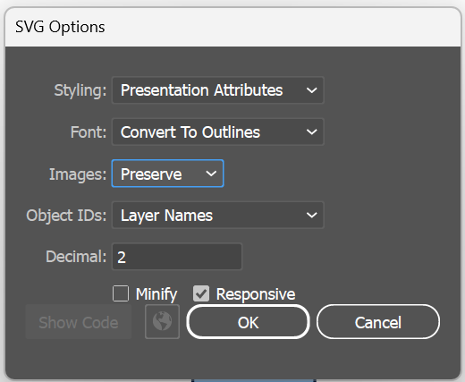
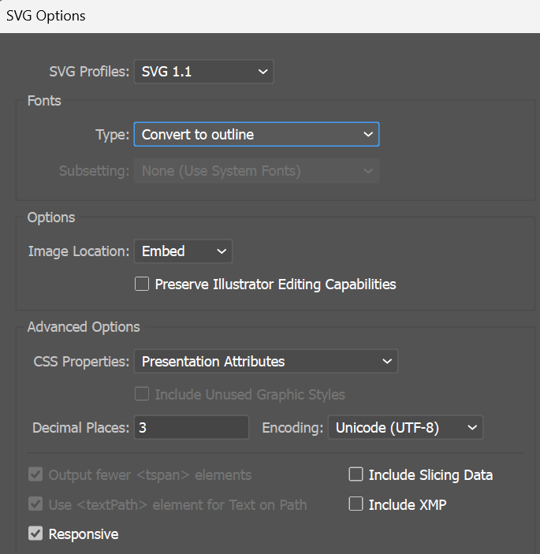

# SVG Preparation for Processing

- Layer names in Illustrator/Figma are set as SVG element IDs, which can help target them in code
- Artboards are important! Match the size of the old assets
  - `Object -> Artboards -> Fit to Selected Art` (or `Fit to Artwork Bounds`)
  - When you load the SVG as a PShape, the width & height will be the size of the artboard
    - You can extend the shape beyond the bounds of the artboard
    - If you want to be sure the shape's size matches the artboard, but it doesn't fill the entire artboard, you can create a transparent rectangle the size of the artboard and that will enforce the size of the PShape.
  - When you draw a PShape, I've found it's best to use CORNER to draw it, not CENTER. The width & height don't seem to always work right if you draw with CENTER, so you have to do your own `translate()` to get it in the right place if you want it centered (for rotating & scaling)
- SVG Simplification & cleanup
  - Simplest technique:
    - Select all 
    - Flatten Transparency with `Convert All Strokes to Outlines` and `Convert All Text to Outlines` selected
    - `Pathfinder -> Divide` to split the shape into multiple shapes
    - `Pathfinder -> Merge` to combine shapes with the same color
  - Remove any gradients - they won't work
  - Remove any clip paths - use Pathfinder to divide/merge masked shapes
    - Select the clip path and masked layers and try `Divide`, possibly with `Flatten Transparency` or `Expand` first to make plitting/merging more likely to work
      - Then `Unite` or `Merge` to bring the divided shapes back together
  - Select elements and `Object -> Flatten Transparency`
    - This can remove svg rotation transformations & other unsupported svg attributes
  - Select elements and `Object -> Expand` (or `Expand Appearance`)
    - By using `expand`, paths with strokes are converted to filled paths, which will render properly. Stroked paths can often render in the wrong stacking order
    - After expanding, you might want to use Pathfinder to `Divide` the shape into multiple shapes, then select shapes with the same color and `Merge` them
- Export SVG
  - SVG 1.1
  - Select all and `File -> Export As...`
  - Select SVG and check "Use Artboards"
  - 3 decimal places
  - Select "Presentation Attributes" for CSS properties

- Use [SVGOMG](https://jakearchibald.github.io/svgomg/) to further optimize
- Checking for incompatibilities
  - Look at the svg source code and make sure there are no:
    - `transform` attributes (usually fixable with flatten transparency)
    - gradients
    - filters
    - clip paths
    - CSS styles
    - `<defs>` tags
    - `<style>` tags
    - embedded images
    - dynamic text

