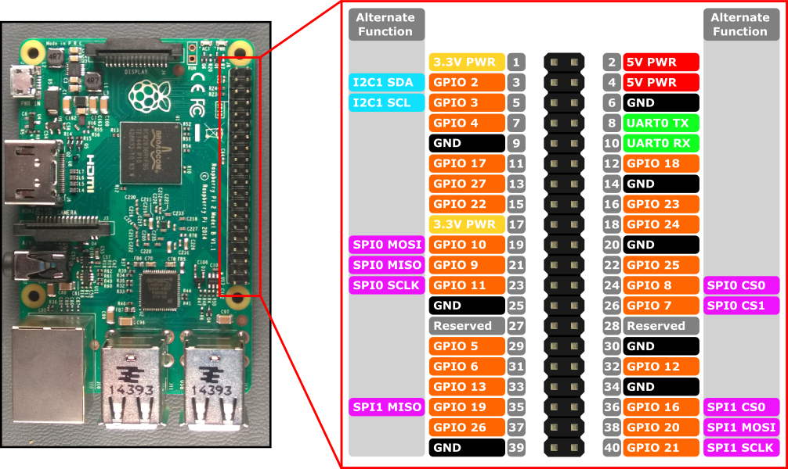

# Raspberry Pi notes

When to use Raspberry Pi vs Arduino: [[source](https://pypi.org/project/RPi.GPIO/)]

> Note that this module is unsuitable for real-time or timing critical applications. This is because you can not predict when Python will be busy garbage collecting. It also runs under the Linux kernel which is not suitable for real time applications - it is multitasking O/S and another process may be given priority over the CPU, causing jitter in your program. If you are after true real-time performance and predictability, buy yourself an Arduino http://www.arduino.cc !

Other reasons: 

- You need disk storage
- You need to interact with a backend and pull down new files
- You want to use web technology like Node.js or Python or Chromium
- You want to run a server (ESP32 can run a simple websocket server though)

## Installation

- Download microSD disk imager from Raspberry Pi website
- Run system updates
  - `sudo apt update`
  - `sudo apt upgrade`
- Download some tools
  - Teamviewer
    - Download .deb file from website (host version)
    - Right-click in UI to install, or run a command like: `sudo dpkg -i teamviewer-host_amd64.deb`
    - Set up a personal password, which will allow remote access, and save the info in your TeamViewer account
    - Switch to X11 mode in rpi system settings, because TeamViewer isn't quite ready for the new Wayland display server
      - `sudo raspi-config`
  - `sudo apt install code`
- Go to `/boot/firmware/config.txt` and enable (uncomment) I2C and SPI

## Doing development from a laptop

- Use Thonny IDE to write/run Python code
- Connect VSCode to the Pi with SSH
  - https://www.youtube.com/watch?v=jvi1nmKK81Y


## Remote login:

- TeamViewer
- [Raspberry Pi Connect](https://www.raspberrypi.com/software/connect/)

## Pinout



## Hardware-specific notes

GPIO library

- https://gpiozero.readthedocs.io/en/latest/recipes.html
- https://gpiozero.readthedocs.io/en/latest/recipes.html#distance-sensor
- https://gpiozero.readthedocs.io/en/stable/api_input.html#distancesensor-hc-sr04

Liquid Crystal IC2

- https://medium.com/@thedyslexiccoder/how-to-set-up-a-raspberry-pi-4-with-lcd-display-using-i2c-backpack-189a0760ae15
- https://www.youtube.com/watch?v=krgKTohXUQk
- Older info:
  - https://www.circuitbasics.com/raspberry-pi-i2c-lcd-set-up-and-programming/
  - https://gist.github.com/DenisFromHR/cc863375a6e19dce359d

VL53L1X

- https://pypi.org/project/VL53L1X/


## Project-specific notes

### Create a local python environment

`python -m venv ./python-local`

### Proximity sound player

Links: 

- https://projects.raspberrypi.org/en/projects/gpio-music-box/4
  - https://www.pygame.org/docs/index.html
  - https://www.youtube.com/watch?v=2izvSzQWYak
- https://www.instructables.com/TeamViewer-on-Raspberry-Pi/

### App 1: Ultrasonic sensor

```python
# run from command line with: 
# - `python -i app.py`
# pygame docs: 
# - https://www.pygame.org/docs/index.html
# rpi pinout diagram
# - https://www.raspberrypi.com/documentation/computers/images/GPIO-Pinout-Diagram-2.png?hash=df7d7847c57a1ca6d5b2617695de6d46
# gpio docs:
# - https://gpiozero.readthedocs.io/en/latest/recipes.html
# - https://gpiozero.readthedocs.io/en/latest/recipes.html#distance-sensor
# - https://gpiozero.readthedocs.io/en/stable/api_input.html#distancesensor-hc-sr04
# VL53L1X:
# - https://pypi.org/project/VL53L1X/
# - python -m venv ./python-local
#   - sudo python-local/bin/pip install smbus2
#   - sudo python-local/bin/pip install vl53l1x
#   - sudo python-local/bin/pip install pygame
#   - sudo python-local/bin/pip install pigpio
#   - sudo python-local/bin/pip install gpiozero
#   - sudo python-local/bin/pip install RPi.GPIO
#   - sudo python-local/bin/pip install lgpio
#   - python-local/bin/python -i app.py
# - sudo pip install smbus2
#   - or: sudo apt install python3-smbus2
# - sudo pip install vl53l1x
#   - or: sudo apt install python3-vl53l1x


import pygame
from gpiozero import Button
from gpiozero import DistanceSensor


# start pygame
pygame.init()
screen = pygame.display.set_mode((320, 240))
clock = pygame.time.Clock()
running = True

# load sounds
hit1 = pygame.mixer.Sound('sounds/DF-TOC-FX-Hit-19.wav')
hit2 = pygame.mixer.Sound('sounds/Futura_recess.wav')
hit3 = pygame.mixer.Sound('sounds/HIT_2.wav')
channel = None

# get time
def getTime():
    return pygame.time.get_ticks()

# trigger sound on button
last_trigger_time = 0
def triggerSample():
    global last_trigger_time
    global channel
    if getTime() - last_trigger_time > 500:
        print('triggerSample')
        hit1.stop()
        channel = hit1.play()
        last_trigger_time = getTime()

def stopSample():
    # hit1.stop()
    hit1.fadeout(500)
    print('stopSample')

btn = Button(17)
btn.when_pressed = triggerSample

# init ultrasonic distance sensor
sensor_max = 2
sensor_value = sensor_max
sensor_rate = 100
sensor_last_read_time = 0
sensor = DistanceSensor(23, 24, max_distance=sensor_max, threshold_distance=0.8)
sensor.when_in_range = triggerSample
sensor.when_out_of_range = stopSample

# start game loop
while running:
    # poll for events
    for event in pygame.event.get():
        if event.type == pygame.QUIT: # pygame.QUIT event means the user clicked X to close your window
            running = False

    # fill the screen with a color to wipe away anything from last frame
    if getTime() > last_trigger_time + 500:
        screen.fill("black")
    else:
        screen.fill("purple")

    # RENDER YOUR GAME HERE
    if getTime() > sensor_last_read_time + sensor_rate:
        sensor_value = sensor.distance
        sensor_value = round(sensor_value, 3)
        sensor_last_read_time = getTime()
        if sensor_value < sensor_max:
            print('Distance to nearest object is', sensor_value, 'm')

    # flip() the display to put your work on screen
    pygame.display.flip()

    clock.tick(20)  # limits FPS to 60

pygame.quit()

```

### App 2: Lidar sensor

Run with: `python-local/bin/python -i app-2.py`

```python
# run from command line with: 
# - `python -i app-2.py`

import pygame
from gpiozero import Button
import VL53L1X


# start pygame
pygame.init()
screen = pygame.display.set_mode((320, 240))
clock = pygame.time.Clock()
running = True

# load sounds
hit1 = pygame.mixer.Sound('sounds/DF-TOC-FX-Hit-19.wav')
hit2 = pygame.mixer.Sound('sounds/Futura_recess.wav')
hit3 = pygame.mixer.Sound('sounds/HIT_2.wav')
channel = None

# get time
def getTime():
    return pygame.time.get_ticks()

# trigger sound on button
last_trigger_time = 0
def triggerSample():
    global last_trigger_time
    global channel
    global in_range
    if getTime() - last_trigger_time > 500:
        print('triggerSample')
        in_range = True
        hit1.stop()
        channel = hit1.play()
        last_trigger_time = getTime()

def stopSample():
    global in_range
    # hit1.stop()
    in_range = False
    hit1.fadeout(500)
    print('stopSample')

btn = Button(17)
btn.when_pressed = triggerSample

# init ultrasonic distance sensor
sensor_max = 700
sensor_value = sensor_max
sensor_rate = 10
sensor_last_read_time = 0
in_range = False

# Open and start the VL53L1X sensor.
tof = VL53L1X.VL53L1X(i2c_bus=1, i2c_address=0x29)
tof.open()
tof.start_ranging(1)  # Start ranging
                      # 0 = Unchanged
                      # 1 = Short Range
                      # 2 = Medium Range
                      # 3 = Long Range
UPDATE_TIME_MICROS = 66000
INTER_MEASUREMENT_PERIOD_MILLIS = 150
tof.set_timing(UPDATE_TIME_MICROS, INTER_MEASUREMENT_PERIOD_MILLIS)

# start game loop
while running:
    # poll for events
    for event in pygame.event.get():
        if event.type == pygame.QUIT: # pygame.QUIT event means the user clicked X to close your window
            running = False

    # fill the screen with a color to wipe away anything from last frame
    if getTime() > last_trigger_time + 500:
        screen.fill("black")
    else:
        screen.fill("purple")

    # RENDER YOUR GAME HERE
    if getTime() > sensor_last_read_time + sensor_rate:
        sensor_value = tof.get_distance()
        sensor_last_read_time = getTime()
        if sensor_value < 1:
            sensor_value = sensor_max
        if sensor_value < sensor_max:
            print('Triggered at: ', sensor_value, 'mm')
            if not in_range:
                triggerSample()
        else:
            print('Looking at:', sensor_value, 'mm')
            if in_range:
                stopSample()

    # flip() the display to put your work on screen
    pygame.display.flip()

    clock.tick(60)  # limits FPS to 60

pygame.quit()
tof.stop_ranging()
```