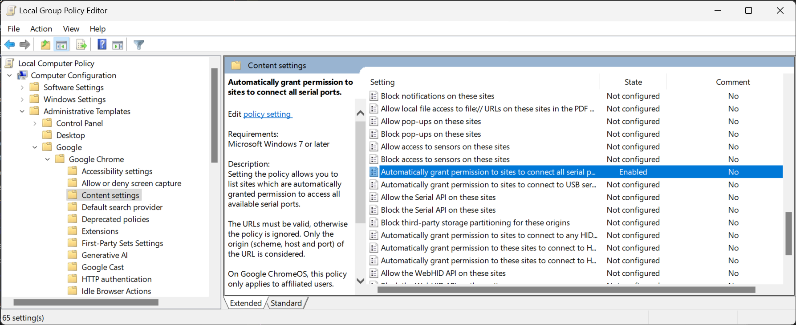
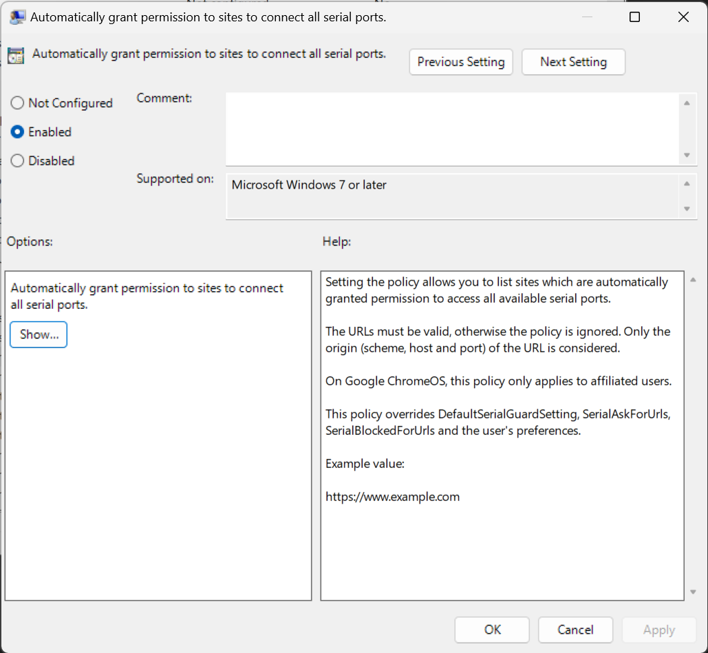
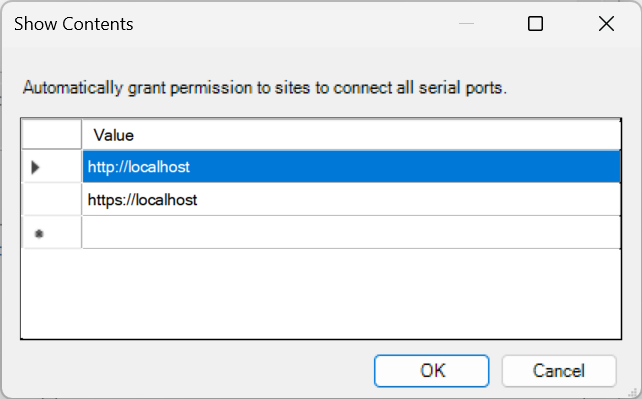

# Web Serial API access in Chrome without user interaction

Some browser features require user interaction to initialize. This is a security feature to prevent malicious websites from accessing your hardware without your knowledge. Some common examples are autoplaying audio/video with sound, accessing the webcam, and accessing the Web Serial API. Some of these features can be enabled *without user interaction* via Chrome flags, but the Web Serial API currently cannot. However, it *can* be enabled by setting Chrome policies at a system level. This guide will focus on Windows, but the technique should be replicable on other systems.

## Steps to enable permissionless Web Serial API access

Check your existing Chrome policies here: [chrome://policy/](chrome://policy/). If you haven't set a policy called "SerialAllowAllPortsForUrls" you can set the policy by following the steps below.

Go through steps 1 & 2 in [Google's documentation for Chrome policy management](https://support.google.com/chrome/a/answer/7650032). This will require downloading a couple of files and copying them to Windows system directories. These files enable easy management of the Chrome policies that we need.

Open the Windows **Local Group Policy Editor** by either:
- Pressing `WIN + R` and typing "**gpedit.msc**" and pressing enter
- Searching for **Edit group policy** in the Windows search bar (or typing WIN and typing **Edit group policy**)

In the Local Group Policy Editor:
- Navigate to the following location:
  - `Computer Configuration -> Administrative Templates -> Google -> Google Chrome -> Content Settings`
- 
- Double click **Automatically grant permission to sites to connect to Serial Devices**. This will open a window that lets you configure [the SerialAllowAllPortsForUrls policy](https://chromeenterprise.google/policies/#SerialAllowAllPortsForUrls)
- 
- Click the `Enabled` radio button in
- Below the `Enabled` button, click "Show", and fill in the table with any local or remote URLs you want to allow access to serial devices. I filled in `http://localhost` and `https://localhost`
- 
- You might also Enable "Automatically grant permission to sites to connect all serial ports", and use the [example JSON](https://chromeenterprise.google/policies/#SerialAllowUsbDevicesForUrls) as the value, but I'm not sure this is necessary.

Now back in Chrome, check to see that your policies have been set by visiting [chrome://policy/](chrome://policy/). You should see the policies you set in the list. If not, you can try clicking "Reload policies". If you still don't see them, you might need to restart your computer, but the changes seem to be immediate when I set them. It should looks like this in the active policy table:

| Policy name                | Policy value                             | Source   | Applies to | Level     | Status |
-----------------------------|------------------------------------------|----------|------------|-----------|--------|
| SerialAllowAllPortsForUrls | ["http://localhost","https://localhost"] | Platform | Machine    | Mandatory | OK     |

Extra URLs from research:
- https://admx.help/?Category=Chrome&Policy=Google.Policies.Chrome::WebUsbAllowDevicesForUrls
- https://groups.google.com/a/chromium.org/g/chromium-dev/c/iS3HhY_Tm6E
- https://chromeenterprise.google/policies/atomic-groups/#WebUsbSettings
- https://chromeenterprise.google/policies/#SerialAllowAllPortsForUrls
- https://chromeenterprise.google/policies/#SerialAllowUsbDevicesForUrls
- https://support.google.com/chrome/a/answer/7650247?hl=en&ref_topic=7649835&sjid=2313974934071077315-NA
- https://chromeenterprise.google/policies/#DefaultSearchProviderAlternateURLs